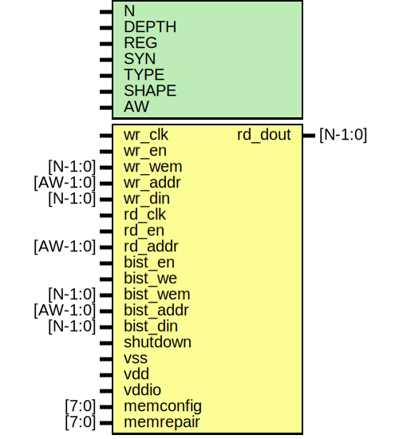

# Entity: oh_memory_dp

- **File**: oh_memory_dp.v
## Diagram

## Description

#############################################################################
# Function: Dual Ported Memory                                              #
#############################################################################
# Author:   Andreas Olofsson                                                #
# License:  MIT (see LICENSE file in OH! repository)                        #
#############################################################################

## Generics

| Generic name | Type | Value         | Description                             |
| ------------ | ---- | ------------- | --------------------------------------- |
| N            |      | 32            |  FIFO width                             |
| DEPTH        |      | 32            |  FIFO depth                             |
| REG          |      | 1             |  Register fifo output                   |
| SYN          |      | "TRUE"        |  hard (macro) or soft (rtl)             |
| TYPE         |      | "DEFAULT"     |  pass through variable for hard macro   |
| SHAPE        |      | "SQUARE"      |  hard macro shape (square, tall, wide)  |
| AW           |      | $clog2(DEPTH) |  rd_count width (derived)               |
## Ports

| Port name | Direction | Type     | Description                |
| --------- | --------- | -------- | -------------------------- |
| wr_clk    | input     |          | write clock                |
| wr_en     | input     |          | write enable               |
| wr_wem    | input     | [N-1:0]  | per bit write enable       |
| wr_addr   | input     | [AW-1:0] | write address              |
| wr_din    | input     | [N-1:0]  | write data                 |
| rd_clk    | input     |          | read clock                 |
| rd_en     | input     |          | read enable                |
| rd_addr   | input     | [AW-1:0] | read address               |
| rd_dout   | output    | [N-1:0]  | read output data           |
| bist_en   | input     |          | bist enable                |
| bist_we   | input     |          | write enable global signal |
| bist_wem  | input     | [N-1:0]  | write enable vector        |
| bist_addr | input     | [AW-1:0] | address                    |
| bist_din  | input     | [N-1:0]  | data input                 |
| shutdown  | input     |          | shutdown signal            |
| vss       | input     |          | ground signal              |
| vdd       | input     |          | memory array power         |
| vddio     | input     |          | periphery/io power         |
| memconfig | input     | [7:0]    | generic memory config      |
| memrepair | input     | [7:0]    | repair vector              |
