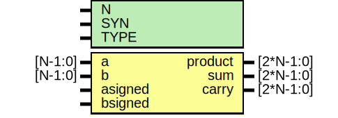

# Entity: oh_mult

- **File**: oh_mult.v
## Diagram

## Description

#############################################################################
# Function: Binary multiplier                                               #
#############################################################################
# Author:   Andreas Olofsson                                                #
# License:  MIT (see LICENSE file in OH! repository)                        #
#############################################################################

## Generics

| Generic name | Type | Value     | Description           |
| ------------ | ---- | --------- | --------------------- |
| N            |      | 32        |  block width          |
| SYN          |      | "TRUE"    |  synthesizable        |
| TYPE         |      | "DEFAULT" |  implementation type  |
## Ports

| Port name | Direction | Type      | Description            |
| --------- | --------- | --------- | ---------------------- |
| a         | input     | [N-1:0]   | a input (multiplier)   |
| b         | input     | [N-1:0]   | b input (multiplicand) |
| asigned   | input     |           | a operand is signed    |
| bsigned   | input     |           | b oeprand is signed    |
| product   | output    | [2*N-1:0] | a*b final product      |
| sum       | output    | [2*N-1:0] | a*b partial sum        |
| carry     | output    | [2*N-1:0] | a*b partial carry      |
