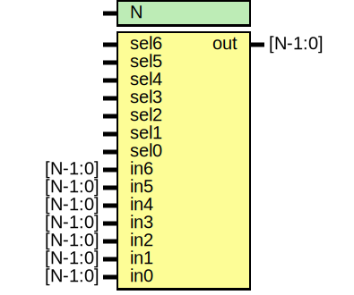

# Entity: oh_mux7

- **File**: oh_mux7.v
## Diagram

## Description

#############################################################################
# Function: 7:1 one hot mux                                                 #
#############################################################################
# Author:   Andreas Olofsson                                                #
# License:  MIT (see LICENSE file in OH! repository)                        #
#############################################################################

## Generics

| Generic name | Type | Value | Description    |
| ------------ | ---- | ----- | -------------- |
| N            |      | 1     |  width of mux  |
## Ports

| Port name | Direction | Type    | Description          |
| --------- | --------- | ------- | -------------------- |
| sel6      | input     |         |                      |
| sel5      | input     |         |                      |
| sel4      | input     |         |                      |
| sel3      | input     |         |                      |
| sel2      | input     |         |                      |
| sel1      | input     |         |                      |
| sel0      | input     |         |                      |
| in6       | input     | [N-1:0] |                      |
| in5       | input     | [N-1:0] |                      |
| in4       | input     | [N-1:0] |                      |
| in3       | input     | [N-1:0] |                      |
| in2       | input     | [N-1:0] |                      |
| in1       | input     | [N-1:0] |                      |
| in0       | input     | [N-1:0] |                      |
| out       | output    | [N-1:0] | selected data output |
