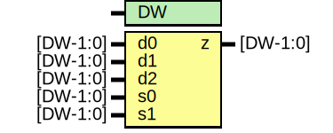

# Entity: oh_mx3

- **File**: oh_mx3.v
## Diagram

## Description

#############################################################################
# Function: 3-Input Mux                                                     #
#                                                                           #
# Copyright: OH Project Authors. ALl rights Reserved.                       #
# License:  MIT (see LICENSE file in OH repository)                         # 
#############################################################################

## Generics

| Generic name | Type | Value | Description   |
| ------------ | ---- | ----- | ------------- |
| DW           |      | 1     |  array width  |
## Ports

| Port name | Direction | Type     | Description |
| --------- | --------- | -------- | ----------- |
| d0        | input     | [DW-1:0] |             |
| d1        | input     | [DW-1:0] |             |
| d2        | input     | [DW-1:0] |             |
| s0        | input     | [DW-1:0] |             |
| s1        | input     | [DW-1:0] |             |
| z         | output    | [DW-1:0] |             |
