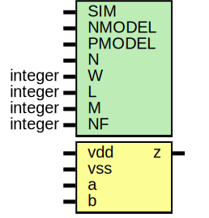

# Entity: oh_nand2

- **File**: oh_nand2.sv
## Diagram

## Description

#############################################################################
# Function: 2 Input Nand Gate                                               #
# Copyright: OH Project Authors. ALl rights Reserved.                       #
# License:  MIT (see LICENSE file in OH repository)                         # 
#############################################################################

## Generics

| Generic name | Type    | Value     | Description |
| ------------ | ------- | --------- | ----------- |
| SIM          |         | "rtl"     |             |
| NMODEL       |         | "nmos"    |             |
| PMODEL       |         | "pmos"    |             |
| N            |         | 4         |             |
| W            | integer | undefined | nanometers  |
| L            | integer | undefined | nanometers  |
| M            | integer | undefined |             |
| NF           | integer | undefined |             |
## Ports

| Port name | Direction | Type | Description |
| --------- | --------- | ---- | ----------- |
| vdd       | input     |      |             |
| vss       | input     |      |             |
| a         | input     |      |             |
| b         | input     |      |             |
| z         | output    |      |             |
