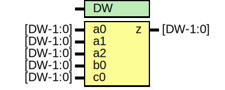

# Entity: oh_oa311

- **File**: oh_oa311.v
## Diagram

## Description

#############################################################################
# Function: Or-And (oa311) Gate                                             #
# Copyright: OH Project Authors. ALl rights Reserved.                       #
# License:  MIT (see LICENSE file in OH repository)                         # 
#############################################################################

## Generics

| Generic name | Type | Value | Description   |
| ------------ | ---- | ----- | ------------- |
| DW           |      | 1     |  array width  |
## Ports

| Port name | Direction | Type     | Description |
| --------- | --------- | -------- | ----------- |
| a0        | input     | [DW-1:0] |             |
| a1        | input     | [DW-1:0] |             |
| a2        | input     | [DW-1:0] |             |
| b0        | input     | [DW-1:0] |             |
| c0        | input     | [DW-1:0] |             |
| z         | output    | [DW-1:0] |             |
