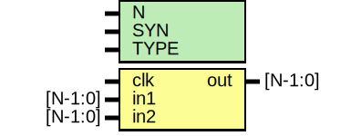

# Entity: oh_oddr

- **File**: oh_oddr.v
## Diagram

## Description

#############################################################################
# Function: Dual data rate output buffer                                    #
#############################################################################
# Author:   Andreas Olofsson                                                #
# License:  MIT (see LICENSE file in OH! repository)                        #
#############################################################################

## Generics

| Generic name | Type | Value     | Description              |
| ------------ | ---- | --------- | ------------------------ |
| N            |      | 1         |  vector width            |
| SYN          |      | "TRUE"    |  synthesizable (or not)  |
| TYPE         |      | "DEFAULT" |  scell type/size         |
## Ports

| Port name | Direction | Type    | Description   |
| --------- | --------- | ------- | ------------- |
| clk       | input     |         | clock input   |
| in1       | input     | [N-1:0] | negedge input |
| in2       | input     | [N-1:0] | posedge input |
| out       | output    | [N-1:0] | ddr output    |
