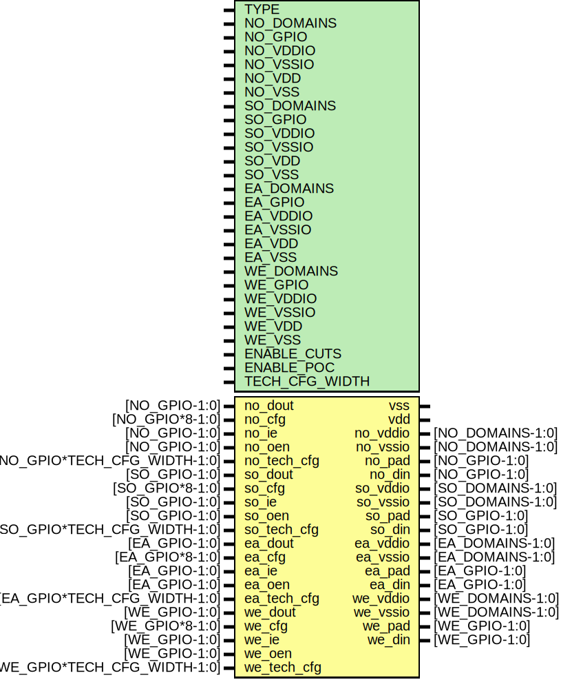

# Entity: oh_padring

- **File**: oh_padring.v
## Diagram

## Description

#############################################################################
# Function: Padring Generator                                               #
# Copyright: OH Project Authors. ALl rights Reserved.                       #
# License:  MIT (see LICENSE file in OH repository)                         #
#############################################################################

## Generics

| Generic name   | Type | Value  | Description               |
| -------------- | ---- | ------ | ------------------------- |
| TYPE           |      | "SOFT" |  asic cell type selector  |
| NO_DOMAINS     |      | 1      |  total domains            |
| NO_GPIO        |      | 8      |  total IO signal pads     |
| NO_VDDIO       |      | 8      |  total IO supply pads     |
| NO_VSSIO       |      | 8      |  total IO ground pads     |
| NO_VDD         |      | 8      |  total core supply pads   |
| NO_VSS         |      | 8      |  total core ground pads   |
| SO_DOMAINS     |      | 1      |  ...                      |
| SO_GPIO        |      | 8      |                           |
| SO_VDDIO       |      | 8      |                           |
| SO_VSSIO       |      | 8      |                           |
| SO_VDD         |      | 8      |                           |
| SO_VSS         |      | 8      |                           |
| EA_DOMAINS     |      | 1      |                           |
| EA_GPIO        |      | 8      |                           |
| EA_VDDIO       |      | 8      |                           |
| EA_VSSIO       |      | 8      |                           |
| EA_VDD         |      | 8      |                           |
| EA_VSS         |      | 8      |                           |
| WE_DOMAINS     |      | 1      |                           |
| WE_GPIO        |      | 8      |                           |
| WE_VDDIO       |      | 8      |                           |
| WE_VSSIO       |      | 8      |                           |
| WE_VDD         |      | 8      |                           |
| WE_VSS         |      | 8      |                           |
| ENABLE_CUTS    |      | 1      |                           |
| ENABLE_POC     |      | 1      |                           |
| TECH_CFG_WIDTH |      | 16     |                           |
## Ports

| Port name   | Direction | Type                         | Description         |
| ----------- | --------- | ---------------------------- | ------------------- |
| vss         | inout     |                              | CONTINUOUS GROUND   |
| vdd         | inout     |                              |                     |
| no_vddio    | inout     | [NO_DOMAINS-1:0]             | NORTH               |
| no_vssio    | inout     | [NO_DOMAINS-1:0]             |                     |
| no_pad      | inout     | [NO_GPIO-1:0]                | pad                 |
| no_din      | output    | [NO_GPIO-1:0]                | data from pad       |
| no_dout     | input     | [NO_GPIO-1:0]                | data to pad         |
| no_cfg      | input     | [NO_GPIO*8-1:0]              | config              |
| no_ie       | input     | [NO_GPIO-1:0]                | input enable        |
| no_oen      | input     | [NO_GPIO-1:0]                | output enable (bar) |
| no_tech_cfg | input     | [NO_GPIO*TECH_CFG_WIDTH-1:0] |                     |
| so_vddio    | inout     | [SO_DOMAINS-1:0]             | SOUTH               |
| so_vssio    | inout     | [SO_DOMAINS-1:0]             |                     |
| so_pad      | inout     | [SO_GPIO-1:0]                | pad                 |
| so_din      | output    | [SO_GPIO-1:0]                | data from pad       |
| so_dout     | input     | [SO_GPIO-1:0]                | data to pad         |
| so_cfg      | input     | [SO_GPIO*8-1:0]              | config              |
| so_ie       | input     | [SO_GPIO-1:0]                | input enable        |
| so_oen      | input     | [SO_GPIO-1:0]                | output enable (bar) |
| so_tech_cfg | input     | [SO_GPIO*TECH_CFG_WIDTH-1:0] |                     |
| ea_vddio    | inout     | [EA_DOMAINS-1:0]             | EAST                |
| ea_vssio    | inout     | [EA_DOMAINS-1:0]             |                     |
| ea_pad      | inout     | [EA_GPIO-1:0]                | pad                 |
| ea_din      | output    | [EA_GPIO-1:0]                | data from pad       |
| ea_dout     | input     | [EA_GPIO-1:0]                | data to pad         |
| ea_cfg      | input     | [EA_GPIO*8-1:0]              | config              |
| ea_ie       | input     | [EA_GPIO-1:0]                | input enable        |
| ea_oen      | input     | [EA_GPIO-1:0]                | output enable (bar) |
| ea_tech_cfg | input     | [EA_GPIO*TECH_CFG_WIDTH-1:0] |                     |
| we_vddio    | inout     | [WE_DOMAINS-1:0]             | WEST                |
| we_vssio    | inout     | [WE_DOMAINS-1:0]             |                     |
| we_pad      | inout     | [WE_GPIO-1:0]                | pad                 |
| we_din      | output    | [WE_GPIO-1:0]                | data from pad       |
| we_dout     | input     | [WE_GPIO-1:0]                | data to pad         |
| we_cfg      | input     | [WE_GPIO*8-1:0]              | config              |
| we_ie       | input     | [WE_GPIO-1:0]                | input enable        |
| we_oen      | input     | [WE_GPIO-1:0]                | output enable (bar) |
| we_tech_cfg | input     | [WE_GPIO*TECH_CFG_WIDTH-1:0] |                     |
## Signals

| Name   | Type                  | Description  |
| ------ | --------------------- | ------------ |
| no_poc | wire [NO_DOMAINS-1:0] | Local wires  |
| so_poc | wire [SO_DOMAINS-1:0] |              |
| we_poc | wire [WE_DOMAINS-1:0] |              |
| ea_poc | wire [EA_DOMAINS-1:0] |              |
