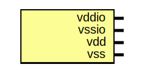

# Entity: oh_pads_corner

- **File**: oh_pads_corner.v
## Diagram

## Description

#############################################################################
# Function: Corner Pads                                                     #
# Copyright: OH Project Authors. ALl rights Reserved.                       #
# License:  MIT (see LICENSE file in OH repository)                         # 
#############################################################################

## Ports

| Port name | Direction | Type | Description   |
| --------- | --------- | ---- | ------------- |
| vddio     | inout     |      | io supply     |
| vssio     | inout     |      | io ground     |
| vdd       | inout     |      | core supply   |
| vss       | inout     |      | common ground |
## Instantiations

- i0: asic_iocorner
