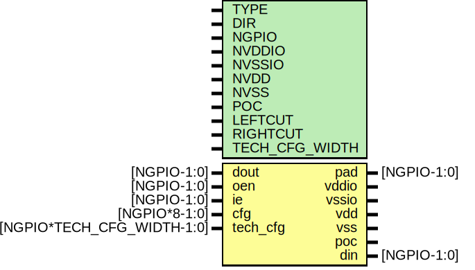

# Entity: oh_pads_domain

- **File**: oh_pads_domain.v
## Diagram

## Description

#############################################################################
# Function:  A Padring IO Domain                                            #
# Copyright: OH Project Authors. ALl rights Reserved.                       #
# License:   MIT (see LICENSE file in OH repository)                        # 
#############################################################################

## Generics

| Generic name   | Type | Value  | Description                                |
| -------------- | ---- | ------ | ------------------------------------------ |
| TYPE           |      | "SOFT" |  asic cell type selector                   |
| DIR            |      | "NO"   |  "NO", "SO", "EA", "WE"                    |
| NGPIO          |      | 8      |  total IO signal pads                      |
| NVDDIO         |      | 8      |  total IO supply pads                      |
| NVSSIO         |      | 8      |  total IO ground pads                      |
| NVDD           |      | 8      |  total core supply pads                    |
| NVSS           |      | 8      |  total core ground pads                    |
| POC            |      | 1      |  1 = place poc cell                        |
| LEFTCUT        |      | 1      |  1 = place cut on left (seen from center)  |
| RIGHTCUT       |      | 1      |  1 = place cut on right (seen from center  |
| TECH_CFG_WIDTH |      | 16     |                                            |
## Ports

| Port name | Direction | Type                       | Description                |
| --------- | --------- | -------------------------- | -------------------------- |
| pad       | inout     | [NGPIO-1:0]                | pad                        |
| vddio     | inout     |                            | io supply                  |
| vssio     | inout     |                            | io ground                  |
| vdd       | inout     |                            | core supply                |
| vss       | inout     |                            | common ground              |
| poc       | inout     |                            | power-on-ctrl              |
| dout      | input     | [NGPIO-1:0]                | data to drive to pad       |
| din       | output    | [NGPIO-1:0]                | data from pad              |
| oen       | input     | [NGPIO-1:0]                | output enable (bar)        |
| ie        | input     | [NGPIO-1:0]                | input enable               |
| cfg       | input     | [NGPIO*8-1:0]              | io config                  |
| tech_cfg  | input     | [NGPIO*TECH_CFG_WIDTH-1:0] | technology-specific config |
