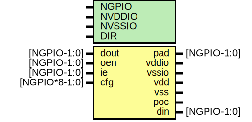

# Entity: oh_pads_gpio

- **File**: oh_pads_gpio.v
## Diagram

## Description

#############################################################################
# Function: GPIO Pads                                                       #
# Copyright: OH Project Authors. ALl rights Reserved.                       #
# License:  MIT (see LICENSE file in OH repository)                         # 
#############################################################################
#
#  IO BUFFER CONFIG
#  0    = pull_enable (1=enable)
#  1    = pull_select (1=pull up)
#  2    = slew limiter
#  3    = shmitt trigger enable
#  4    = ds[0]
#  5    = ds[1]
#  6    = ds[2]
#  7    = ds[3]
#
#############################################################################

## Generics

| Generic name | Type | Value | Description              |
| ------------ | ---- | ----- | ------------------------ |
| NGPIO        |      | 8     |  total IO signal pads    |
| NVDDIO       |      | 8     |  total IO supply pads    |
| NVSSIO       |      | 8     |  total IO ground pads    |
| DIR          |      | "NO"  |  "NO", "SO", "EA", "WE"  |
## Ports

| Port name | Direction | Type          | Description          |
| --------- | --------- | ------------- | -------------------- |
| pad       | inout     | [NGPIO-1:0]   | pad                  |
| vddio     | inout     |               | io supply            |
| vssio     | inout     |               | io ground            |
| vdd       | inout     |               | core supply          |
| vss       | inout     |               | common ground        |
| poc       | inout     |               | power-on-ctrl        |
| dout      | input     | [NGPIO-1:0]   | data to drive to pad |
| din       | output    | [NGPIO-1:0]   | data from pad        |
| oen       | input     | [NGPIO-1:0]   | output enable (bar)  |
| ie        | input     | [NGPIO-1:0]   | input enable         |
| cfg       | input     | [NGPIO*8-1:0] | io config            |
