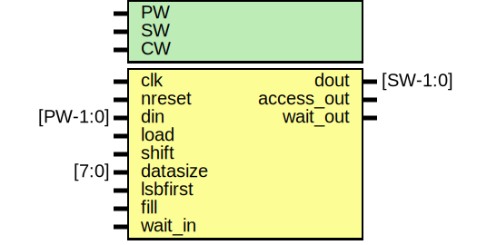

# Entity: oh_par2ser

- **File**: oh_par2ser.v
## Diagram

## Description

#############################################################################
# Function: Parallel to Serial Converter                                    #
#############################################################################
# Author:   Andreas Olofsson                                                #
# License:  MIT (see LICENSE in OH! repositpory)                            #
#############################################################################

## Generics

| Generic name | Type | Value         | Description             |
| ------------ | ---- | ------------- | ----------------------- |
| PW           |      | 32            |  parallel packet width  |
| SW           |      | 1             |  serial packet width    |
| CW           |      | $clog2(PW/SW) |  serialization factor   |
## Ports

| Port name  | Direction | Type     | Description                         |
| ---------- | --------- | -------- | ----------------------------------- |
| clk        | input     |          | sampling clock                      |
| nreset     | input     |          | async active low reset              |
| din        | input     | [PW-1:0] | parallel data                       |
| dout       | output    | [SW-1:0] | serial output data                  |
| access_out | output    |          | output data valid                   |
| load       | input     |          | load parallel data (priority)       |
| shift      | input     |          | shift data                          |
| datasize   | input     | [7:0]    | size of data to shift               |
| lsbfirst   | input     |          | lsb first order                     |
| fill       | input     |          | fill bit                            |
| wait_in    | input     |          | wait input                          |
| wait_out   | output    |          | wait output (wait in | serial wait) |
## Signals

| Name           | Type         | Description   |
| -------------- | ------------ | ------------- |
| shiftreg       | reg [PW-1:0] |  local wires  |
| count          | reg [CW-1:0] |               |
| start_transfer | wire         |               |
| busy           | wire         |               |
## Processes
- unnamed: ( @ (posedge clk or negedge nreset) )
  - **Type:** always
 **Description**
transfer counter 
- unnamed: ( @ (posedge clk or negedge nreset) )
  - **Type:** always
 **Description**
 shift register 
