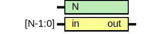

# Entity: oh_parity

- **File**: oh_parity.v
## Diagram

## Description

#############################################################################
# Function: Calculates parity value for                                     #
#############################################################################
# Author:   Andreas Olofsson                                                #
# License:  MIT (see LICENSE file in OH repository)                         #
#############################################################################

## Generics

| Generic name | Type | Value | Description  |
| ------------ | ---- | ----- | ------------ |
| N            |      | 2     |  data width  |
## Ports

| Port name | Direction | Type    | Description           |
| --------- | --------- | ------- | --------------------- |
| in        | input     | [N-1:0] | data input            |
| out       | output    |         | calculated parity bit |
