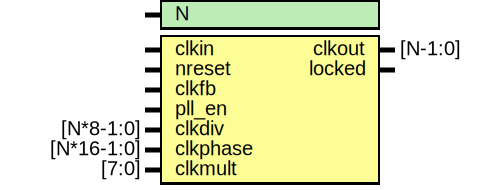

# Entity: oh_pll

- **File**: oh_pll.v
## Diagram

## Description

#############################################################################
# Function: Phase Locked Loop                                               #
#############################################################################
# Author:   Andreas Olofsson                                                #
# License:  MIT (see LICENSE file in OH! repository)                        # 
#############################################################################

## Generics

| Generic name | Type | Value | Description        |
| ------------ | ---- | ----- | ------------------ |
| N            |      | 8     |  number of clocks  |
## Ports

| Port name | Direction | Type       | Description                          |
| --------- | --------- | ---------- | ------------------------------------ |
| clkin     | input     |            | primary clock input                  |
| nreset    | input     |            | async active low reset               |
| clkfb     | input     |            | feedback clock                       |
| pll_en    | input     |            | enable pll                           |
| clkdiv    | input     | [N*8-1:0]  | clock divider settings (per clock)   |
| clkphase  | input     | [N*16-1:0] | clock phase setting (rise/fall edge) |
| clkmult   | input     | [7:0]      | feedback clock multiplier            |
| clkout    | output    | [N-1:0]    | output clocks                        |
| locked    | output    |            | PLL locked status                    |
