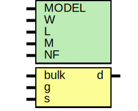

# Entity: oh_pmos

- **File**: oh_pmos.sv
## Diagram

## Generics

| Generic name | Type | Value  | Description |
| ------------ | ---- | ------ | ----------- |
| MODEL        |      | "pmos" |             |
| W            |      | "0"    |             |
| L            |      | "0"    |             |
| M            |      | "0"    |             |
| NF           |      | "0"    |             |
## Ports

| Port name | Direction | Type | Description |
| --------- | --------- | ---- | ----------- |
| bulk      | input     |      |             |
| g         | input     |      |             |
| s         | input     |      |             |
| d         | inout     |      |             |
