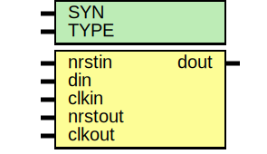

# Entity: oh_pulse2pulse

- **File**: oh_pulse2pulse.v
## Diagram

## Description

#############################################################################
# Function: Clock domain one cycle pulse transfer                           #
            !!"din" pulse width must be 2x greater than clkout width!!!     #
#############################################################################
# Author:   Andreas Olofsson                                                #
# License:  MIT (see LICENSE file in OH! repository)                        #
#############################################################################

## Generics

| Generic name | Type | Value     | Description          |
| ------------ | ---- | --------- | -------------------- |
| SYN          |      | "TRUE"    |  true=synthesizable  |
| TYPE         |      | "DEFAULT" |  scell type/size     |
## Ports

| Port name | Direction | Type | Description                    |
| --------- | --------- | ---- | ------------------------------ |
| nrstin    | input     |      | input domain reset             |
| din       | input     |      | input pulse (one clock cycle)  |
| clkin     | input     |      | input clock                    |
| nrstout   | input     |      | output domain reset            |
| clkout    | input     |      | output clock                   |
| dout      | output    |      | output pulse (one clock cycle) |
## Signals

| Name       | Type | Description   |
| ---------- | ---- | ------------- |
| toggle_reg | reg  |  local wires  |
| pulse_reg  | reg  |               |
| toggle     | wire |               |
## Processes
- unnamed: ( @ (posedge clkin) )
  - **Type:** always
- unnamed: ( @ (posedge clkout) )
  - **Type:** always
 **Description**
toogle to pulse 
## Instantiations

- sync: oh_dsync
 **Description**
metastability synchronizer

