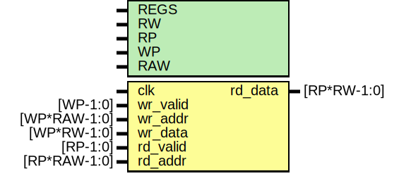

# Entity: oh_regfile

- **File**: oh_regfile.v
## Diagram

## Description

#############################################################################
# Function: Parametrized register file                                      #
#############################################################################
# Author:   Andreas Olofsson                                                #
# License:  MIT (see LICENSE file in OH! repository)                        #
#############################################################################

## Generics

| Generic name | Type | Value        | Description               |
| ------------ | ---- | ------------ | ------------------------- |
| REGS         |      | 8            |  number of registeres     |
| RW           |      | 16           |  register width           |
| RP           |      | 5            |  read ports               |
| WP           |      | 3            |  write prots              |
| RAW          |      | $clog2(REGS) |  (derived) rf addr width  |
## Ports

| Port name | Direction | Type         | Description      |
| --------- | --------- | ------------ | ---------------- |
| clk       | input     |              | Control inputs   |
| wr_valid  | input     | [WP-1:0]     | write access     |
| wr_addr   | input     | [WP*RAW-1:0] | register address |
| wr_data   | input     | [WP*RW-1:0]  | write data       |
| rd_valid  | input     | [RP-1:0]     | read access      |
| rd_addr   | input     | [RP*RAW-1:0] | register address |
| rd_data   | output    | [RP*RW-1:0]  | output data      |
## Signals

| Name     | Type          | Description |
| -------- | ------------- | ----------- |
| mem      | reg [RW-1:0]  |             |
| write_en | wire [WP-1:0] |             |
| datamux  | wire [RW-1:0] |             |
