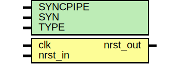

# Entity: oh_rsync

- **File**: oh_rsync.v
## Diagram

## Description

#############################################################################
# Function: Reset synchronizer (async assert, sync deassert)                #
#############################################################################
# Author:   Andreas Olofsson                                                #
# License:  MIT (see LICENSE file in OH! repository)                        #
#############################################################################

## Generics

| Generic name | Type | Value     | Description             |
| ------------ | ---- | --------- | ----------------------- |
| SYNCPIPE     |      | 2         |  number of sync stages  |
| SYN          |      | "TRUE"    |  true=synthesizable     |
| TYPE         |      | "DEFAULT" |  scell type/size        |
## Ports

| Port name | Direction | Type | Description |
| --------- | --------- | ---- | ----------- |
| clk       | input     |      |             |
| nrst_in   | input     |      |             |
| nrst_out  | output    |      |             |
