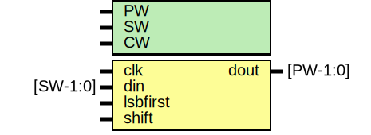

# Entity: oh_ser2par

- **File**: oh_ser2par.v
## Diagram

## Description

#############################################################################
# Purpose: Serial to Parallel Converter                                     #
#############################################################################
# Author:   Andreas Olofsson                                                #
# License:  MIT (see LICENSE file in OH! repository)                        # 
#############################################################################

## Generics

| Generic name | Type | Value         | Description                          |
| ------------ | ---- | ------------- | ------------------------------------ |
| PW           |      | 64            |  parallel packet width               |
| SW           |      | 1             |  serial packet width                 |
| CW           |      | $clog2(PW/SW) |  serialization factor (for counter)  |
## Ports

| Port name | Direction | Type     | Description       |
| --------- | --------- | -------- | ----------------- |
| clk       | input     |          | sampling clock    |
| din       | input     | [SW-1:0] | serial data       |
| dout      | output    | [PW-1:0] | parallel data     |
| lsbfirst  | input     |          | lsb first order   |
| shift     | input     |          | shift the shifter |
## Signals

| Name      | Type          | Description |
| --------- | ------------- | ----------- |
| count     | reg [CW-1:0]  |             |
| shiftdata | wire [PW-1:0] |             |
## Processes
- unnamed: ( @ (posedge clk) )
  - **Type:** always
