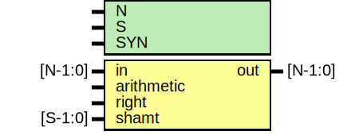

# Entity: oh_shift

- **File**: oh_shift.v
## Diagram

## Description

#############################################################################
# Function: Barrel shifter                                                  #
#############################################################################
# Author:   Andreas Olofsson                                                #
# License:  MIT (see LICENSE file in OH! repository)                        #
#############################################################################

## Generics

| Generic name | Type | Value     | Description                       |
| ------------ | ---- | --------- | --------------------------------- |
| N            |      | 32        |  Operator width (8,16,32,64,128)  |
| S            |      | $clog2(N) |  stages=shift width               |
| SYN          |      | "TRUE"    |  TRUE is synthesizable            |
## Ports

| Port name  | Direction | Type    | Description                         |
| ---------- | --------- | ------- | ----------------------------------- |
| in         | input     | [N-1:0] | data to be shifted                  |
| arithmetic | input     |         | shifts in in[N-1] instead of 0      |
| right      | input     |         | shift right (default is left shift) |
| shamt      | input     | [S-1:0] | shift amount (unsigned)             |
| out        | output    | [N-1:0] | shifted output                      |
