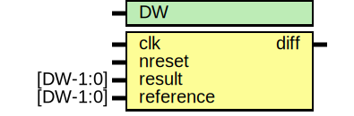

# Entity: oh_simchecker

- **File**: oh_simchecker.v
## Diagram

## Generics

| Generic name | Type | Value | Description      |
| ------------ | ---- | ----- | ---------------- |
| DW           |      | 32    |  Datapath width  |
## Ports

| Port name | Direction | Type     | Description      |
| --------- | --------- | -------- | ---------------- |
| clk       | input     |          | Inputs           |
| nreset    | input     |          |                  |
| result    | input     | [DW-1:0] | result to check  |
| reference | input     | [DW-1:0] | reference result |
| diff      | output    |          | fail indicator   |
## Processes
- unnamed: ( @ (negedge clk or negedge nreset) )
  - **Type:** always
