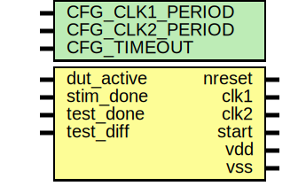

# Entity: oh_simctrl

- **File**: oh_simctrl.v
## Diagram

## Description

 verilator lint_off STMTDLY */

## Generics

| Generic name    | Type | Value | Description |
| --------------- | ---- | ----- | ----------- |
| CFG_CLK1_PERIOD |      | 10    |             |
| CFG_CLK2_PERIOD |      | 20    |             |
| CFG_TIMEOUT     |      | 500   |             |
## Ports

| Port name  | Direction | Type | Description                    |
| ---------- | --------- | ---- | ------------------------------ |
| nreset     | output    |      | async active low reset         |
| clk1       | output    |      | main clock                     |
| clk2       | output    |      | secondary clock                |
| start      | output    |      | start test (level)             |
| vdd        | output    |      | driving vdd                    |
| vss        | output    |      | driving vss                    |
| dut_active | input     |      | dut  reset sequence is done    |
| stim_done  | input     |      | stimulus is done               |
| test_done  | input     |      | test is done                   |
| test_diff  | input     |      | diff between dut and reference |
## Signals

| Name       | Type         | Description          |
| ---------- | ------------ | -------------------- |
| vdd        | reg          | signal declarations  |
| vss        | reg          |                      |
| nreset     | reg          |                      |
| start      | reg          |                      |
| clk1       | reg          |                      |
| clk2       | reg          |                      |
| clk1_phase | reg [6:0]    |                      |
| clk2_phase | reg [6:0]    |                      |
| test_fail  | reg          |                      |
| seed       | integer      |                      |
| r          | integer      |                      |
| testname   | reg [1023:0] |                      |
## Constants

| Name           | Type | Value             | Description |
| -------------- | ---- | ----------------- | ----------- |
| CFG_CLK1_PHASE |      | CFG_CLK1_PERIOD/2 |             |
| CFG_CLK2_PHASE |      | CFG_CLK2_PERIOD/2 |             |
## Processes
- unnamed: (  )
  - **Type:** always
 **Description**
################################# CLK GENERATORS ################################# 
- unnamed: (  )
  - **Type:** always
- unnamed: ( @ (posedge clk1 or negedge nreset) )
  - **Type:** always
 **Description**
################################# SYNCHRONOUS STIMULUS ################################# START TEST 
- unnamed: ( @ (posedge clk1 or negedge nreset) )
  - **Type:** always
 **Description**
STOP SIMULATION ON END 
