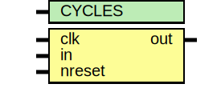

# Entity: oh_stretcher

- **File**: oh_stretcher.v
## Diagram

## Description

#############################################################################
# Purpose: Stretches a pulse by N+1 clock cycles                            #
#          Adds one cycle latency                                           #
#############################################################################
# Author:   Andreas Olofsson                                                #
# License:  MIT (see LICENSE file in OH! repository)                        #
#############################################################################

## Generics

| Generic name | Type | Value | Description       |
| ------------ | ---- | ----- | ----------------- |
| CYCLES       |      | 5     |  "wakeup" cycles  |
## Ports

| Port name | Direction | Type | Description            |
| --------- | --------- | ---- | ---------------------- |
| clk       | input     |      | clock                  |
| in        | input     |      | input pulse            |
| nreset    | input     |      | async active low reset |
| out       | output    |      | stretched output pulse |
## Signals

| Name  | Type             | Description |
| ----- | ---------------- | ----------- |
| valid | reg [CYCLES-1:0] |             |
## Processes
- unnamed: ( @ (posedge clk or negedge nreset) )
  - **Type:** always
