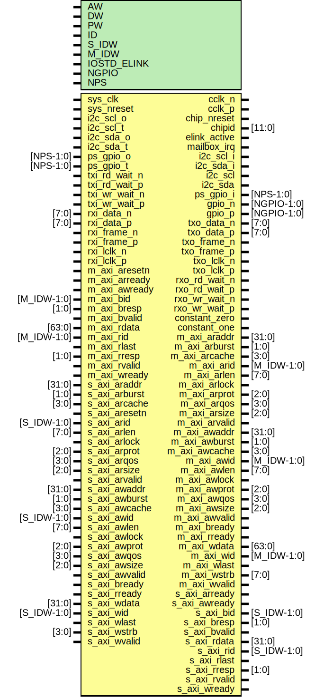

# Entity: parallella_base

- **File**: parallella_base.v
## Diagram

## Generics

| Generic name | Type | Value     | Description           |
| ------------ | ---- | --------- | --------------------- |
| AW           |      | 32        |                       |
| DW           |      | 32        |                       |
| PW           |      | 104       | packet width          |
| ID           |      | 12'h810   |                       |
| S_IDW        |      | 12        | ID width for S_AXI    |
| M_IDW        |      | 6         | ID width for M_AXI    |
| IOSTD_ELINK  |      | "LVDS_25" |                       |
| NGPIO        |      | 24        |                       |
| NPS          |      | 64        | Number of PS signals  |
## Ports

| Port name     | Direction | Type        | Description                   |
| ------------- | --------- | ----------- | ----------------------------- |
| sys_clk       | input     |             | RESET+CLK                     |
| sys_nreset    | input     |             |                               |
| cclk_n        | output    |             | MISC                          |
| cclk_p        | output    |             |                               |
| chip_nreset   | output    |             |                               |
| chipid        | output    | [11:0]      |                               |
| elink_active  | output    |             |                               |
| mailbox_irq   | output    |             |                               |
| i2c_scl_i     | output    |             | I2C                           |
| i2c_sda_i     | output    |             |                               |
| i2c_scl_o     | input     |             |                               |
| i2c_scl_t     | input     |             |                               |
| i2c_sda_o     | input     |             |                               |
| i2c_sda_t     | input     |             |                               |
| i2c_scl       | inout     |             |                               |
| i2c_sda       | inout     |             |                               |
| ps_gpio_o     | input     | [NPS-1:0]   | GPIO                          |
| ps_gpio_t     | input     | [NPS-1:0]   |                               |
| ps_gpio_i     | output    | [NPS-1:0]   |                               |
| gpio_n        | inout     | [NGPIO-1:0] |                               |
| gpio_p        | inout     | [NGPIO-1:0] |                               |
| txo_data_n    | output    | [7:0]       | TX                            |
| txo_data_p    | output    | [7:0]       |                               |
| txo_frame_n   | output    |             |                               |
| txo_frame_p   | output    |             |                               |
| txo_lclk_n    | output    |             |                               |
| txo_lclk_p    | output    |             |                               |
| txi_rd_wait_n | input     |             |                               |
| txi_rd_wait_p | input     |             |                               |
| txi_wr_wait_n | input     |             |                               |
| txi_wr_wait_p | input     |             |                               |
| rxi_data_n    | input     | [7:0]       | RX                            |
| rxi_data_p    | input     | [7:0]       |                               |
| rxi_frame_n   | input     |             |                               |
| rxi_frame_p   | input     |             |                               |
| rxi_lclk_n    | input     |             |                               |
| rxi_lclk_p    | input     |             |                               |
| rxo_rd_wait_n | output    |             |                               |
| rxo_rd_wait_p | output    |             |                               |
| rxo_wr_wait_n | output    |             |                               |
| rxo_wr_wait_p | output    |             |                               |
| constant_zero | output    |             |                               |
| constant_one  | output    |             |                               |
| m_axi_araddr  | output    | [31:0]      | From axi_elink of axi_elink.v |
| m_axi_arburst | output    | [1:0]       | From axi_elink of axi_elink.v |
| m_axi_arcache | output    | [3:0]       | From axi_elink of axi_elink.v |
| m_axi_arid    | output    | [M_IDW-1:0] | From axi_elink of axi_elink.v |
| m_axi_arlen   | output    | [7:0]       | From axi_elink of axi_elink.v |
| m_axi_arlock  | output    |             | From axi_elink of axi_elink.v |
| m_axi_arprot  | output    | [2:0]       | From axi_elink of axi_elink.v |
| m_axi_arqos   | output    | [3:0]       | From axi_elink of axi_elink.v |
| m_axi_arsize  | output    | [2:0]       | From axi_elink of axi_elink.v |
| m_axi_arvalid | output    |             | From axi_elink of axi_elink.v |
| m_axi_awaddr  | output    | [31:0]      | From axi_elink of axi_elink.v |
| m_axi_awburst | output    | [1:0]       | From axi_elink of axi_elink.v |
| m_axi_awcache | output    | [3:0]       | From axi_elink of axi_elink.v |
| m_axi_awid    | output    | [M_IDW-1:0] | From axi_elink of axi_elink.v |
| m_axi_awlen   | output    | [7:0]       | From axi_elink of axi_elink.v |
| m_axi_awlock  | output    |             | From axi_elink of axi_elink.v |
| m_axi_awprot  | output    | [2:0]       | From axi_elink of axi_elink.v |
| m_axi_awqos   | output    | [3:0]       | From axi_elink of axi_elink.v |
| m_axi_awsize  | output    | [2:0]       | From axi_elink of axi_elink.v |
| m_axi_awvalid | output    |             | From axi_elink of axi_elink.v |
| m_axi_bready  | output    |             | From axi_elink of axi_elink.v |
| m_axi_rready  | output    |             | From axi_elink of axi_elink.v |
| m_axi_wdata   | output    | [63:0]      | From axi_elink of axi_elink.v |
| m_axi_wid     | output    | [M_IDW-1:0] | From axi_elink of axi_elink.v |
| m_axi_wlast   | output    |             | From axi_elink of axi_elink.v |
| m_axi_wstrb   | output    | [7:0]       | From axi_elink of axi_elink.v |
| m_axi_wvalid  | output    |             | From axi_elink of axi_elink.v |
| s_axi_arready | output    |             | From axi_elink of axi_elink.v |
| s_axi_awready | output    |             | From axi_elink of axi_elink.v |
| s_axi_bid     | output    | [S_IDW-1:0] | From axi_elink of axi_elink.v |
| s_axi_bresp   | output    | [1:0]       | From axi_elink of axi_elink.v |
| s_axi_bvalid  | output    |             | From axi_elink of axi_elink.v |
| s_axi_rdata   | output    | [31:0]      | From axi_elink of axi_elink.v |
| s_axi_rid     | output    | [S_IDW-1:0] | From axi_elink of axi_elink.v |
| s_axi_rlast   | output    |             | From axi_elink of axi_elink.v |
| s_axi_rresp   | output    | [1:0]       | From axi_elink of axi_elink.v |
| s_axi_rvalid  | output    |             | From axi_elink of axi_elink.v |
| s_axi_wready  | output    |             | From axi_elink of axi_elink.v |
| m_axi_aresetn | input     |             | To axi_elink of axi_elink.v   |
| m_axi_arready | input     |             | To axi_elink of axi_elink.v   |
| m_axi_awready | input     |             | To axi_elink of axi_elink.v   |
| m_axi_bid     | input     | [M_IDW-1:0] | To axi_elink of axi_elink.v   |
| m_axi_bresp   | input     | [1:0]       | To axi_elink of axi_elink.v   |
| m_axi_bvalid  | input     |             | To axi_elink of axi_elink.v   |
| m_axi_rdata   | input     | [63:0]      | To axi_elink of axi_elink.v   |
| m_axi_rid     | input     | [M_IDW-1:0] | To axi_elink of axi_elink.v   |
| m_axi_rlast   | input     |             | To axi_elink of axi_elink.v   |
| m_axi_rresp   | input     | [1:0]       | To axi_elink of axi_elink.v   |
| m_axi_rvalid  | input     |             | To axi_elink of axi_elink.v   |
| m_axi_wready  | input     |             | To axi_elink of axi_elink.v   |
| s_axi_araddr  | input     | [31:0]      | To axi_elink of axi_elink.v   |
| s_axi_arburst | input     | [1:0]       | To axi_elink of axi_elink.v   |
| s_axi_arcache | input     | [3:0]       | To axi_elink of axi_elink.v   |
| s_axi_aresetn | input     |             | To axi_elink of axi_elink.v   |
| s_axi_arid    | input     | [S_IDW-1:0] | To axi_elink of axi_elink.v   |
| s_axi_arlen   | input     | [7:0]       | To axi_elink of axi_elink.v   |
| s_axi_arlock  | input     |             | To axi_elink of axi_elink.v   |
| s_axi_arprot  | input     | [2:0]       | To axi_elink of axi_elink.v   |
| s_axi_arqos   | input     | [3:0]       | To axi_elink of axi_elink.v   |
| s_axi_arsize  | input     | [2:0]       | To axi_elink of axi_elink.v   |
| s_axi_arvalid | input     |             | To axi_elink of axi_elink.v   |
| s_axi_awaddr  | input     | [31:0]      | To axi_elink of axi_elink.v   |
| s_axi_awburst | input     | [1:0]       | To axi_elink of axi_elink.v   |
| s_axi_awcache | input     | [3:0]       | To axi_elink of axi_elink.v   |
| s_axi_awid    | input     | [S_IDW-1:0] | To axi_elink of axi_elink.v   |
| s_axi_awlen   | input     | [7:0]       | To axi_elink of axi_elink.v   |
| s_axi_awlock  | input     |             | To axi_elink of axi_elink.v   |
| s_axi_awprot  | input     | [2:0]       | To axi_elink of axi_elink.v   |
| s_axi_awqos   | input     | [3:0]       | To axi_elink of axi_elink.v   |
| s_axi_awsize  | input     | [2:0]       | To axi_elink of axi_elink.v   |
| s_axi_awvalid | input     |             | To axi_elink of axi_elink.v   |
| s_axi_bready  | input     |             | To axi_elink of axi_elink.v   |
| s_axi_rready  | input     |             | To axi_elink of axi_elink.v   |
| s_axi_wdata   | input     | [31:0]      | To axi_elink of axi_elink.v   |
| s_axi_wid     | input     | [S_IDW-1:0] | To axi_elink of axi_elink.v   |
| s_axi_wlast   | input     |             | To axi_elink of axi_elink.v   |
| s_axi_wstrb   | input     | [3:0]       | To axi_elink of axi_elink.v   |
| s_axi_wvalid  | input     |             | To axi_elink of axi_elink.v   |
## Instantiations

- pi2c: pi2c
 **Description**
AUTOINST*/

