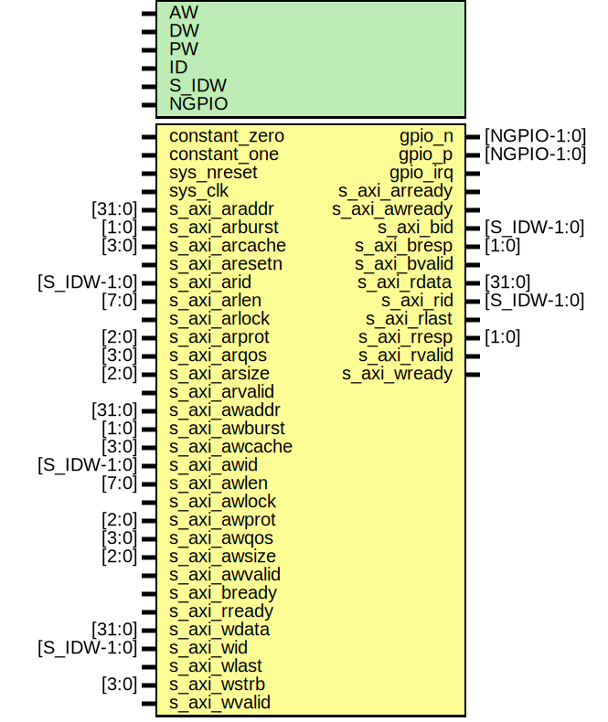

# Entity: parallella_gpio

- **File**: parallella_gpio.v
## Diagram

## Description

#############################################################################
# Purpose: Parallella GPIO top                                              #
#############################################################################
# Author:   Ola Jeppsson                                                    #
# SPDX-License-Identifier:     MIT                                          #
#############################################################################

## Generics

| Generic name | Type | Value   | Description           |
| ------------ | ---- | ------- | --------------------- |
| AW           |      | 32      |  address width        |
| DW           |      | 32      |                       |
| PW           |      | 2*AW+40 |  packet width         |
| ID           |      | 12'h7ff |  addr[31:20] id       |
| S_IDW        |      | 12      |  ID width for S_AXI   |
| NGPIO        |      | 24      |  number of gpio pins  |
## Ports

| Port name     | Direction | Type        | Description                 |
| ------------- | --------- | ----------- | --------------------------- |
| constant_zero | input     |             | Always 0                    |
| constant_one  | input     |             | Always 1                    |
| sys_nreset    | input     |             | active low async reset      |
| sys_clk       | input     |             | system clock for AXI        |
| gpio_n        | inout     | [NGPIO-1:0] | physical gpio pins          |
| gpio_p        | inout     | [NGPIO-1:0] | physical gpio pins          |
| s_axi_araddr  | input     | [31:0]      | To axi_gpio of axi_gpio.v   |
| s_axi_arburst | input     | [1:0]       | To axi_gpio of axi_gpio.v   |
| s_axi_arcache | input     | [3:0]       | To axi_gpio of axi_gpio.v   |
| s_axi_aresetn | input     |             | To axi_gpio of axi_gpio.v   |
| s_axi_arid    | input     | [S_IDW-1:0] | To axi_gpio of axi_gpio.v   |
| s_axi_arlen   | input     | [7:0]       | To axi_gpio of axi_gpio.v   |
| s_axi_arlock  | input     |             | To axi_gpio of axi_gpio.v   |
| s_axi_arprot  | input     | [2:0]       | To axi_gpio of axi_gpio.v   |
| s_axi_arqos   | input     | [3:0]       | To axi_gpio of axi_gpio.v   |
| s_axi_arsize  | input     | [2:0]       | To axi_gpio of axi_gpio.v   |
| s_axi_arvalid | input     |             | To axi_gpio of axi_gpio.v   |
| s_axi_awaddr  | input     | [31:0]      | To axi_gpio of axi_gpio.v   |
| s_axi_awburst | input     | [1:0]       | To axi_gpio of axi_gpio.v   |
| s_axi_awcache | input     | [3:0]       | To axi_gpio of axi_gpio.v   |
| s_axi_awid    | input     | [S_IDW-1:0] | To axi_gpio of axi_gpio.v   |
| s_axi_awlen   | input     | [7:0]       | To axi_gpio of axi_gpio.v   |
| s_axi_awlock  | input     |             | To axi_gpio of axi_gpio.v   |
| s_axi_awprot  | input     | [2:0]       | To axi_gpio of axi_gpio.v   |
| s_axi_awqos   | input     | [3:0]       | To axi_gpio of axi_gpio.v   |
| s_axi_awsize  | input     | [2:0]       | To axi_gpio of axi_gpio.v   |
| s_axi_awvalid | input     |             | To axi_gpio of axi_gpio.v   |
| s_axi_bready  | input     |             | To axi_gpio of axi_gpio.v   |
| s_axi_rready  | input     |             | To axi_gpio of axi_gpio.v   |
| s_axi_wdata   | input     | [31:0]      | To axi_gpio of axi_gpio.v   |
| s_axi_wid     | input     | [S_IDW-1:0] | To axi_gpio of axi_gpio.v   |
| s_axi_wlast   | input     |             | To axi_gpio of axi_gpio.v   |
| s_axi_wstrb   | input     | [3:0]       | To axi_gpio of axi_gpio.v   |
| s_axi_wvalid  | input     |             | To axi_gpio of axi_gpio.v   |
| gpio_irq      | output    |             | From axi_gpio of axi_gpio.v |
| s_axi_arready | output    |             | From axi_gpio of axi_gpio.v |
| s_axi_awready | output    |             | From axi_gpio of axi_gpio.v |
| s_axi_bid     | output    | [S_IDW-1:0] | From axi_gpio of axi_gpio.v |
| s_axi_bresp   | output    | [1:0]       | From axi_gpio of axi_gpio.v |
| s_axi_bvalid  | output    |             | From axi_gpio of axi_gpio.v |
| s_axi_rdata   | output    | [31:0]      | From axi_gpio of axi_gpio.v |
| s_axi_rid     | output    | [S_IDW-1:0] | From axi_gpio of axi_gpio.v |
| s_axi_rlast   | output    |             | From axi_gpio of axi_gpio.v |
| s_axi_rresp   | output    | [1:0]       | From axi_gpio of axi_gpio.v |
| s_axi_rvalid  | output    |             | From axi_gpio of axi_gpio.v |
| s_axi_wready  | output    |             | From axi_gpio of axi_gpio.v |
## Signals

| Name      | Type             | Description          |
| --------- | ---------------- | -------------------- |
| gpio_in   | wire [NGPIO-1:0] | oh gpio in           |
| gpio_out  | wire [NGPIO-1:0] | oh gpio out          |
| gpio_dir  | wire [NGPIO-1:0] | oh gpio direction    |
| pgpio_in  | wire [NGPIO-1:0] | parallella gpio in   |
| pgpio_out | wire [NGPIO-1:0] | parallella gpio out  |
