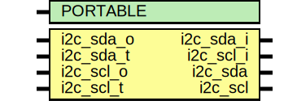

# Entity: pi2c

- **File**: pi2c.v
## Diagram

## Generics

| Generic name | Type | Value | Description |
| ------------ | ---- | ----- | ----------- |
| PORTABLE     |      | 0     |             |
## Ports

| Port name | Direction | Type | Description |
| --------- | --------- | ---- | ----------- |
| i2c_sda_o | input     |      |             |
| i2c_sda_t | input     |      |             |
| i2c_sda_i | output    |      |             |
| i2c_scl_o | input     |      |             |
| i2c_scl_t | input     |      |             |
| i2c_scl_i | output    |      |             |
| i2c_sda   | inout     |      |             |
| i2c_scl   | inout     |      |             |
