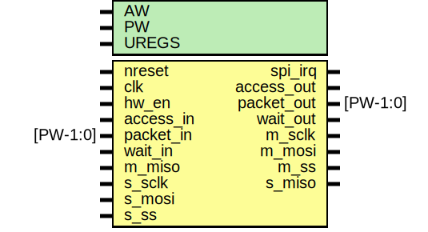

# Entity: spi

- **File**: spi.v
## Diagram

## Description

#############################################################################
# Purpose: SPI top (configurable as master or slave)                        #
#############################################################################
# Author:   Andreas Olofsson                                                #
# License:  MIT (see LICENSE file in OH! repository)                        # 
#############################################################################

## Generics

| Generic name | Type | Value | Description                 |
| ------------ | ---- | ----- | --------------------------- |
| AW           |      | 32    |  address width              |
| PW           |      | 104   |  packet size                |
| UREGS        |      | 13    |  number of user slave regs  |
## Ports

| Port name  | Direction | Type     | Description             |
| ---------- | --------- | -------- | ----------------------- |
| nreset     | input     |          | asynch active low reset |
| clk        | input     |          | core clock              |
| hw_en      | input     |          | block enable pin        |
| spi_irq    | output    |          | interrupt output        |
| access_in  | input     |          | access from core        |
| packet_in  | input     | [PW-1:0] | packet from core        |
| wait_in    | input     |          | pushback from io        |
| access_out | output    |          | access to core          |
| packet_out | output    | [PW-1:0] | packet to core          |
| wait_out   | output    |          | pushback from core      |
| m_sclk     | output    |          | master clock            |
| m_mosi     | output    |          | master output           |
| m_ss       | output    |          | slave select            |
| m_miso     | input     |          | master input            |
| s_sclk     | input     |          | slave clock             |
| s_mosi     | input     |          | slave input             |
| s_ss       | input     |          | slave select            |
| s_miso     | output    |          | slave output            |
## Signals

| Name         | Type          | Description                      |
| ------------ | ------------- | -------------------------------- |
| m_access_out | wire          | From spi_master of spi_master.v  |
| m_packet_out | wire [PW-1:0] | From spi_master of spi_master.v  |
| m_wait_out   | wire          | From spi_master of spi_master.v  |
| s_access_out | wire          | From spi_slave of spi_slave.v    |
| s_packet_out | wire [PW-1:0] | From spi_slave of spi_slave.v    |
| s_spi_regs   | wire [511:0]  | From spi_slave of spi_slave.v    |
| s_wait_out   | wire          | From spi_slave of spi_slave.v    |
