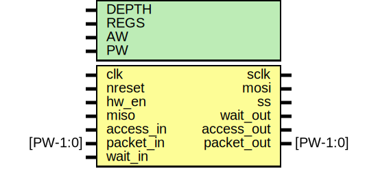

# Entity: spi_master

- **File**: spi_master.v
## Diagram

## Description

#############################################################################
# Purpose: SPI master                                                       #
#############################################################################
# Author:   Andreas Olofsson                                                #
# License:  MIT (see LICENSE file in OH! repository)                        # 
#############################################################################

## Generics

| Generic name | Type | Value | Description          |
| ------------ | ---- | ----- | -------------------- |
| DEPTH        |      | 32    |  fifo depth          |
| REGS         |      | 16    |  total # of regs     |
| AW           |      | 32    |  addresss width      |
| PW           |      | 104   |  packet width        |
## Ports

| Port name  | Direction | Type     | Description                |
| ---------- | --------- | -------- | -------------------------- |
| clk        | input     |          | core clock                 |
| nreset     | input     |          | async active low reset     |
| hw_en      | input     |          | hardware enable pin        |
| sclk       | output    |          | spi clock                  |
| mosi       | output    |          | slave input                |
| ss         | output    |          | slave select               |
| miso       | input     |          | slave output               |
| access_in  | input     |          | access from core           |
| packet_in  | input     | [PW-1:0] | data to core               |
| wait_out   | output    |          | pushback from spi register |
| access_out | output    |          | readback access            |
| packet_out | output    | [PW-1:0] | packet from spi register   |
| wait_in    | input     |          | pushback by core           |
## Signals

| Name           | Type        | Description                                |
| -------------- | ----------- | ------------------------------------------ |
| clkdiv_reg     | wire [7:0]  | From spi_master_regs of spi_master_regs.v  |
| cpha           | wire        | From spi_master_regs of spi_master_regs.v  |
| cpol           | wire        | From spi_master_regs of spi_master_regs.v  |
| fifo_dout      | wire [7:0]  | From spi_master_fifo of spi_master_fifo.v  |
| fifo_empty     | wire        | From spi_master_fifo of spi_master_fifo.v  |
| fifo_prog_full | wire        | From spi_master_fifo of spi_master_fifo.v  |
| fifo_read      | wire        | From spi_master_io of spi_master_io.v      |
| fifo_wait      | wire        | From spi_master_fifo of spi_master_fifo.v  |
| lsbfirst       | wire        | From spi_master_regs of spi_master_regs.v  |
| manual_mode    | wire        | From spi_master_regs of spi_master_regs.v  |
| rx_access      | wire        | From spi_master_io of spi_master_io.v      |
| rx_data        | wire [63:0] | From spi_master_io of spi_master_io.v      |
| send_data      | wire        | From spi_master_regs of spi_master_regs.v  |
| spi_en         | wire        | From spi_master_regs of spi_master_regs.v  |
| spi_state      | wire [2:0]  | From spi_master_io of spi_master_io.v      |
## Instantiations

- spi_master_io: spi_master_io
 **Description**
#####################################################
# SPI IO (8 bit)
#####################################################

