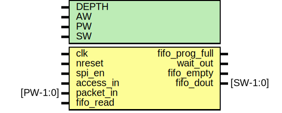

# Entity: spi_master_fifo

- **File**: spi_master_fifo.v
## Diagram

## Description

#############################################################################
# Purpose: SPI Master Transmit Fifo                                         #
#############################################################################
# Author:   Andreas Olofsson                                                #
# License:  MIT (see LICENSE file in OH! repository)                        # 
#############################################################################

## Generics

| Generic name | Type | Value | Description             |
| ------------ | ---- | ----- | ----------------------- |
| DEPTH        |      | 16    |  fifo entries           |
| AW           |      | 32    |  address width          |
| PW           |      | 104   |  input packet width     |
| SW           |      | 8     |  io packet width        |
## Ports

| Port name      | Direction | Type     | Description                    |
| -------------- | --------- | -------- | ------------------------------ |
| clk            | input     |          | clk                            |
| nreset         | input     |          | async active low reset         |
| spi_en         | input     |          | spi enable                     |
| fifo_prog_full | output    |          | fifo full indicator for status |
| access_in      | input     |          | access by core                 |
| packet_in      | input     | [PW-1:0] | packet from core               |
| wait_out       | output    |          | pushback to core               |
| fifo_read      | input     |          | pull a byte to IO              |
| fifo_empty     | output    |          | fifo is empty                  |
| fifo_dout      | output    | [SW-1:0] | byte for IO                    |
## Signals

| Name        | Type          | Description                                    |
| ----------- | ------------- | ---------------------------------------------- |
| datasize    | wire [7:0]    | ############### # LOCAL WIRES ###############  |
| tx_data     | wire [PW-1:0] |                                                |
| fifo_din    | wire [SW-1:0] |                                                |
| tx_write    | wire          |                                                |
| fifo_wait   | wire          |                                                |
| fifo_wr     | wire          |                                                |
| fifo_full   | wire          |                                                |
| ctrlmode_in | wire [4:0]    | From p2e of packet2emesh.v                     |
| data_in     | wire [AW-1:0] | From p2e of packet2emesh.v                     |
| datamode_in | wire [1:0]    | From p2e of packet2emesh.v                     |
| dstaddr_in  | wire [AW-1:0] | From p2e of packet2emesh.v                     |
| srcaddr_in  | wire [AW-1:0] | From p2e of packet2emesh.v                     |
| write_in    | wire          | From p2e of packet2emesh.v                     |
## Constants

| Name | Type | Value         | Description           |
| ---- | ---- | ------------- | --------------------- |
| FAW  |      | $clog2(DEPTH) | fifo address width    |
| SRW  |      | $clog2(PW/SW) | serialization factor  |
## Instantiations

- fifo: oh_fifo_sync
 **Description**
##################################
# FIFO
###################################

