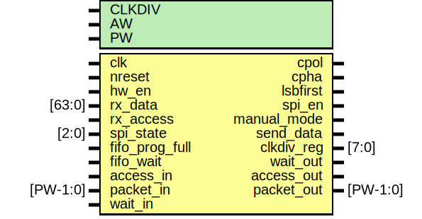

# Entity: spi_master_regs

- **File**: spi_master_regs.v
## Diagram

## Description

#############################################################################
# Purpose: SPI master Registers                                             #
#############################################################################
# Author:   Andreas Olofsson                                                #
# License:  MIT (see LICENSE file in OH! repository)                        # 
#############################################################################

## Generics

| Generic name | Type | Value | Description           |
| ------------ | ---- | ----- | --------------------- |
| CLKDIV       |      | 1     |  default clkdiv       |
| AW           |      | 32    |  addresss width       |
| PW           |      | 104   |  packet width         |
## Ports

| Port name      | Direction | Type     | Description                    |
| -------------- | --------- | -------- | ------------------------------ |
| clk            | input     |          | core clock                     |
| nreset         | input     |          | async active low reset         |
| hw_en          | input     |          | block enable                   |
| rx_data        | input     | [63:0]   | rx data                        |
| rx_access      | input     |          | rx access pulse                |
| cpol           | output    |          | clk polarity (default is 0)    |
| cpha           | output    |          | clk phase shift (default is 0) |
| lsbfirst       | output    |          | send lsbfirst                  |
| spi_en         | output    |          | enable transmitter             |
| manual_mode    | output    |          | sets manual ss control         |
| send_data      | output    |          | controls ss in manual ss mode  |
| clkdiv_reg     | output    | [7:0]    | baud rate setting              |
| spi_state      | input     | [2:0]    | transmit state                 |
| fifo_prog_full | input     |          | fifo reached half/full         |
| fifo_wait      | input     |          | tx transfer wait               |
| access_in      | input     |          | access from core               |
| packet_in      | input     | [PW-1:0] | data to core                   |
| wait_out       | output    |          | pushback from spi master       |
| access_out     | output    |          | writeback from spi             |
| packet_out     | output    | [PW-1:0] | writeback data from spi        |
| wait_in        | input     |          | pushback by core               |
## Signals

| Name         | Type          | Description                                    |
| ------------ | ------------- | ---------------------------------------------- |
| config_reg   | reg [7:0]     | ############### # LOCAL WIRES ###############  |
| status_reg   | reg [7:0]     |                                                |
| rx_reg       | reg [63:0]    |                                                |
| reg_rdata    | reg [AW-1:0]  |                                                |
| autotran     | reg           |                                                |
| dstaddr_out  | reg [AW-1:0]  |                                                |
| ctrlmode_out | reg [4:0]     |                                                |
| datamode_out | reg [1:0]     |                                                |
| reg_wdata    | wire [31:0]   |                                                |
| reg_write    | wire          |                                                |
| reg_read     | wire          |                                                |
| config_write | wire          |                                                |
| status_write | wire          |                                                |
| clkdiv_write | wire          |                                                |
| cmd_write    | wire          |                                                |
| tx_write     | wire          |                                                |
| irq_en       | wire          |                                                |
| wait_pulse   | wire          |                                                |
| i            | integer       |                                                |
| ctrlmode_in  | wire [4:0]    | From pe2 of packet2emesh.v                     |
| data_in      | wire [AW-1:0] | From pe2 of packet2emesh.v                     |
| datamode_in  | wire [1:0]    | From pe2 of packet2emesh.v                     |
| dstaddr_in   | wire [AW-1:0] | From pe2 of packet2emesh.v                     |
| srcaddr_in   | wire [AW-1:0] | From pe2 of packet2emesh.v                     |
| write_in     | wire          | From pe2 of packet2emesh.v                     |
## Processes
- unnamed: ( @ (posedge clk or negedge nreset) )
  - **Type:** always
 **Description**
#################################### # CONFIG #################################### 
- unnamed: ( @ (posedge clk or negedge nreset) )
  - **Type:** always
 **Description**
 ss bit #################################### # STATUS #################################### 
- unnamed: ( @ (posedge clk or negedge nreset) )
  - **Type:** always
 **Description**
0 #################################### # CLKDIV  #################################### 
- unnamed: ( @ (posedge clk) )
  - **Type:** always
 **Description**
#################################### # RX REG #################################### 
- unnamed: ( @ (posedge clk) )
  - **Type:** always
 **Description**
#################################### # READBACK #################################### read back registers 
- unnamed: ( @ (posedge clk or negedge nreset) )
  - **Type:** always
 **Description**
 case (dstaddr_in[5:0]) 
- unnamed: ( @ (posedge clk) )
  - **Type:** always
## Instantiations

- e2pulse: oh_edge2pulse
 **Description**
create a single cycle pulse on register read

