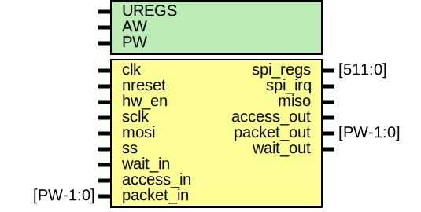

# Entity: spi_slave

- **File**: spi_slave.v
## Diagram

## Description

#############################################################################
# Purpose: SPI slave                                                        #
#############################################################################
# Author:   Andreas Olofsson                                                #
# License:  MIT (see LICENSE file in OH! repository)                        # 
#############################################################################

## Generics

| Generic name | Type | Value | Description                   |
| ------------ | ---- | ----- | ----------------------------- |
| UREGS        |      | 13    |  number of spi slave regs     |
| AW           |      | 32    |  addresss width               |
| PW           |      | 104   |  packet width                 |
## Ports

| Port name  | Direction | Type     | Description                          |
| ---------- | --------- | -------- | ------------------------------------ |
| clk        | input     |          | core clock                           |
| nreset     | input     |          | async active low reset               |
| hw_en      | input     |          | block enbale pin                     |
| spi_regs   | output    | [511:0]  | all registers for control            |
| spi_irq    | output    |          | interrupt                            |
| sclk       | input     |          | spi clock                            |
| mosi       | input     |          | slave input                          |
| ss         | input     |          | slave select                         |
| miso       | output    |          | slave output                         |
| access_out | output    |          | valid transaction                    |
| packet_out | output    | [PW-1:0] | data to core (from spi port)         |
| wait_in    | input     |          | pushback from core (not implemented) |
| access_in  | input     |          | read response from core              |
| packet_in  | input     | [PW-1:0] | read response packet from core       |
| wait_out   | output    |          | pushback (not used)                  |
## Signals

| Name      | Type       | Description                                   |
| --------- | ---------- | --------------------------------------------- |
| cpha      | wire       | From spi_slave_regs of spi_slave_regs.v       |
| cpol      | wire       | From spi_slave_regs of spi_slave_regs.v       |
| irq_en    | wire       | From spi_slave_regs of spi_slave_regs.v       |
| lsbfirst  | wire       | From spi_slave_regs of spi_slave_regs.v       |
| spi_addr  | wire [5:0] | From spi_slave_io of spi_slave_io.v           |
| spi_clk   | wire       | From spi_slave_io of spi_slave_io.v           |
| spi_en    | wire       | From spi_slave_regs of spi_slave_regs.v       |
| spi_rdata | wire [7:0] | From spi_slave_regs of spi_slave_regs.v, ...  |
| spi_wdata | wire [7:0] | From spi_slave_io of spi_slave_io.v           |
| spi_write | wire       | From spi_slave_io of spi_slave_io.v           |
