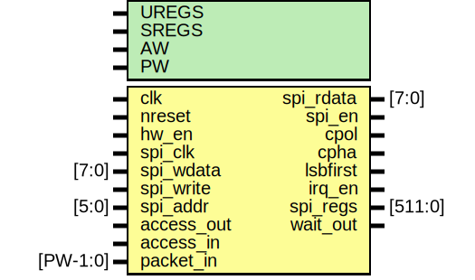

# Entity: spi_slave_regs

- **File**: spi_slave_regs.v
## Diagram

## Description

#############################################################################
# Purpose: SPI slave register file                                          #
#############################################################################
# Author:   Andreas Olofsson                                                #
# License:  MIT (see LICENSE file in OH! repository)                        # 
#############################################################################

## Generics

| Generic name | Type | Value    | Description               |
| ------------ | ---- | -------- | ------------------------- |
| UREGS        |      | 13       |  # of user regs (max 48)  |
| SREGS        |      | UREGS+32 |  total regs               |
| AW           |      | 32       |  address width            |
| PW           |      | 104      |  packet width             |
## Ports

| Port name  | Direction | Type     | Description                         |
| ---------- | --------- | -------- | ----------------------------------- |
| clk        | input     |          | core clock                          |
| nreset     | input     |          | asych active low                    |
| hw_en      | input     |          | block enable pin                    |
| spi_clk    | input     |          | slave clock                         |
| spi_wdata  | input     | [7:0]    | slave write data in (for write)     |
| spi_write  | input     |          | slave write                         |
| spi_addr   | input     | [5:0]    | slave write addr (64 regs)          |
| spi_rdata  | output    | [7:0]    | slave read data                     |
| spi_en     | output    |          | enable spi                          |
| cpol       | output    |          | clk polarity (default is 0)         |
| cpha       | output    |          | clk phase shift (default is 0)      |
| lsbfirst   | output    |          | send lsbfirst                       |
| irq_en     | output    |          | interrupt enable                    |
| spi_regs   | output    | [511:0]  | all regs concatenated for easy read |
| access_out | input     |          | signal used to clear status         |
| access_in  | input     |          |                                     |
| packet_in  | input     | [PW-1:0] | writeback data                      |
| wait_out   | output    |          |                                     |
## Signals

| Name         | Type          | Description                                    |
| ------------ | ------------- | ---------------------------------------------- |
| spi_config   | reg [7:0]     | ############### # LOCAL WIRES ###############  |
| spi_status   | reg [7:0]     |                                                |
| spi_cmd      | reg [7:0]     |                                                |
| spi_psize    | reg [7:0]     |                                                |
| core_regs    | reg [63:0]    |                                                |
| user_regs    | reg [7:0]     |                                                |
| core_data    | wire [63:0]   |                                                |
| config_write | wire          |                                                |
| user_write   | wire          |                                                |
| status_write | wire          |                                                |
| valid        | wire          |                                                |
| i            | integer       |                                                |
| ctrlmode_in  | wire [4:0]    | From pe2 of packet2emesh.v                     |
| data_in      | wire [AW-1:0] | From pe2 of packet2emesh.v                     |
| datamode_in  | wire [1:0]    | From pe2 of packet2emesh.v                     |
| dstaddr_in   | wire [AW-1:0] | From pe2 of packet2emesh.v                     |
| srcaddr_in   | wire [AW-1:0] | From pe2 of packet2emesh.v                     |
| write_in     | wire          | From pe2 of packet2emesh.v                     |
## Processes
- unnamed: ( @ (negedge spi_clk or negedge nreset) )
  - **Type:** always
 **Description**
##################################### # CONFIG [0] ##################################### 
- unnamed: ( @ (negedge spi_clk) )
  - **Type:** always
 **Description**
 user regs enable ##################################### # USER SPACE REGISTERS ##################################### 
- unnamed: ( @ (posedge clk) )
  - **Type:** always
 **Description**
#####################################    # STATUS [1] ##################################### 
- unnamed: ( @ (posedge clk) )
  - **Type:** always
 **Description**
 data ready ##################################### # RX DATA FOR FETCH ##################################### Data to sample 
- unnamed: ( @* )
  - **Type:** always
 **Description**
##################################### # REGISTER VECTOR (FOR FLEXIBILITY) ##################################### 
