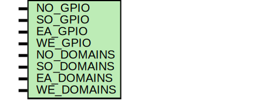

# Entity: testbench

- **File**: tb_oh_padring.v
## Diagram

## Generics

| Generic name | Type | Value | Description |
| ------------ | ---- | ----- | ----------- |
| NO_GPIO      |      | 8     |             |
| SO_GPIO      |      | 8     |             |
| EA_GPIO      |      | 8     |             |
| WE_GPIO      |      | 8     |             |
| NO_DOMAINS   |      | 2     |             |
| SO_DOMAINS   |      | 2     |             |
| EA_DOMAINS   |      | 2     |             |
| WE_DOMAINS   |      | 2     |             |
## Signals

| Name     | Type                  | Description                 |
| -------- | --------------------- | --------------------------- |
| ea_cfg   | wire [EA_GPIO*8-1:0]  | To i0 of oh_padring.v       |
| ea_dout  | wire [EA_GPIO-2:0]    | To i0 of oh_padring.v       |
| ea_ie    | wire [EA_GPIO-1:0]    | To i0 of oh_padring.v       |
| ea_oen   | wire [EA_GPIO-1:0]    | To i0 of oh_padring.v       |
| no_cfg   | wire [NO_GPIO*8-1:0]  | To i0 of oh_padring.v       |
| no_dout  | wire [NO_GPIO-2:0]    | To i0 of oh_padring.v       |
| no_ie    | wire [NO_GPIO-1:0]    | To i0 of oh_padring.v       |
| no_oen   | wire [NO_GPIO-1:0]    | To i0 of oh_padring.v       |
| so_cfg   | wire [SO_GPIO*8-1:0]  | To i0 of oh_padring.v       |
| so_dout  | wire [SO_GPIO-2:0]    | To i0 of oh_padring.v       |
| so_ie    | wire [SO_GPIO-1:0]    | To i0 of oh_padring.v       |
| so_oen   | wire [SO_GPIO-1:0]    | To i0 of oh_padring.v       |
| we_cfg   | wire [WE_GPIO*8-1:0]  | To i0 of oh_padring.v       |
| we_dout  | wire [WE_GPIO-2:0]    | To i0 of oh_padring.v       |
| we_ie    | wire [WE_GPIO-1:0]    | To i0 of oh_padring.v       |
| we_oen   | wire [WE_GPIO-1:0]    | To i0 of oh_padring.v       |
| ea_din   | wire [EA_GPIO-1:0]    | From i0 of oh_padring.v     |
| ea_pad   | wire [EA_GPIO-1:0]    | To/From i0 of oh_padring.v  |
| ea_vddio | wire [EA_DOMAINS-1:0] | To/From i0 of oh_padring.v  |
| ea_vssio | wire [EA_DOMAINS-1:0] | To/From i0 of oh_padring.v  |
| no_din   | wire [NO_GPIO-1:0]    | From i0 of oh_padring.v     |
| no_pad   | wire [NO_GPIO-1:0]    | To/From i0 of oh_padring.v  |
| no_vddio | wire [NO_DOMAINS-1:0] | To/From i0 of oh_padring.v  |
| no_vssio | wire [NO_DOMAINS-1:0] | To/From i0 of oh_padring.v  |
| so_din   | wire [SO_GPIO-1:0]    | From i0 of oh_padring.v     |
| so_pad   | wire [SO_GPIO-1:0]    | To/From i0 of oh_padring.v  |
| so_vddio | wire [SO_DOMAINS-1:0] | To/From i0 of oh_padring.v  |
| so_vssio | wire [SO_DOMAINS-1:0] | To/From i0 of oh_padring.v  |
| vdd      | wire                  | To/From i0 of oh_padring.v  |
| vss      | wire                  | To/From i0 of oh_padring.v  |
| we_din   | wire [WE_GPIO-1:0]    | From i0 of oh_padring.v     |
| we_pad   | wire [WE_GPIO-1:0]    | To/From i0 of oh_padring.v  |
| we_vddio | wire [WE_DOMAINS-1:0] | To/From i0 of oh_padring.v  |
| we_vssio | wire [WE_DOMAINS-1:0] | To/From i0 of oh_padring.v  |
