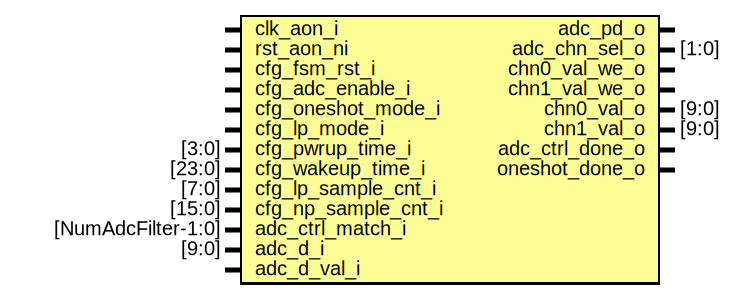

# Entity: adc_ctrl_fsm

## Diagram

## Description

Copyright lowRISC contributors.
 Licensed under the Apache License, Version 2.0, see LICENSE for details.
 SPDX-License-Identifier: Apache-2.0
 Description adc_ctrl detection FSM module
 
## Ports

| Port name         | Direction | Type               | Description |
| ----------------- | --------- | ------------------ | ----------- |
| clk_aon_i         | input     |                    |             |
| rst_slow_ni       | input     |                    |             |
| cfg_fsm_rst       | input     |                    |             |
| cfg_adc_enable    | input     |                    |             |
| cfg_oneshot_mode  | input     |                    |             |
| cfg_lp_mode       | input     |                    |             |
| cfg_pwrup_time    | input     | [3:0]              |             |
| cfg_wakeup_time   | input     | [23:0]             |             |
| cfg_lp_sample_cnt | input     | [7:0]              |             |
| cfg_np_sample_cnt | input     | [15:0]             |             |
| adc_ctrl_match    | input     | [NumAdcFilter-1:0] |             |
| adc_d             | input     | [9:0]              |             |
| adc_d_val         | input     |                    |             |
| adc_pd            | output    |                    |             |
| adc_chn_sel       | output    | [1:0]              |             |
| chn0_val_we       | output    |                    |             |
| chn1_val_we       | output    |                    |             |
| chn0_val          | output    | [9:0]              |             |
| chn1_val          | output    | [9:0]              |             |
| adc_ctrl_done     | output    |                    |             |
| oneshot_done      | output    |                    |             |
## Signals

| Name                 | Type                     | Description |
| -------------------- | ------------------------ | ----------- |
| trigger_q            | logic                    |             |
| trigger_l2h          | logic                    |             |
| trigger_h2l          | logic                    |             |
| pwrup_timer_cnt_d    | logic [3:0]              |             |
| pwrup_timer_cnt_q    | logic [3:0]              |             |
| pwrup_timer_cnt_clr  | logic                    |             |
| pwrup_timer_cnt_en   | logic                    |             |
| chn0_val_d           | logic [9:0]              |             |
| chn1_val_d           | logic [9:0]              |             |
| fsm_chn0_sel         | logic                    |             |
| fsm_chn1_sel         | logic                    |             |
| chn0_val_we_d        | logic                    |             |
| chn1_val_we_d        | logic                    |             |
| lp_sample_cnt_d      | logic [7:0]              |             |
| lp_sample_cnt_q      | logic [7:0]              |             |
| lp_sample_cnt_clr    | logic                    |             |
| lp_sample_cnt_en     | logic                    |             |
| wakeup_timer_cnt_d   | logic [23:0]             |             |
| wakeup_timer_cnt_q   | logic [23:0]             |             |
| wakeup_timer_cnt_clr | logic                    |             |
| wakeup_timer_cnt_en  | logic                    |             |
| adc_ctrl_match_q     | logic [NumAdcFilter-1:0] |             |
| fst_lp_match         | logic [NumAdcFilter-1:0] |             |
| any_fst_lp_match     | logic                    |             |
| stay_match           | logic                    |             |
| np_sample_cnt_d      | logic [15:0]             |             |
| np_sample_cnt_q      | logic [15:0]             |             |
| np_sample_cnt_clr    | logic                    |             |
| np_sample_cnt_en     | logic                    |             |
| fsm_state_q          | fsm_state_e              |             |
| fsm_state_d          | fsm_state_e              |             |
## Types

| Name        | Type                                                                                                                                                                                                                                                                                                                                                                                                                                                                                                                                                                                                                                                                                                                                                         | Description |
| ----------- | ------------------------------------------------------------------------------------------------------------------------------------------------------------------------------------------------------------------------------------------------------------------------------------------------------------------------------------------------------------------------------------------------------------------------------------------------------------------------------------------------------------------------------------------------------------------------------------------------------------------------------------------------------------------------------------------------------------------------------------------------------------ | ----------- |
| fsm_state_e | enum logic [3:0] {                             PWRDN = 4'h0,                             PWRUP = 4'h1,                             IDLE = 4'h2,                             ONEST_0 = 4'h3,                             ONEST_021 = 4'h4,                             ONEST_1 = 4'h5,                             LP_0 = 4'h6,                             LP_021 = 4'h7,                             LP_1 = 4'h8,                             LP_EVAL = 4'h9,                             LP_SLP = 4'ha,                             LP_PWRUP = 4'hb,                             NP_0 = 4'hc,                             NP_021 = 4'hd,                             NP_1 = 4'he,                             NP_EVAL = 4'hf                             } |             |
## Processes
- i_trigger_reg: ( @(posedge clk_aon_i or negedge rst_slow_ni) )
- i_pwrup_timer_cnt_reg: ( @(posedge clk_aon_i or negedge rst_slow_ni) )
- i_lp_sample_cnt_reg: ( @(posedge clk_aon_i or negedge rst_slow_ni) )
- i_np_sample_cnt_reg: ( @(posedge clk_aon_i or negedge rst_slow_ni) )
- i_wakeup_timer_cnt_reg: ( @(posedge clk_aon_i or negedge rst_slow_ni) )
- i_chn01_val_we_reg: ( @(posedge clk_aon_i or negedge rst_slow_ni) )
- i_adc_ctrl_match_reg: ( @(posedge clk_aon_i or negedge rst_slow_ni) )
- i_fsm_state_reg: ( @(posedge clk_aon_i or negedge rst_slow_ni) )
- adc_fsm: (  )
