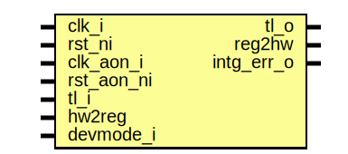

# Entity: adc_ctrl_reg_top

- **File**: adc_ctrl_reg_top.sv
## Diagram

## Description

 Copyright lowRISC contributors.
 Licensed under the Apache License, Version 2.0, see LICENSE for details.
 SPDX-License-Identifier: Apache-2.0

 Register Top module auto-generated by `reggen`

## Ports

| Port name  | Direction | Type | Description                                              |
| ---------- | --------- | ---- | -------------------------------------------------------- |
| clk_i      | input     |      |                                                          |
| rst_ni     | input     |      |                                                          |
| clk_aon_i  | input     |      |                                                          |
| rst_aon_ni | input     |      |                                                          |
| tl_i       | input     |      |                                                          |
| tl_o       | output    |      |                                                          |
| reg2hw     | output    |      | Write                                                    |
| hw2reg     | input     |      | Read                                                     |
| intg_err_o | output    |      |  Integrity check errors                                  |
| devmode_i  | input     |      | If 1, explicit error return for unmapped register access |
## Signals

| Name                                              | Type               | Description                                                                                                                  |
| ------------------------------------------------- | ------------------ | ---------------------------------------------------------------------------------------------------------------------------- |
| reg_we                                            | logic              |  register signals                                                                                                            |
| reg_re                                            | logic              |                                                                                                                              |
| reg_addr                                          | logic [AW-1:0]     |                                                                                                                              |
| reg_wdata                                         | logic [DW-1:0]     |                                                                                                                              |
| reg_be                                            | logic [DBW-1:0]    |                                                                                                                              |
| reg_rdata                                         | logic [DW-1:0]     |                                                                                                                              |
| reg_error                                         | logic              |                                                                                                                              |
| addrmiss                                          | logic              |                                                                                                                              |
| wr_err                                            | logic              |                                                                                                                              |
| reg_rdata_next                                    | logic [DW-1:0]     |                                                                                                                              |
| reg_busy                                          | logic              |                                                                                                                              |
| tl_reg_h2d                                        | tlul_pkg::tl_h2d_t |                                                                                                                              |
| tl_reg_d2h                                        | tlul_pkg::tl_d2h_t |                                                                                                                              |
| intg_err                                          | logic              |  incoming payload check                                                                                                      |
| intg_err_q                                        | logic              |                                                                                                                              |
| tl_o_pre                                          | tlul_pkg::tl_d2h_t |  outgoing integrity generation                                                                                               |
| sync_aon_update                                   | logic              |  cdc oversampling signals                                                                                                    |
| intr_state_we                                     | logic              |  Define SW related signals  Format: <reg>_<field>_{wd|we|qs}         or <reg>_{wd|we|qs} if field == 1 or 0                  |
| intr_state_qs                                     | logic              |                                                                                                                              |
| intr_state_wd                                     | logic              |                                                                                                                              |
| intr_enable_we                                    | logic              |                                                                                                                              |
| intr_enable_qs                                    | logic              |                                                                                                                              |
| intr_enable_wd                                    | logic              |                                                                                                                              |
| intr_test_we                                      | logic              |                                                                                                                              |
| intr_test_wd                                      | logic              |                                                                                                                              |
| alert_test_we                                     | logic              |                                                                                                                              |
| alert_test_wd                                     | logic              |                                                                                                                              |
| adc_en_ctl_we                                     | logic              |                                                                                                                              |
| adc_en_ctl_qs                                     | logic [1:0]        |                                                                                                                              |
| adc_en_ctl_busy                                   | logic              |                                                                                                                              |
| adc_pd_ctl_we                                     | logic              |                                                                                                                              |
| adc_pd_ctl_qs                                     | logic [31:0]       |                                                                                                                              |
| adc_pd_ctl_busy                                   | logic              |                                                                                                                              |
| adc_lp_sample_ctl_we                              | logic              |                                                                                                                              |
| adc_lp_sample_ctl_qs                              | logic [7:0]        |                                                                                                                              |
| adc_lp_sample_ctl_busy                            | logic              |                                                                                                                              |
| adc_sample_ctl_we                                 | logic              |                                                                                                                              |
| adc_sample_ctl_qs                                 | logic [15:0]       |                                                                                                                              |
| adc_sample_ctl_busy                               | logic              |                                                                                                                              |
| adc_fsm_rst_we                                    | logic              |                                                                                                                              |
| adc_fsm_rst_qs                                    | logic [0:0]        |                                                                                                                              |
| adc_fsm_rst_busy                                  | logic              |                                                                                                                              |
| adc_chn0_filter_ctl_0_we                          | logic              |                                                                                                                              |
| adc_chn0_filter_ctl_0_qs                          | logic [31:0]       |                                                                                                                              |
| adc_chn0_filter_ctl_0_busy                        | logic              |                                                                                                                              |
| adc_chn0_filter_ctl_1_we                          | logic              |                                                                                                                              |
| adc_chn0_filter_ctl_1_qs                          | logic [31:0]       |                                                                                                                              |
| adc_chn0_filter_ctl_1_busy                        | logic              |                                                                                                                              |
| adc_chn0_filter_ctl_2_we                          | logic              |                                                                                                                              |
| adc_chn0_filter_ctl_2_qs                          | logic [31:0]       |                                                                                                                              |
| adc_chn0_filter_ctl_2_busy                        | logic              |                                                                                                                              |
| adc_chn0_filter_ctl_3_we                          | logic              |                                                                                                                              |
| adc_chn0_filter_ctl_3_qs                          | logic [31:0]       |                                                                                                                              |
| adc_chn0_filter_ctl_3_busy                        | logic              |                                                                                                                              |
| adc_chn0_filter_ctl_4_we                          | logic              |                                                                                                                              |
| adc_chn0_filter_ctl_4_qs                          | logic [31:0]       |                                                                                                                              |
| adc_chn0_filter_ctl_4_busy                        | logic              |                                                                                                                              |
| adc_chn0_filter_ctl_5_we                          | logic              |                                                                                                                              |
| adc_chn0_filter_ctl_5_qs                          | logic [31:0]       |                                                                                                                              |
| adc_chn0_filter_ctl_5_busy                        | logic              |                                                                                                                              |
| adc_chn0_filter_ctl_6_we                          | logic              |                                                                                                                              |
| adc_chn0_filter_ctl_6_qs                          | logic [31:0]       |                                                                                                                              |
| adc_chn0_filter_ctl_6_busy                        | logic              |                                                                                                                              |
| adc_chn0_filter_ctl_7_we                          | logic              |                                                                                                                              |
| adc_chn0_filter_ctl_7_qs                          | logic [31:0]       |                                                                                                                              |
| adc_chn0_filter_ctl_7_busy                        | logic              |                                                                                                                              |
| adc_chn1_filter_ctl_0_we                          | logic              |                                                                                                                              |
| adc_chn1_filter_ctl_0_qs                          | logic [31:0]       |                                                                                                                              |
| adc_chn1_filter_ctl_0_busy                        | logic              |                                                                                                                              |
| adc_chn1_filter_ctl_1_we                          | logic              |                                                                                                                              |
| adc_chn1_filter_ctl_1_qs                          | logic [31:0]       |                                                                                                                              |
| adc_chn1_filter_ctl_1_busy                        | logic              |                                                                                                                              |
| adc_chn1_filter_ctl_2_we                          | logic              |                                                                                                                              |
| adc_chn1_filter_ctl_2_qs                          | logic [31:0]       |                                                                                                                              |
| adc_chn1_filter_ctl_2_busy                        | logic              |                                                                                                                              |
| adc_chn1_filter_ctl_3_we                          | logic              |                                                                                                                              |
| adc_chn1_filter_ctl_3_qs                          | logic [31:0]       |                                                                                                                              |
| adc_chn1_filter_ctl_3_busy                        | logic              |                                                                                                                              |
| adc_chn1_filter_ctl_4_we                          | logic              |                                                                                                                              |
| adc_chn1_filter_ctl_4_qs                          | logic [31:0]       |                                                                                                                              |
| adc_chn1_filter_ctl_4_busy                        | logic              |                                                                                                                              |
| adc_chn1_filter_ctl_5_we                          | logic              |                                                                                                                              |
| adc_chn1_filter_ctl_5_qs                          | logic [31:0]       |                                                                                                                              |
| adc_chn1_filter_ctl_5_busy                        | logic              |                                                                                                                              |
| adc_chn1_filter_ctl_6_we                          | logic              |                                                                                                                              |
| adc_chn1_filter_ctl_6_qs                          | logic [31:0]       |                                                                                                                              |
| adc_chn1_filter_ctl_6_busy                        | logic              |                                                                                                                              |
| adc_chn1_filter_ctl_7_we                          | logic              |                                                                                                                              |
| adc_chn1_filter_ctl_7_qs                          | logic [31:0]       |                                                                                                                              |
| adc_chn1_filter_ctl_7_busy                        | logic              |                                                                                                                              |
| adc_chn_val_0_qs                                  | logic [27:0]       |                                                                                                                              |
| adc_chn_val_0_busy                                | logic              |                                                                                                                              |
| adc_chn_val_1_qs                                  | logic [27:0]       |                                                                                                                              |
| adc_chn_val_1_busy                                | logic              |                                                                                                                              |
| adc_wakeup_ctl_we                                 | logic              |                                                                                                                              |
| adc_wakeup_ctl_qs                                 | logic [7:0]        |                                                                                                                              |
| adc_wakeup_ctl_busy                               | logic              |                                                                                                                              |
| filter_status_we                                  | logic              |                                                                                                                              |
| filter_status_qs                                  | logic [7:0]        |                                                                                                                              |
| filter_status_busy                                | logic              |                                                                                                                              |
| adc_intr_ctl_we                                   | logic              |                                                                                                                              |
| adc_intr_ctl_qs                                   | logic [8:0]        |                                                                                                                              |
| adc_intr_ctl_wd                                   | logic [8:0]        |                                                                                                                              |
| adc_intr_status_we                                | logic              |                                                                                                                              |
| adc_intr_status_cc_sink_det_qs                    | logic              |                                                                                                                              |
| adc_intr_status_cc_sink_det_wd                    | logic              |                                                                                                                              |
| adc_intr_status_cc_1a5_sink_det_qs                | logic              |                                                                                                                              |
| adc_intr_status_cc_1a5_sink_det_wd                | logic              |                                                                                                                              |
| adc_intr_status_cc_3a0_sink_det_qs                | logic              |                                                                                                                              |
| adc_intr_status_cc_3a0_sink_det_wd                | logic              |                                                                                                                              |
| adc_intr_status_cc_src_det_qs                     | logic              |                                                                                                                              |
| adc_intr_status_cc_src_det_wd                     | logic              |                                                                                                                              |
| adc_intr_status_cc_1a5_src_det_qs                 | logic              |                                                                                                                              |
| adc_intr_status_cc_1a5_src_det_wd                 | logic              |                                                                                                                              |
| adc_intr_status_cc_src_det_flip_qs                | logic              |                                                                                                                              |
| adc_intr_status_cc_src_det_flip_wd                | logic              |                                                                                                                              |
| adc_intr_status_cc_1a5_src_det_flip_qs            | logic              |                                                                                                                              |
| adc_intr_status_cc_1a5_src_det_flip_wd            | logic              |                                                                                                                              |
| adc_intr_status_cc_discon_qs                      | logic              |                                                                                                                              |
| adc_intr_status_cc_discon_wd                      | logic              |                                                                                                                              |
| adc_intr_status_oneshot_qs                        | logic              |                                                                                                                              |
| adc_intr_status_oneshot_wd                        | logic              |                                                                                                                              |
| aon_adc_en_ctl_adc_enable_qs_int                  | logic              |  Define register CDC handling.  CDC handling is done on a per-reg instead of per-field boundary.                             |
| aon_adc_en_ctl_oneshot_mode_qs_int                | logic              |                                                                                                                              |
| aon_adc_en_ctl_d                                  | logic [1:0]        |                                                                                                                              |
| aon_adc_en_ctl_wdata                              | logic [1:0]        |                                                                                                                              |
| aon_adc_en_ctl_we                                 | logic              |                                                                                                                              |
| unused_aon_adc_en_ctl_wdata                       | logic              |                                                                                                                              |
| aon_adc_pd_ctl_lp_mode_qs_int                     | logic              |                                                                                                                              |
| aon_adc_pd_ctl_pwrup_time_qs_int                  | logic [3:0]        |                                                                                                                              |
| aon_adc_pd_ctl_wakeup_time_qs_int                 | logic [23:0]       |                                                                                                                              |
| aon_adc_pd_ctl_d                                  | logic [31:0]       |                                                                                                                              |
| aon_adc_pd_ctl_wdata                              | logic [31:0]       |                                                                                                                              |
| aon_adc_pd_ctl_we                                 | logic              |                                                                                                                              |
| unused_aon_adc_pd_ctl_wdata                       | logic              |                                                                                                                              |
| aon_adc_lp_sample_ctl_qs_int                      | logic [7:0]        |                                                                                                                              |
| aon_adc_lp_sample_ctl_d                           | logic [7:0]        |                                                                                                                              |
| aon_adc_lp_sample_ctl_wdata                       | logic [7:0]        |                                                                                                                              |
| aon_adc_lp_sample_ctl_we                          | logic              |                                                                                                                              |
| unused_aon_adc_lp_sample_ctl_wdata                | logic              |                                                                                                                              |
| aon_adc_sample_ctl_qs_int                         | logic [15:0]       |                                                                                                                              |
| aon_adc_sample_ctl_d                              | logic [15:0]       |                                                                                                                              |
| aon_adc_sample_ctl_wdata                          | logic [15:0]       |                                                                                                                              |
| aon_adc_sample_ctl_we                             | logic              |                                                                                                                              |
| unused_aon_adc_sample_ctl_wdata                   | logic              |                                                                                                                              |
| aon_adc_fsm_rst_qs_int                            | logic              |                                                                                                                              |
| aon_adc_fsm_rst_d                                 | logic [0:0]        |                                                                                                                              |
| aon_adc_fsm_rst_wdata                             | logic [0:0]        |                                                                                                                              |
| aon_adc_fsm_rst_we                                | logic              |                                                                                                                              |
| unused_aon_adc_fsm_rst_wdata                      | logic              |                                                                                                                              |
| aon_adc_chn0_filter_ctl_0_min_v_0_qs_int          | logic [9:0]        |                                                                                                                              |
| aon_adc_chn0_filter_ctl_0_cond_0_qs_int           | logic              |                                                                                                                              |
| aon_adc_chn0_filter_ctl_0_max_v_0_qs_int          | logic [9:0]        |                                                                                                                              |
| aon_adc_chn0_filter_ctl_0_en_0_qs_int             | logic              |                                                                                                                              |
| aon_adc_chn0_filter_ctl_0_d                       | logic [31:0]       |                                                                                                                              |
| aon_adc_chn0_filter_ctl_0_wdata                   | logic [31:0]       |                                                                                                                              |
| aon_adc_chn0_filter_ctl_0_we                      | logic              |                                                                                                                              |
| unused_aon_adc_chn0_filter_ctl_0_wdata            | logic              |                                                                                                                              |
| aon_adc_chn0_filter_ctl_1_min_v_1_qs_int          | logic [9:0]        |                                                                                                                              |
| aon_adc_chn0_filter_ctl_1_cond_1_qs_int           | logic              |                                                                                                                              |
| aon_adc_chn0_filter_ctl_1_max_v_1_qs_int          | logic [9:0]        |                                                                                                                              |
| aon_adc_chn0_filter_ctl_1_en_1_qs_int             | logic              |                                                                                                                              |
| aon_adc_chn0_filter_ctl_1_d                       | logic [31:0]       |                                                                                                                              |
| aon_adc_chn0_filter_ctl_1_wdata                   | logic [31:0]       |                                                                                                                              |
| aon_adc_chn0_filter_ctl_1_we                      | logic              |                                                                                                                              |
| unused_aon_adc_chn0_filter_ctl_1_wdata            | logic              |                                                                                                                              |
| aon_adc_chn0_filter_ctl_2_min_v_2_qs_int          | logic [9:0]        |                                                                                                                              |
| aon_adc_chn0_filter_ctl_2_cond_2_qs_int           | logic              |                                                                                                                              |
| aon_adc_chn0_filter_ctl_2_max_v_2_qs_int          | logic [9:0]        |                                                                                                                              |
| aon_adc_chn0_filter_ctl_2_en_2_qs_int             | logic              |                                                                                                                              |
| aon_adc_chn0_filter_ctl_2_d                       | logic [31:0]       |                                                                                                                              |
| aon_adc_chn0_filter_ctl_2_wdata                   | logic [31:0]       |                                                                                                                              |
| aon_adc_chn0_filter_ctl_2_we                      | logic              |                                                                                                                              |
| unused_aon_adc_chn0_filter_ctl_2_wdata            | logic              |                                                                                                                              |
| aon_adc_chn0_filter_ctl_3_min_v_3_qs_int          | logic [9:0]        |                                                                                                                              |
| aon_adc_chn0_filter_ctl_3_cond_3_qs_int           | logic              |                                                                                                                              |
| aon_adc_chn0_filter_ctl_3_max_v_3_qs_int          | logic [9:0]        |                                                                                                                              |
| aon_adc_chn0_filter_ctl_3_en_3_qs_int             | logic              |                                                                                                                              |
| aon_adc_chn0_filter_ctl_3_d                       | logic [31:0]       |                                                                                                                              |
| aon_adc_chn0_filter_ctl_3_wdata                   | logic [31:0]       |                                                                                                                              |
| aon_adc_chn0_filter_ctl_3_we                      | logic              |                                                                                                                              |
| unused_aon_adc_chn0_filter_ctl_3_wdata            | logic              |                                                                                                                              |
| aon_adc_chn0_filter_ctl_4_min_v_4_qs_int          | logic [9:0]        |                                                                                                                              |
| aon_adc_chn0_filter_ctl_4_cond_4_qs_int           | logic              |                                                                                                                              |
| aon_adc_chn0_filter_ctl_4_max_v_4_qs_int          | logic [9:0]        |                                                                                                                              |
| aon_adc_chn0_filter_ctl_4_en_4_qs_int             | logic              |                                                                                                                              |
| aon_adc_chn0_filter_ctl_4_d                       | logic [31:0]       |                                                                                                                              |
| aon_adc_chn0_filter_ctl_4_wdata                   | logic [31:0]       |                                                                                                                              |
| aon_adc_chn0_filter_ctl_4_we                      | logic              |                                                                                                                              |
| unused_aon_adc_chn0_filter_ctl_4_wdata            | logic              |                                                                                                                              |
| aon_adc_chn0_filter_ctl_5_min_v_5_qs_int          | logic [9:0]        |                                                                                                                              |
| aon_adc_chn0_filter_ctl_5_cond_5_qs_int           | logic              |                                                                                                                              |
| aon_adc_chn0_filter_ctl_5_max_v_5_qs_int          | logic [9:0]        |                                                                                                                              |
| aon_adc_chn0_filter_ctl_5_en_5_qs_int             | logic              |                                                                                                                              |
| aon_adc_chn0_filter_ctl_5_d                       | logic [31:0]       |                                                                                                                              |
| aon_adc_chn0_filter_ctl_5_wdata                   | logic [31:0]       |                                                                                                                              |
| aon_adc_chn0_filter_ctl_5_we                      | logic              |                                                                                                                              |
| unused_aon_adc_chn0_filter_ctl_5_wdata            | logic              |                                                                                                                              |
| aon_adc_chn0_filter_ctl_6_min_v_6_qs_int          | logic [9:0]        |                                                                                                                              |
| aon_adc_chn0_filter_ctl_6_cond_6_qs_int           | logic              |                                                                                                                              |
| aon_adc_chn0_filter_ctl_6_max_v_6_qs_int          | logic [9:0]        |                                                                                                                              |
| aon_adc_chn0_filter_ctl_6_en_6_qs_int             | logic              |                                                                                                                              |
| aon_adc_chn0_filter_ctl_6_d                       | logic [31:0]       |                                                                                                                              |
| aon_adc_chn0_filter_ctl_6_wdata                   | logic [31:0]       |                                                                                                                              |
| aon_adc_chn0_filter_ctl_6_we                      | logic              |                                                                                                                              |
| unused_aon_adc_chn0_filter_ctl_6_wdata            | logic              |                                                                                                                              |
| aon_adc_chn0_filter_ctl_7_min_v_7_qs_int          | logic [9:0]        |                                                                                                                              |
| aon_adc_chn0_filter_ctl_7_cond_7_qs_int           | logic              |                                                                                                                              |
| aon_adc_chn0_filter_ctl_7_max_v_7_qs_int          | logic [9:0]        |                                                                                                                              |
| aon_adc_chn0_filter_ctl_7_en_7_qs_int             | logic              |                                                                                                                              |
| aon_adc_chn0_filter_ctl_7_d                       | logic [31:0]       |                                                                                                                              |
| aon_adc_chn0_filter_ctl_7_wdata                   | logic [31:0]       |                                                                                                                              |
| aon_adc_chn0_filter_ctl_7_we                      | logic              |                                                                                                                              |
| unused_aon_adc_chn0_filter_ctl_7_wdata            | logic              |                                                                                                                              |
| aon_adc_chn1_filter_ctl_0_min_v_0_qs_int          | logic [9:0]        |                                                                                                                              |
| aon_adc_chn1_filter_ctl_0_cond_0_qs_int           | logic              |                                                                                                                              |
| aon_adc_chn1_filter_ctl_0_max_v_0_qs_int          | logic [9:0]        |                                                                                                                              |
| aon_adc_chn1_filter_ctl_0_en_0_qs_int             | logic              |                                                                                                                              |
| aon_adc_chn1_filter_ctl_0_d                       | logic [31:0]       |                                                                                                                              |
| aon_adc_chn1_filter_ctl_0_wdata                   | logic [31:0]       |                                                                                                                              |
| aon_adc_chn1_filter_ctl_0_we                      | logic              |                                                                                                                              |
| unused_aon_adc_chn1_filter_ctl_0_wdata            | logic              |                                                                                                                              |
| aon_adc_chn1_filter_ctl_1_min_v_1_qs_int          | logic [9:0]        |                                                                                                                              |
| aon_adc_chn1_filter_ctl_1_cond_1_qs_int           | logic              |                                                                                                                              |
| aon_adc_chn1_filter_ctl_1_max_v_1_qs_int          | logic [9:0]        |                                                                                                                              |
| aon_adc_chn1_filter_ctl_1_en_1_qs_int             | logic              |                                                                                                                              |
| aon_adc_chn1_filter_ctl_1_d                       | logic [31:0]       |                                                                                                                              |
| aon_adc_chn1_filter_ctl_1_wdata                   | logic [31:0]       |                                                                                                                              |
| aon_adc_chn1_filter_ctl_1_we                      | logic              |                                                                                                                              |
| unused_aon_adc_chn1_filter_ctl_1_wdata            | logic              |                                                                                                                              |
| aon_adc_chn1_filter_ctl_2_min_v_2_qs_int          | logic [9:0]        |                                                                                                                              |
| aon_adc_chn1_filter_ctl_2_cond_2_qs_int           | logic              |                                                                                                                              |
| aon_adc_chn1_filter_ctl_2_max_v_2_qs_int          | logic [9:0]        |                                                                                                                              |
| aon_adc_chn1_filter_ctl_2_en_2_qs_int             | logic              |                                                                                                                              |
| aon_adc_chn1_filter_ctl_2_d                       | logic [31:0]       |                                                                                                                              |
| aon_adc_chn1_filter_ctl_2_wdata                   | logic [31:0]       |                                                                                                                              |
| aon_adc_chn1_filter_ctl_2_we                      | logic              |                                                                                                                              |
| unused_aon_adc_chn1_filter_ctl_2_wdata            | logic              |                                                                                                                              |
| aon_adc_chn1_filter_ctl_3_min_v_3_qs_int          | logic [9:0]        |                                                                                                                              |
| aon_adc_chn1_filter_ctl_3_cond_3_qs_int           | logic              |                                                                                                                              |
| aon_adc_chn1_filter_ctl_3_max_v_3_qs_int          | logic [9:0]        |                                                                                                                              |
| aon_adc_chn1_filter_ctl_3_en_3_qs_int             | logic              |                                                                                                                              |
| aon_adc_chn1_filter_ctl_3_d                       | logic [31:0]       |                                                                                                                              |
| aon_adc_chn1_filter_ctl_3_wdata                   | logic [31:0]       |                                                                                                                              |
| aon_adc_chn1_filter_ctl_3_we                      | logic              |                                                                                                                              |
| unused_aon_adc_chn1_filter_ctl_3_wdata            | logic              |                                                                                                                              |
| aon_adc_chn1_filter_ctl_4_min_v_4_qs_int          | logic [9:0]        |                                                                                                                              |
| aon_adc_chn1_filter_ctl_4_cond_4_qs_int           | logic              |                                                                                                                              |
| aon_adc_chn1_filter_ctl_4_max_v_4_qs_int          | logic [9:0]        |                                                                                                                              |
| aon_adc_chn1_filter_ctl_4_en_4_qs_int             | logic              |                                                                                                                              |
| aon_adc_chn1_filter_ctl_4_d                       | logic [31:0]       |                                                                                                                              |
| aon_adc_chn1_filter_ctl_4_wdata                   | logic [31:0]       |                                                                                                                              |
| aon_adc_chn1_filter_ctl_4_we                      | logic              |                                                                                                                              |
| unused_aon_adc_chn1_filter_ctl_4_wdata            | logic              |                                                                                                                              |
| aon_adc_chn1_filter_ctl_5_min_v_5_qs_int          | logic [9:0]        |                                                                                                                              |
| aon_adc_chn1_filter_ctl_5_cond_5_qs_int           | logic              |                                                                                                                              |
| aon_adc_chn1_filter_ctl_5_max_v_5_qs_int          | logic [9:0]        |                                                                                                                              |
| aon_adc_chn1_filter_ctl_5_en_5_qs_int             | logic              |                                                                                                                              |
| aon_adc_chn1_filter_ctl_5_d                       | logic [31:0]       |                                                                                                                              |
| aon_adc_chn1_filter_ctl_5_wdata                   | logic [31:0]       |                                                                                                                              |
| aon_adc_chn1_filter_ctl_5_we                      | logic              |                                                                                                                              |
| unused_aon_adc_chn1_filter_ctl_5_wdata            | logic              |                                                                                                                              |
| aon_adc_chn1_filter_ctl_6_min_v_6_qs_int          | logic [9:0]        |                                                                                                                              |
| aon_adc_chn1_filter_ctl_6_cond_6_qs_int           | logic              |                                                                                                                              |
| aon_adc_chn1_filter_ctl_6_max_v_6_qs_int          | logic [9:0]        |                                                                                                                              |
| aon_adc_chn1_filter_ctl_6_en_6_qs_int             | logic              |                                                                                                                              |
| aon_adc_chn1_filter_ctl_6_d                       | logic [31:0]       |                                                                                                                              |
| aon_adc_chn1_filter_ctl_6_wdata                   | logic [31:0]       |                                                                                                                              |
| aon_adc_chn1_filter_ctl_6_we                      | logic              |                                                                                                                              |
| unused_aon_adc_chn1_filter_ctl_6_wdata            | logic              |                                                                                                                              |
| aon_adc_chn1_filter_ctl_7_min_v_7_qs_int          | logic [9:0]        |                                                                                                                              |
| aon_adc_chn1_filter_ctl_7_cond_7_qs_int           | logic              |                                                                                                                              |
| aon_adc_chn1_filter_ctl_7_max_v_7_qs_int          | logic [9:0]        |                                                                                                                              |
| aon_adc_chn1_filter_ctl_7_en_7_qs_int             | logic              |                                                                                                                              |
| aon_adc_chn1_filter_ctl_7_d                       | logic [31:0]       |                                                                                                                              |
| aon_adc_chn1_filter_ctl_7_wdata                   | logic [31:0]       |                                                                                                                              |
| aon_adc_chn1_filter_ctl_7_we                      | logic              |                                                                                                                              |
| unused_aon_adc_chn1_filter_ctl_7_wdata            | logic              |                                                                                                                              |
| aon_adc_chn_val_0_adc_chn_value_ext_0_qs_int      | logic [1:0]        |                                                                                                                              |
| aon_adc_chn_val_0_adc_chn_value_0_qs_int          | logic [9:0]        |                                                                                                                              |
| aon_adc_chn_val_0_adc_chn_value_intr_ext_0_qs_int | logic [1:0]        |                                                                                                                              |
| aon_adc_chn_val_0_adc_chn_value_intr_0_qs_int     | logic [9:0]        |                                                                                                                              |
| aon_adc_chn_val_0_d                               | logic [27:0]       |                                                                                                                              |
| aon_adc_chn_val_1_adc_chn_value_ext_1_qs_int      | logic [1:0]        |                                                                                                                              |
| aon_adc_chn_val_1_adc_chn_value_1_qs_int          | logic [9:0]        |                                                                                                                              |
| aon_adc_chn_val_1_adc_chn_value_intr_ext_1_qs_int | logic [1:0]        |                                                                                                                              |
| aon_adc_chn_val_1_adc_chn_value_intr_1_qs_int     | logic [9:0]        |                                                                                                                              |
| aon_adc_chn_val_1_d                               | logic [27:0]       |                                                                                                                              |
| aon_adc_wakeup_ctl_qs_int                         | logic [7:0]        |                                                                                                                              |
| aon_adc_wakeup_ctl_d                              | logic [7:0]        |                                                                                                                              |
| aon_adc_wakeup_ctl_wdata                          | logic [7:0]        |                                                                                                                              |
| aon_adc_wakeup_ctl_we                             | logic              |                                                                                                                              |
| unused_aon_adc_wakeup_ctl_wdata                   | logic              |                                                                                                                              |
| aon_filter_status_qs_int                          | logic [7:0]        |                                                                                                                              |
| aon_filter_status_d                               | logic [7:0]        |                                                                                                                              |
| aon_filter_status_wdata                           | logic [7:0]        |                                                                                                                              |
| aon_filter_status_we                              | logic              |                                                                                                                              |
| unused_aon_filter_status_wdata                    | logic              |                                                                                                                              |
| addr_hit                                          | logic [30:0]       |                                                                                                                              |
| shadow_busy                                       | logic              |  shadow busy                                                                                                                 |
| reg_busy_sel                                      | logic              |  register busy                                                                                                               |
| unused_wdata                                      | logic              |  Unused signal tieoff  wdata / byte enable are not always fully used  add a blanket unused statement to handle lint waivers  |
| unused_be                                         | logic              |                                                                                                                              |
## Constants

| Name | Type | Value | Description |
| ---- | ---- | ----- | ----------- |
| AW   | int  | 7     |             |
| DW   | int  | 32    |             |
| DBW  | int  | DW/8  | Byte Width  |
## Processes
- unnamed: ( @(posedge clk_i or negedge rst_ni) )
  - **Type:** always_ff
- unnamed: (  )
  - **Type:** always_comb
- unnamed: (  )
  - **Type:** always_comb
- unnamed: (  )
  - **Type:** always_comb
- unnamed: (  )
  - **Type:** always_comb
- unnamed: (  )
  - **Type:** always_comb
- unnamed: (  )
  - **Type:** always_comb
- unnamed: (  )
  - **Type:** always_comb
- unnamed: (  )
  - **Type:** always_comb
- unnamed: (  )
  - **Type:** always_comb
- unnamed: (  )
  - **Type:** always_comb
- unnamed: (  )
  - **Type:** always_comb
- unnamed: (  )
  - **Type:** always_comb
- unnamed: (  )
  - **Type:** always_comb
- unnamed: (  )
  - **Type:** always_comb
- unnamed: (  )
  - **Type:** always_comb
- unnamed: (  )
  - **Type:** always_comb
- unnamed: (  )
  - **Type:** always_comb
- unnamed: (  )
  - **Type:** always_comb
- unnamed: (  )
  - **Type:** always_comb
- unnamed: (  )
  - **Type:** always_comb
- unnamed: (  )
  - **Type:** always_comb
- unnamed: (  )
  - **Type:** always_comb
- unnamed: (  )
  - **Type:** always_comb
- unnamed: (  )
  - **Type:** always_comb
- unnamed: (  )
  - **Type:** always_comb
- unnamed: (  )
  - **Type:** always_comb
- unnamed: (  )
  - **Type:** always_comb
**Description**
 Check sub-word write is permitted 
- unnamed: (  )
  - **Type:** always_comb
**Description**
 Read data return 
- unnamed: (  )
  - **Type:** always_comb
## Instantiations

- u_chk: tlul_cmd_intg_chk
- u_rsp_intg_gen: tlul_rsp_intg_gen
- u_reg_if: tlul_adapter_reg
- u_aon_tgl: prim_pulse_sync
- u_adc_en_ctl_cdc: prim_reg_cdc
- u_adc_pd_ctl_cdc: prim_reg_cdc
- u_adc_lp_sample_ctl_cdc: prim_reg_cdc
- u_adc_sample_ctl_cdc: prim_reg_cdc
- u_adc_fsm_rst_cdc: prim_reg_cdc
- u_adc_chn0_filter_ctl_0_cdc: prim_reg_cdc
- u_adc_chn0_filter_ctl_1_cdc: prim_reg_cdc
- u_adc_chn0_filter_ctl_2_cdc: prim_reg_cdc
- u_adc_chn0_filter_ctl_3_cdc: prim_reg_cdc
- u_adc_chn0_filter_ctl_4_cdc: prim_reg_cdc
- u_adc_chn0_filter_ctl_5_cdc: prim_reg_cdc
- u_adc_chn0_filter_ctl_6_cdc: prim_reg_cdc
- u_adc_chn0_filter_ctl_7_cdc: prim_reg_cdc
- u_adc_chn1_filter_ctl_0_cdc: prim_reg_cdc
- u_adc_chn1_filter_ctl_1_cdc: prim_reg_cdc
- u_adc_chn1_filter_ctl_2_cdc: prim_reg_cdc
- u_adc_chn1_filter_ctl_3_cdc: prim_reg_cdc
- u_adc_chn1_filter_ctl_4_cdc: prim_reg_cdc
- u_adc_chn1_filter_ctl_5_cdc: prim_reg_cdc
- u_adc_chn1_filter_ctl_6_cdc: prim_reg_cdc
- u_adc_chn1_filter_ctl_7_cdc: prim_reg_cdc
- u_adc_chn_val_0_cdc: prim_reg_cdc
- u_adc_chn_val_1_cdc: prim_reg_cdc
- u_adc_wakeup_ctl_cdc: prim_reg_cdc
- u_filter_status_cdc: prim_reg_cdc
- u_intr_state: prim_subreg
**Description**
 Register instances
 R[intr_state]: V(False)

- u_intr_enable: prim_subreg
**Description**
 R[intr_enable]: V(False)

- u_intr_test: prim_subreg_ext
**Description**
 R[intr_test]: V(True)

- u_alert_test: prim_subreg_ext
**Description**
 R[alert_test]: V(True)

- u_adc_en_ctl_adc_enable: prim_subreg
**Description**
 R[adc_en_ctl]: V(False)
   F[adc_enable]: 0:0

- u_adc_en_ctl_oneshot_mode: prim_subreg
**Description**
   F[oneshot_mode]: 1:1

- u_adc_pd_ctl_lp_mode: prim_subreg
**Description**
 R[adc_pd_ctl]: V(False)
   F[lp_mode]: 0:0

- u_adc_pd_ctl_pwrup_time: prim_subreg
**Description**
   F[pwrup_time]: 7:4

- u_adc_pd_ctl_wakeup_time: prim_subreg
**Description**
   F[wakeup_time]: 31:8

- u_adc_lp_sample_ctl: prim_subreg
**Description**
 R[adc_lp_sample_ctl]: V(False)

- u_adc_sample_ctl: prim_subreg
**Description**
 R[adc_sample_ctl]: V(False)

- u_adc_fsm_rst: prim_subreg
**Description**
 R[adc_fsm_rst]: V(False)

- u_adc_wakeup_ctl: prim_subreg
**Description**
 R[adc_wakeup_ctl]: V(False)

- u_filter_status: prim_subreg
**Description**
 R[filter_status]: V(False)

- u_adc_intr_ctl: prim_subreg
**Description**
 R[adc_intr_ctl]: V(False)

- u_adc_intr_status_cc_sink_det: prim_subreg
**Description**
 R[adc_intr_status]: V(False)
   F[cc_sink_det]: 0:0

- u_adc_intr_status_cc_1a5_sink_det: prim_subreg
**Description**
   F[cc_1a5_sink_det]: 1:1

- u_adc_intr_status_cc_3a0_sink_det: prim_subreg
**Description**
   F[cc_3a0_sink_det]: 2:2

- u_adc_intr_status_cc_src_det: prim_subreg
**Description**
   F[cc_src_det]: 3:3

- u_adc_intr_status_cc_1a5_src_det: prim_subreg
**Description**
   F[cc_1a5_src_det]: 4:4

- u_adc_intr_status_cc_src_det_flip: prim_subreg
**Description**
   F[cc_src_det_flip]: 5:5

- u_adc_intr_status_cc_1a5_src_det_flip: prim_subreg
**Description**
   F[cc_1a5_src_det_flip]: 6:6

- u_adc_intr_status_cc_discon: prim_subreg
**Description**
   F[cc_discon]: 7:7

- u_adc_intr_status_oneshot: prim_subreg
**Description**
   F[oneshot]: 8:8

