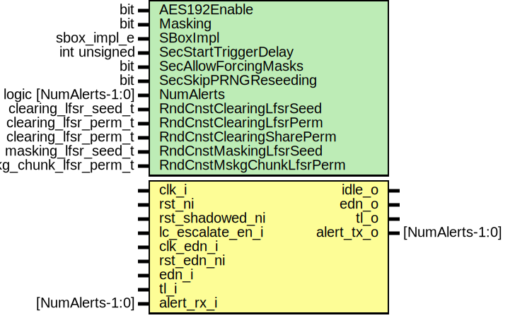

# Entity: aes
## Diagram

## Description
Copyright lowRISC contributors.
 Licensed under the Apache License, Version 2.0, see LICENSE for details.
 SPDX-License-Identifier: Apache-2.0
 AES top-level wrapper
 
## Generics
| Generic name             | Type                   | Value                           | Description                                                                                                                                                                        |
| ------------------------ | ---------------------- | ------------------------------- | ---------------------------------------------------------------------------------------------------------------------------------------------------------------------------------- |
| AES192Enable             | bit                    | 1                               | Can be 0 (disable), or 1 (enable).                                                                                                                                                 |
| Masking                  | bit                    | 1                               | Can be 0 (no masking), or                                                                                                                                                          |
| SBoxImpl                 | sbox_impl_e            | SBoxImplDom                     | See aes_pkg.sv                                                                                                                                                                     |
| SecStartTriggerDelay     | int unsigned           | 0                               | Manual start trigger delay, useful for                                                                                                                                             |
| SecAllowForcingMasks     | bit                    | 0                               | Allow forcing masks to 0 using                                                                                                                                                     |
| SecSkipPRNGReseeding     | bit                    | 0                               | The current SCA setup doesn't provide enough                                                                                                                                       |
| NumAlerts                | logic [NumAlerts-1:0]  | undefined                       | resources to implement the infrastucture required for PRNG reseeding (CSRNG, EDN). To enable SCA resistance evaluations, we need to skip reseeding requests. Useful for SCA only.  |
| RndCnstClearingLfsrSeed  | clearing_lfsr_seed_t   | RndCnstClearingLfsrSeedDefault  |                                                                                                                                                                                    |
| RndCnstClearingLfsrPerm  | clearing_lfsr_perm_t   | RndCnstClearingLfsrPermDefault  |                                                                                                                                                                                    |
| RndCnstClearingSharePerm | clearing_lfsr_perm_t   | RndCnstClearingSharePermDefault |                                                                                                                                                                                    |
| RndCnstMaskingLfsrSeed   | masking_lfsr_seed_t    | RndCnstMaskingLfsrSeedDefault   |                                                                                                                                                                                    |
| RndCnstMskgChunkLfsrPerm | mskg_chunk_lfsr_perm_t | RndCnstMskgChunkLfsrPermDefault |                                                                                                                                                                                    |
## Ports
| Port name        | Direction | Type            | Description                                  |
| ---------------- | --------- | --------------- | -------------------------------------------- |
| clk_i            | input     |                 |                                              |
| rst_ni           | input     |                 |                                              |
| idle_o           | output    |                 | Idle indicator for clock manager             |
| lc_escalate_en_i | input     |                 | Life cycle                                   |
| clk_edn_i        | input     |                 | Entropy distribution network (EDN) interface |
| rst_edn_ni       | input     |                 |                                              |
| edn_o            | output    |                 |                                              |
| edn_i            | input     |                 |                                              |
| tl_i             | input     |                 | Bus interface                                |
| tl_o             | output    |                 |                                              |
| alert_rx_i       | input     | [NumAlerts-1:0] | Alerts                                       |
| alert_tx_o       | output    | [NumAlerts-1:0] |                                              |
## Signals
| Name                 | Type                       | Description         |
| -------------------- | -------------------------- | ------------------- |
| reg2hw               | aes_reg2hw_t               | Signals             |
| hw2reg               | aes_hw2reg_t               |                     |
| alert                | logic      [NumAlerts-1:0] |                     |
| lc_escalate_en       | lc_ctrl_pkg::lc_tx_t       |                     |
| edn_req              | logic                      |                     |
| edn_ack              | logic                      |                     |
| edn_data             | logic   [EntropyWidth-1:0] |                     |
| unused_edn_fips      | logic                      |                     |
| entropy_clearing_req | logic                      |                     |
| entropy_masking_req  | logic                      |                     |
| entropy_clearing_ack | logic                      |                     |
| entropy_masking_ack  | logic                      |                     |
| intg_err_alert       | logic                      | Register interface  |
| alert_test           | logic [NumAlerts-1:0]      |                     |
## Constants
| Name         | Type         | Value                       | Description |
| ------------ | ------------ | --------------------------- | ----------- |
| EntropyWidth | int unsigned | edn_pkg::ENDPOINT_BUS_WIDTH |             |
## Instantiations
- u_reg: aes_reg_top
- u_prim_lc_sync: prim_lc_sync
**Description**
Synchronize life cycle input

- u_prim_sync_reqack_data: prim_sync_reqack_data
**Description**
Synchronize EDN interface

- u_aes_core: aes_core
**Description**
AES core

