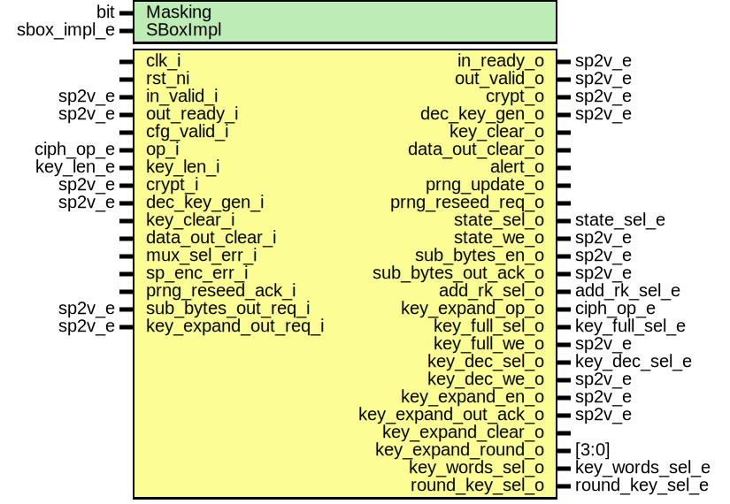

# Entity: aes_cipher_control
## Diagram

## Description
Copyright lowRISC contributors.
 Licensed under the Apache License, Version 2.0, see LICENSE for details.
 SPDX-License-Identifier: Apache-2.0
 AES cipher core control
 This module controls the AES cipher core including the key expand module.
 
## Generics
| Generic name | Type        | Value       | Description |
| ------------ | ----------- | ----------- | ----------- |
| Masking      | bit         | 0           |             |
| SBoxImpl     | sbox_impl_e | SBoxImplLut |             |
## Ports
| Port name            | Direction | Type            | Description                                       |
| -------------------- | --------- | --------------- | ------------------------------------------------- |
| clk_i                | input     |                 |                                                   |
| rst_ni               | input     |                 |                                                   |
| in_valid_i           | input     | sp2v_e          | Input handshake signals                           |
| in_ready_o           | output    | sp2v_e          |                                                   |
| out_valid_o          | output    | sp2v_e          | Output handshake signals                          |
| out_ready_i          | input     | sp2v_e          |                                                   |
| cfg_valid_i          | input     |                 | Control and sync signals                          |
| op_i                 | input     | ciph_op_e       |                                                   |
| key_len_i            | input     | key_len_e       |                                                   |
| crypt_i              | input     | sp2v_e          |                                                   |
| crypt_o              | output    | sp2v_e          |                                                   |
| dec_key_gen_i        | input     | sp2v_e          |                                                   |
| dec_key_gen_o        | output    | sp2v_e          |                                                   |
| key_clear_i          | input     |                 |                                                   |
| key_clear_o          | output    |                 |                                                   |
| data_out_clear_i     | input     |                 |                                                   |
| data_out_clear_o     | output    |                 |                                                   |
| mux_sel_err_i        | input     |                 |                                                   |
| sp_enc_err_i         | input     |                 |                                                   |
| alert_o              | output    |                 |                                                   |
| prng_update_o        | output    |                 | Control signals for masking PRNG                  |
| prng_reseed_req_o    | output    |                 |                                                   |
| prng_reseed_ack_i    | input     |                 |                                                   |
| state_sel_o          | output    | state_sel_e     | Control and sync signals for cipher data path     |
| state_we_o           | output    | sp2v_e          |                                                   |
| sub_bytes_en_o       | output    | sp2v_e          |                                                   |
| sub_bytes_out_req_i  | input     | sp2v_e          |                                                   |
| sub_bytes_out_ack_o  | output    | sp2v_e          |                                                   |
| add_rk_sel_o         | output    | add_rk_sel_e    |                                                   |
| key_expand_op_o      | output    | ciph_op_e       | Control and sync signals for key expand data path |
| key_full_sel_o       | output    | key_full_sel_e  |                                                   |
| key_full_we_o        | output    | sp2v_e          |                                                   |
| key_dec_sel_o        | output    | key_dec_sel_e   |                                                   |
| key_dec_we_o         | output    | sp2v_e          |                                                   |
| key_expand_en_o      | output    | sp2v_e          |                                                   |
| key_expand_out_req_i | input     | sp2v_e          |                                                   |
| key_expand_out_ack_o | output    | sp2v_e          |                                                   |
| key_expand_clear_o   | output    |                 |                                                   |
| key_expand_round_o   | output    | [3:0]           |                                                   |
| key_words_sel_o      | output    | key_words_sel_e |                                                   |
| round_key_sel_o      | output    | round_key_sel_e |                                                   |
## Signals
| Name                   | Type                                   | Description                                                                                                                                                                                                                                                                                               |
| ---------------------- | -------------------------------------- | --------------------------------------------------------------------------------------------------------------------------------------------------------------------------------------------------------------------------------------------------------------------------------------------------------- |
| aes_cipher_ctrl_ns     | aes_cipher_ctrl_e                      |                                                                                                                                                                                                                                                                                                           |
| aes_cipher_ctrl_cs     | aes_cipher_ctrl_e                      |                                                                                                                                                                                                                                                                                                           |
| rnd_ctr_d              | logic [3:0]                            | Signals                                                                                                                                                                                                                                                                                                   |
| rnd_ctr_q              | logic [3:0]                            | Signals                                                                                                                                                                                                                                                                                                   |
| rnd_ctr_rem_d          | logic [3:0]                            |                                                                                                                                                                                                                                                                                                           |
| rnd_ctr_rem_q          | logic [3:0]                            |                                                                                                                                                                                                                                                                                                           |
| rnd_ctr_sum            | logic [3:0]                            |                                                                                                                                                                                                                                                                                                           |
| num_rounds_d           | logic [3:0]                            |                                                                                                                                                                                                                                                                                                           |
| num_rounds_q           | logic [3:0]                            |                                                                                                                                                                                                                                                                                                           |
| num_rounds_regular     | logic [3:0]                            |                                                                                                                                                                                                                                                                                                           |
| rnd_ctr_parity         | logic                                  |                                                                                                                                                                                                                                                                                                           |
| rnd_ctr_parity_d       | logic                                  |                                                                                                                                                                                                                                                                                                           |
| rnd_ctr_parity_q       | logic                                  |                                                                                                                                                                                                                                                                                                           |
| rnd_ctr_err            | logic                                  |                                                                                                                                                                                                                                                                                                           |
| rnd_ctr_err_sum        | logic                                  |                                                                                                                                                                                                                                                                                                           |
| rnd_ctr_err_parity     | logic                                  |                                                                                                                                                                                                                                                                                                           |
| crypt_d                | sp2v_e                                 |                                                                                                                                                                                                                                                                                                           |
| crypt_q                | sp2v_e                                 |                                                                                                                                                                                                                                                                                                           |
| dec_key_gen_d          | sp2v_e                                 |                                                                                                                                                                                                                                                                                                           |
| dec_key_gen_q          | sp2v_e                                 |                                                                                                                                                                                                                                                                                                           |
| key_clear_d            | logic                                  |                                                                                                                                                                                                                                                                                                           |
| key_clear_q            | logic                                  |                                                                                                                                                                                                                                                                                                           |
| data_out_clear_d       | logic                                  |                                                                                                                                                                                                                                                                                                           |
| data_out_clear_q       | logic                                  |                                                                                                                                                                                                                                                                                                           |
| prng_reseed_done_d     | logic                                  |                                                                                                                                                                                                                                                                                                           |
| prng_reseed_done_q     | logic                                  |                                                                                                                                                                                                                                                                                                           |
| sub_bytes_out_req      | sp2v_e                                 |                                                                                                                                                                                                                                                                                                           |
| key_expand_out_req     | sp2v_e                                 |                                                                                                                                                                                                                                                                                                           |
| advance                | sp2v_e                                 |                                                                                                                                                                                                                                                                                                           |
| advance_chk            | sp2v_e                                 |                                                                                                                                                                                                                                                                                                           |
| in_valid               | sp2v_e                                 |                                                                                                                                                                                                                                                                                                           |
| out_ready              | sp2v_e                                 |                                                                                                                                                                                                                                                                                                           |
| crypt                  | sp2v_e                                 |                                                                                                                                                                                                                                                                                                           |
| dec_key_gen            | sp2v_e                                 |                                                                                                                                                                                                                                                                                                           |
| sp_enc_err             | logic                                  |                                                                                                                                                                                                                                                                                                           |
| unused_cfg_valid       | logic                                  | cfg_valid_i is used for gating assertions only.                                                                                                                                                                                                                                                           |
| aes_cipher_ctrl_cs_raw | logic [StateWidth-1:0]                 | This primitive is used to place a size-only constraint on the flops in order to prevent FSM state encoding optimizations.                                                                                                                                                                                 |
| crypt_q_raw            | logic [Sp2VWidth-1:0]                  | If any sparsely encoded signal becomes invalid, the cipher core further immediately de-asserts the out_valid_o signal to prevent any data from being released. The following primitives are used to place a size-only constraint on the flops in order to prevent optimizations on these status signals.  |
| dec_key_gen_q_raw      | logic [Sp2VWidth-1:0]                  |                                                                                                                                                                                                                                                                                                           |
| sp2v_sig               | sp2v_e [NumSp2VSig-1:0]                |                                                                                                                                                                                                                                                                                                           |
| sp2v_sig_chk           | sp2v_e [NumSp2VSig-1:0]                |                                                                                                                                                                                                                                                                                                           |
| sp2v_sig_chk_raw       | logic  [NumSp2VSig-1:0][Sp2VWidth-1:0] |                                                                                                                                                                                                                                                                                                           |
| sp2v_sig_err           | logic  [NumSp2VSig-1:0]                |                                                                                                                                                                                                                                                                                                           |
## Constants
| Name       | Type         | Value | Description                                                             |
| ---------- | ------------ | ----- | ----------------------------------------------------------------------- |
| StateWidth | int          | 6     |                                                                         |
| NumSp2VSig | int unsigned | 9     | We use vectors of sparsely encoded signals to reduce code duplication.  |
## Types
| Name              | Type                                                                                                                                                                                                                   | Description |
| ----------------- | ---------------------------------------------------------------------------------------------------------------------------------------------------------------------------------------------------------------------- | ----------- |
| aes_cipher_ctrl_e | enum logic [StateWidth-1:0] {     IDLE     = 6'b111100,     INIT     = 6'b101001,     ROUND    = 6'b010000,     FINISH   = 6'b100010,     CLEAR_S  = 6'b011011,     CLEAR_KD = 6'b110111,     ERROR    = 6'b001110   } |             |
## Processes
- aes_cipher_ctrl_fsm: _(  )_
FSM

**Description**
FSM

- reg_fsm: _( @(posedge clk_i or negedge rst_ni) )_

## Instantiations
- u_state_regs: prim_flop
- u_rnd_ctr_regs: prim_flop
**Description**
An alert is signaled and the FSM goes into the terminal error state if
i) the sum of the counters doesn't add up, i.e. rnd_ctr_q + rnd_ctr_rem_q != num_rounds_q, or
ii) the parity information is incorrect.
The following primitives are used to place size-only constraints on the
flops in order to prevent optimizations on the protected round counter.

- u_rnd_ctr_rem_regs: prim_flop
- u_rnd_ctr_par_reg: prim_flop
- u_crypt_regs: prim_flop
- u_dec_key_gen_regs: prim_flop
