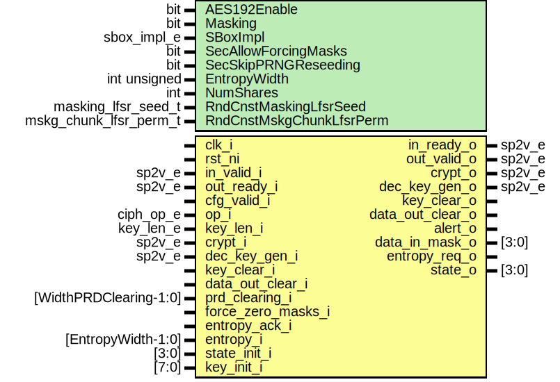

# Entity: aes_cipher_core

## Diagram

## Description

Copyright lowRISC contributors.
 Licensed under the Apache License, Version 2.0, see LICENSE for details.
 SPDX-License-Identifier: Apache-2.0
 AES cipher core implementation
 This module contains the AES cipher core including, state register, full key and decryption key
 registers as well as key expand module and control unit.
 Masking
 -------
 If the parameter "Masking" is set to one, first-order masking is applied to the entire
 cipher core including key expand module. For details, see Rivain et al., "Provably secure
 higher-order masking of AES" available at https://eprint.iacr.org/2010/441.pdf .
 Details on the data formats
 ---------------------------
 This implementation uses 4-dimensional SystemVerilog arrays to represent the AES state:
   logic [3:0][3:0][7:0] state_q [NumShares];
 The fourth dimension (unpacked) corresponds to the different shares. The first element holds the
 (masked) data share whereas the other elements hold the masks (masked implementation only).
 The three packed dimensions correspond to the 128-bit state matrix per share. This
 implementation uses the same encoding as the Advanced Encryption Standard (AES) FIPS Publication
 197 available at https://www.nist.gov/publications/advanced-encryption-standard-aes (see Section
 3.4). An input sequence of 16 bytes (128-bit, left most byte is the first one)
   b0 b1 b2 b3 b4 b5 b6 b7 b8 b9 b10 b11 b12 b13 b14 b15
 is mapped to the state matrix as
   [ b0  b4  b8  b12 ]
   [ b1  b5  b9  b13 ]
   [ b2  b6  b10 b14 ]
   [ b3  b7  b11 b15 ] .
 This is mapped to three packed dimensions of SystemVerilog array as follows:
 - The first dimension corresponds to the rows. Thus, state_q[0] gives
   - The first row of the state matrix       [ b0   b4  b8  b12 ], or
   - A 32-bit packed SystemVerilog array 32h'{ b12, b8, b4, b0  }.
 - The second dimension corresponds to the columns. To access complete columns, the state matrix
   must be transposed first. Thus state_transposed = aes_pkg::aes_transpose(state_q) and then
   state_transposed[1] gives
   - The second column of the state matrix   [ b4  b5  b6  b7 ], or
   - A 32-bit packed SystemVerilog array 32h'{ b7, b6, b5, b4 }.
 - The third dimension corresponds to the bytes.
 Note that the CSRs are little-endian. The input sequence above is provided to 32-bit DATA_IN_0 -
 DATA_IN_3 registers as
                   MSB            LSB
 - DATA_IN_0 32h'{ b3 , b2 , b1 , b0  }
 - DATA_IN_1 32h'{ b7 , b6 , b4 , b4  }
 - DATA_IN_2 32h'{ b11, b10, b9 , b8  }
 - DATA_IN_3 32h'{ b15, b14, b13, b12 } .
 The input state can thus be obtained by transposing the content of the DATA_IN_0 - DATA_IN_3
 registers.
 Similarly, the implementation uses a 3-dimensional array to represent the AES keys:
   logic     [7:0][31:0] key_full_q [NumShares]
 The third dimension (unpacked) corresponds to the different shares. The first element holds the
 (masked) key share whereas the other elements hold the masks (masked implementation only).
 The two packed dimensions correspond to the 256-bit key per share. This implementation uses
 the same encoding as the Advanced Encryption Standard (AES) FIPS Publication
 197 available at https://www.nist.gov/publications/advanced-encryption-standard-aes .
 The first packed dimension corresponds to the 8 key words. The second packed dimension
 corresponds to the 32 bits per key word. A key sequence of 32 bytes (256-bit, left most byte is
 the first one)
   b0 b1 b2 b3 b4 b5 b6 b7 b8 b9 b10 b11 b12 b13 b14 b15 ... ... b28 b29 b30 b31
 is mapped to the key words and registers (little-endian) as
                      MSB            LSB
 - KEY_SHARE0_0 32h'{ b3 , b2 , b1 , b0  }
 - KEY_SHARE0_1 32h'{ b7 , b6 , b4 , b4  }
 - KEY_SHARE0_2 32h'{ b11, b10, b9 , b8  }
 - KEY_SHARE0_3 32h'{ b15, b14, b13, b12 }
 - KEY_SHARE0_4 32h'{  .    .    .    .  }
 - KEY_SHARE0_5 32h'{  .    .    .    .  }
 - KEY_SHARE0_6 32h'{  .    .    .    .  }
 - KEY_SHARE0_7 32h'{ b31, b30, b29, b28 } .
 
## Generics

| Generic name             | Type                   | Value                           | Description       |
| ------------------------ | ---------------------- | ------------------------------- | ----------------- |
| AES192Enable             | bit                    | 1                               |                   |
| Masking                  | bit                    | 1                               |                   |
| SBoxImpl                 | sbox_impl_e            | SBoxImplDom                     |                   |
| SecAllowForcingMasks     | bit                    | 0                               |                   |
| SecSkipPRNGReseeding     | bit                    | 0                               |                   |
| EntropyWidth             | int unsigned           | edn_pkg::ENDPOINT_BUS_WIDTH     |                   |
| NumShares                | int                    | Masking ? 2 : 1                 | derived parameter |
| RndCnstMaskingLfsrSeed   | masking_lfsr_seed_t    | RndCnstMaskingLfsrSeedDefault   |                   |
| RndCnstMskgChunkLfsrPerm | mskg_chunk_lfsr_perm_t | RndCnstMskgChunkLfsrPermDefault |                   |
## Ports

| Port name          | Direction | Type                   | Description                              |
| ------------------ | --------- | ---------------------- | ---------------------------------------- |
| clk_i              | input     |                        |                                          |
| rst_ni             | input     |                        |                                          |
| in_valid_i         | input     | sp2v_e                 | Input handshake signals                  |
| in_ready_o         | output    | sp2v_e                 |                                          |
| out_valid_o        | output    | sp2v_e                 | Output handshake signals                 |
| out_ready_i        | input     | sp2v_e                 |                                          |
| cfg_valid_i        | input     |                        | Used for gating assertions only.         |
| op_i               | input     | ciph_op_e              |                                          |
| key_len_i          | input     | key_len_e              |                                          |
| crypt_i            | input     | sp2v_e                 |                                          |
| crypt_o            | output    | sp2v_e                 |                                          |
| dec_key_gen_i      | input     | sp2v_e                 |                                          |
| dec_key_gen_o      | output    | sp2v_e                 |                                          |
| key_clear_i        | input     |                        |                                          |
| key_clear_o        | output    |                        |                                          |
| data_out_clear_i   | input     |                        | Re-use the cipher core muxes.            |
| data_out_clear_o   | output    |                        |                                          |
| alert_o            | output    |                        |                                          |
| prd_clearing_i     | input     | [WidthPRDClearing-1:0] | Pseudo-random data for register clearing |
| force_zero_masks_i | input     |                        | Useful for SCA only.                     |
| data_in_mask_o     | output    | [3:0]                  |                                          |
| entropy_req_o      | output    |                        |                                          |
| entropy_ack_i      | input     |                        |                                          |
| entropy_i          | input     | [EntropyWidth-1:0]     |                                          |
| state_init_i       | input     | [3:0]                  | I/O data & initial key                   |
| key_init_i         | input     | [7:0]                  |                                          |
| state_o            | output    | [3:0]                  |                                          |
## Signals

| Name                | Type                                   | Description                                           |
| ------------------- | -------------------------------------- | ----------------------------------------------------- |
| state_d             | logic               [3:0][3:0][7:0]    | Signals                                               |
| state_q             | logic               [3:0][3:0][7:0]    |                                                       |
| state_we_ctrl       | sp2v_e                                 |                                                       |
| state_we            | sp2v_e                                 |                                                       |
| state_sel_raw       | logic           [StateSelWidth-1:0]    |                                                       |
| state_sel_ctrl      | state_sel_e                            |                                                       |
| state_sel           | state_sel_e                            |                                                       |
| state_sel_err       | logic                                  |                                                       |
| sub_bytes_en        | sp2v_e                                 |                                                       |
| sub_bytes_out_req   | sp2v_e                                 |                                                       |
| sub_bytes_out_ack   | sp2v_e                                 |                                                       |
| sub_bytes_err       | logic                                  |                                                       |
| sub_bytes_out       | logic               [3:0][3:0][7:0]    |                                                       |
| sb_in_mask          | logic               [3:0][3:0][7:0]    |                                                       |
| sb_out_mask         | logic               [3:0][3:0][7:0]    |                                                       |
| shift_rows_in       | logic               [3:0][3:0][7:0]    |                                                       |
| shift_rows_out      | logic               [3:0][3:0][7:0]    |                                                       |
| mix_columns_out     | logic               [3:0][3:0][7:0]    |                                                       |
| add_round_key_in    | logic               [3:0][3:0][7:0]    |                                                       |
| add_round_key_out   | logic               [3:0][3:0][7:0]    |                                                       |
| add_rk_sel_raw      | logic           [AddRKSelWidth-1:0]    |                                                       |
| add_rk_sel_ctrl     | add_rk_sel_e                           |                                                       |
| add_rk_sel          | add_rk_sel_e                           |                                                       |
| add_rk_sel_err      | logic                                  |                                                       |
| key_full_d          | logic                   [7:0][31:0]    |                                                       |
| key_full_q          | logic                   [7:0][31:0]    |                                                       |
| key_full_we_ctrl    | sp2v_e                                 |                                                       |
| key_full_we         | sp2v_e                                 |                                                       |
| key_full_sel_raw    | logic         [KeyFullSelWidth-1:0]    |                                                       |
| key_full_sel_ctrl   | key_full_sel_e                         |                                                       |
| key_full_sel        | key_full_sel_e                         |                                                       |
| key_full_sel_err    | logic                                  |                                                       |
| key_dec_d           | logic                   [7:0][31:0]    |                                                       |
| key_dec_q           | logic                   [7:0][31:0]    |                                                       |
| key_dec_we_ctrl     | sp2v_e                                 |                                                       |
| key_dec_we          | sp2v_e                                 |                                                       |
| key_dec_sel_raw     | logic          [KeyDecSelWidth-1:0]    |                                                       |
| key_dec_sel_ctrl    | key_dec_sel_e                          |                                                       |
| key_dec_sel         | key_dec_sel_e                          |                                                       |
| key_dec_sel_err     | logic                                  |                                                       |
| key_expand_out      | logic                   [7:0][31:0]    |                                                       |
| key_expand_op       | ciph_op_e                              |                                                       |
| key_expand_en       | sp2v_e                                 |                                                       |
| key_expand_out_req  | sp2v_e                                 |                                                       |
| key_expand_out_ack  | sp2v_e                                 |                                                       |
| key_expand_err      | logic                                  |                                                       |
| key_expand_clear    | logic                                  |                                                       |
| key_expand_round    | logic                         [3:0]    |                                                       |
| key_words_sel_raw   | logic        [KeyWordsSelWidth-1:0]    |                                                       |
| key_words_sel_ctrl  | key_words_sel_e                        |                                                       |
| key_words_sel       | key_words_sel_e                        |                                                       |
| key_words_sel_err   | logic                                  |                                                       |
| key_words           | logic                   [3:0][31:0]    |                                                       |
| key_bytes           | logic               [3:0][3:0][7:0]    |                                                       |
| key_mix_columns_out | logic               [3:0][3:0][7:0]    |                                                       |
| round_key           | logic               [3:0][3:0][7:0]    |                                                       |
| round_key_sel_raw   | logic        [RoundKeySelWidth-1:0]    |                                                       |
| round_key_sel_ctrl  | round_key_sel_e                        |                                                       |
| round_key_sel       | round_key_sel_e                        |                                                       |
| round_key_sel_err   | logic                                  |                                                       |
| mux_sel_err         | logic                                  |                                                       |
| sp_enc_err_d        | logic                                  |                                                       |
| sp_enc_err_q        | logic                                  |                                                       |
| prd_clearing_128    | logic                       [127:0]    | Pseudo-random data for clearing and masking purposes  |
| prd_clearing_256    | logic                       [255:0]    |                                                       |
| prd_masking         | logic         [WidthPRDMasking-1:0]    |                                                       |
| prd_sub_bytes       | logic  [3:0][3:0][WidthPRDSBox-1:0]    |                                                       |
| prd_key_expand      | logic             [WidthPRDKey-1:0]    |                                                       |
| prd_masking_upd     | logic                                  |                                                       |
| prd_masking_rsd_req | logic                                  |                                                       |
| prd_masking_rsd_ack | logic                                  |                                                       |
| sp2v_sig            | sp2v_e [NumSp2VSig-1:0]                |                                                       |
| sp2v_sig_chk        | sp2v_e [NumSp2VSig-1:0]                |                                                       |
| sp2v_sig_chk_raw    | logic  [NumSp2VSig-1:0][Sp2VWidth-1:0] |                                                       |
| sp2v_sig_err        | logic  [NumSp2VSig-1:0]                |                                                       |
## Constants

| Name        | Type         | Value           | Description                                                                                                                                                                                                                                                                                        |
| ----------- | ------------ | --------------- | -------------------------------------------------------------------------------------------------------------------------------------------------------------------------------------------------------------------------------------------------------------------------------------------------- |
| NumShares   | int          | Masking ? 2 : 1 | derived parameter                                                                                                                                                                                                                                                                                  |
| WidthPRDRow | int unsigned | 4*WidthPRDSBox  | When using a masked S-Box implementation other than Canright, we still select the 8 LSBs of the per-S-Box PRD to form the input data mask of the corresponding byte. We do this to distribute the input data masks over all LFSR chunks of the masking PRNG. We do the extraction on a row basis.  |
| NumSp2VSig  | int unsigned | 3               | If any sparsely encoded signal becomes invalid, the cipher core further immediately de-asserts the out_valid_o signal to prevent any data from being released. We use vectors of sparsely encoded signals to reduce code duplication.                                                              |
## Processes
- state_mux: (  )
**Description**
State registers

- state_reg: ( @(posedge clk_i or negedge rst_ni) )
- add_round_key_in_mux: (  )
- key_full_mux: (  )
**Description**
Full Key registers

- key_full_reg: ( @(posedge clk_i or negedge rst_ni) )
- key_dec_mux: (  )
**Description**
Decryption Key registers

- key_dec_reg: ( @(posedge clk_i or negedge rst_ni) )
- round_key_mux: (  )
- reg_sp_enc_err: ( @(posedge clk_i or negedge rst_ni) )
**Description**
We need to register the collected error signal to avoid circular loops in the cipher core
controller related to out_valid_o and detecting errors in state_we_o and sub_bytes_out_ack.

## Instantiations

- u_aes_sub_bytes: aes_sub_bytes
**Description**
Cipher data path

- u_aes_key_expand: aes_key_expand
**Description**
Key expand data path

- u_aes_cipher_control: aes_cipher_control
**Description**
Control

- u_aes_state_sel_buf_chk: aes_sel_buf_chk
**Description**
If any mux selector signal becomes invalid, the cipher core further immediately de-asserts
the out_valid_o signal to prevent any data from being released.

- u_aes_add_rk_sel_buf_chk: aes_sel_buf_chk
- u_aes_key_full_sel_buf_chk: aes_sel_buf_chk
- u_aes_key_dec_sel_buf_chk: aes_sel_buf_chk
- u_aes_key_words_sel_buf_chk: aes_sel_buf_chk
- u_aes_round_key_sel_buf_chk: aes_sel_buf_chk
