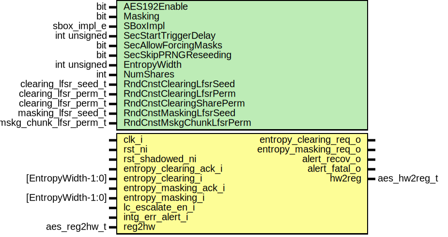

# Entity: aes_core
## Diagram

## Description
Copyright lowRISC contributors.
 Licensed under the Apache License, Version 2.0, see LICENSE for details.
 SPDX-License-Identifier: Apache-2.0
 AES core implementation
 
## Generics
| Generic name             | Type                   | Value                           | Description       |
| ------------------------ | ---------------------- | ------------------------------- | ----------------- |
| AES192Enable             | bit                    | 1                               |                   |
| Masking                  | bit                    | 1                               |                   |
| SBoxImpl                 | sbox_impl_e            | SBoxImplDom                     |                   |
| SecStartTriggerDelay     | int unsigned           | 0                               |                   |
| SecAllowForcingMasks     | bit                    | 0                               |                   |
| SecSkipPRNGReseeding     | bit                    | 0                               |                   |
| EntropyWidth             | int unsigned           | edn_pkg::ENDPOINT_BUS_WIDTH     |                   |
| NumShares                | int                    | Masking ? 2 : 1                 | derived parameter |
| RndCnstClearingLfsrSeed  | clearing_lfsr_seed_t   | RndCnstClearingLfsrSeedDefault  |                   |
| RndCnstClearingLfsrPerm  | clearing_lfsr_perm_t   | RndCnstClearingLfsrPermDefault  |                   |
| RndCnstClearingSharePerm | clearing_lfsr_perm_t   | RndCnstClearingSharePermDefault |                   |
| RndCnstMaskingLfsrSeed   | masking_lfsr_seed_t    | RndCnstMaskingLfsrSeedDefault   |                   |
| RndCnstMskgChunkLfsrPerm | mskg_chunk_lfsr_perm_t | RndCnstMskgChunkLfsrPermDefault |                   |
## Ports
| Port name              | Direction | Type               | Description                                               |
| ---------------------- | --------- | ------------------ | --------------------------------------------------------- |
| clk_i                  | input     |                    |                                                           |
| rst_ni                 | input     |                    |                                                           |
| entropy_clearing_req_o | output    |                    | Entropy request interfaces for clearing and masking PRNGs |
| entropy_clearing_ack_i | input     |                    |                                                           |
| entropy_clearing_i     | input     | [EntropyWidth-1:0] |                                                           |
| entropy_masking_req_o  | output    |                    |                                                           |
| entropy_masking_ack_i  | input     |                    |                                                           |
| entropy_masking_i      | input     | [EntropyWidth-1:0] |                                                           |
| lc_escalate_en_i       | input     |                    | Life cycle                                                |
| intg_err_alert_i       | input     |                    | Alerts                                                    |
| alert_recov_o          | output    |                    |                                                           |
| alert_fatal_o          | output    |                    |                                                           |
| reg2hw                 | input     | aes_reg2hw_t       | Bus Interface                                             |
| hw2reg                 | output    | aes_hw2reg_t       |                                                           |
## Signals
| Name                       | Type                                        | Description                               |
| -------------------------- | ------------------------------------------- | ----------------------------------------- |
| ctrl_re                    | logic                                       | Signals                                   |
| ctrl_qe                    | logic                                       |                                           |
| ctrl_we                    | logic                                       |                                           |
| aes_op_q                   | aes_op_e                                    |                                           |
| mode                       | aes_mode_e                                  |                                           |
| aes_mode_q                 | aes_mode_e                                  |                                           |
| cipher_op                  | ciph_op_e                                   |                                           |
| key_len                    | key_len_e                                   |                                           |
| key_len_q                  | key_len_e                                   |                                           |
| manual_operation_q         | logic                                       |                                           |
| force_zero_masks_q         | logic                                       |                                           |
| ctrl_d                     | ctrl_reg_t                                  |                                           |
| ctrl_q                     | ctrl_reg_t                                  |                                           |
| ctrl_err_update            | logic                                       |                                           |
| ctrl_err_storage           | logic                                       |                                           |
| ctrl_err_storage_d         | logic                                       |                                           |
| ctrl_err_storage_q         | logic                                       |                                           |
| ctrl_alert                 | logic                                       |                                           |
| mux_sel_err                | logic                                       |                                           |
| sp_enc_err_d               | logic                                       |                                           |
| sp_enc_err_q               | logic                                       |                                           |
| state_in                   | logic                       [3:0][3:0][7:0] |                                           |
| state_in_sel_raw           | logic                      [SISelWidth-1:0] |                                           |
| state_in_sel_ctrl          | si_sel_e                                    |                                           |
| state_in_sel               | si_sel_e                                    |                                           |
| state_in_sel_err           | logic                                       |                                           |
| add_state_in               | logic                       [3:0][3:0][7:0] |                                           |
| add_state_in_sel_raw       | logic                   [AddSISelWidth-1:0] |                                           |
| add_state_in_sel_ctrl      | add_si_sel_e                                |                                           |
| add_state_in_sel           | add_si_sel_e                                |                                           |
| add_state_in_sel_err       | logic                                       |                                           |
| state_mask                 | logic                       [3:0][3:0][7:0] |                                           |
| state_init                 | logic                       [3:0][3:0][7:0] |                                           |
| state_done                 | logic                       [3:0][3:0][7:0] |                                           |
| state_out                  | logic                       [3:0][3:0][7:0] |                                           |
| key_init                   | logic                [NumRegsKey-1:0][31:0] |                                           |
| key_init_qe                | logic                [NumRegsKey-1:0]       |                                           |
| key_init_d                 | logic                [NumRegsKey-1:0][31:0] |                                           |
| key_init_q                 | logic                [NumRegsKey-1:0][31:0] |                                           |
| key_init_cipher            | logic                [NumRegsKey-1:0][31:0] |                                           |
| key_init_we_ctrl           | sp2v_e               [NumRegsKey-1:0]       |                                           |
| key_init_we                | sp2v_e               [NumRegsKey-1:0]       |                                           |
| key_init_sel_raw           | logic                 [KeyInitSelWidth-1:0] |                                           |
| key_init_sel_ctrl          | key_init_sel_e                              |                                           |
| key_init_sel               | key_init_sel_e                              |                                           |
| key_init_sel_err           | logic                                       |                                           |
| iv                         | logic                 [NumRegsIv-1:0][31:0] |                                           |
| iv_qe                      | logic                 [NumRegsIv-1:0]       |                                           |
| iv_d                       | logic  [NumSlicesCtr-1:0][SliceSizeCtr-1:0] |                                           |
| iv_q                       | logic  [NumSlicesCtr-1:0][SliceSizeCtr-1:0] |                                           |
| iv_we_ctrl                 | sp2v_e [NumSlicesCtr-1:0]                   |                                           |
| iv_we                      | sp2v_e [NumSlicesCtr-1:0]                   |                                           |
| iv_sel_raw                 | logic                      [IVSelWidth-1:0] |                                           |
| iv_sel_ctrl                | iv_sel_e                                    |                                           |
| iv_sel                     | iv_sel_e                                    |                                           |
| iv_sel_err                 | logic                                       |                                           |
| ctr                        | logic  [NumSlicesCtr-1:0][SliceSizeCtr-1:0] |                                           |
| ctr_we                     | sp2v_e [NumSlicesCtr-1:0]                   |                                           |
| ctr_incr                   | sp2v_e                                      |                                           |
| ctr_ready                  | sp2v_e                                      |                                           |
| ctr_alert                  | logic                                       |                                           |
| data_in_prev_d             | logic               [NumRegsData-1:0][31:0] |                                           |
| data_in_prev_q             | logic               [NumRegsData-1:0][31:0] |                                           |
| data_in_prev_we_ctrl       | sp2v_e                                      |                                           |
| data_in_prev_we            | sp2v_e                                      |                                           |
| data_in_prev_sel_raw       | logic                     [DIPSelWidth-1:0] |                                           |
| data_in_prev_sel_ctrl      | dip_sel_e                                   |                                           |
| data_in_prev_sel           | dip_sel_e                                   |                                           |
| data_in_prev_sel_err       | logic                                       |                                           |
| data_in                    | logic               [NumRegsData-1:0][31:0] |                                           |
| data_in_qe                 | logic               [NumRegsData-1:0]       |                                           |
| data_in_we                 | logic                                       |                                           |
| add_state_out              | logic                       [3:0][3:0][7:0] |                                           |
| add_state_out_sel_raw      | logic                   [AddSOSelWidth-1:0] |                                           |
| add_state_out_sel_ctrl     | add_so_sel_e                                |                                           |
| add_state_out_sel          | add_so_sel_e                                |                                           |
| add_state_out_sel_err      | logic                                       |                                           |
| data_out_d                 | logic               [NumRegsData-1:0][31:0] |                                           |
| data_out_q                 | logic               [NumRegsData-1:0][31:0] |                                           |
| data_out_we_ctrl           | sp2v_e                                      |                                           |
| data_out_we                | sp2v_e                                      |                                           |
| data_out_re                | logic               [NumRegsData-1:0]       |                                           |
| cipher_in_valid            | sp2v_e                                      |                                           |
| cipher_in_ready            | sp2v_e                                      |                                           |
| cipher_out_valid           | sp2v_e                                      |                                           |
| cipher_out_ready           | sp2v_e                                      |                                           |
| cipher_crypt               | sp2v_e                                      |                                           |
| cipher_crypt_busy          | sp2v_e                                      |                                           |
| cipher_dec_key_gen         | sp2v_e                                      |                                           |
| cipher_dec_key_gen_busy    | sp2v_e                                      |                                           |
| cipher_key_clear           | logic                                       |                                           |
| cipher_key_clear_busy      | logic                                       |                                           |
| cipher_data_out_clear      | logic                                       |                                           |
| cipher_data_out_clear_busy | logic                                       |                                           |
| cipher_alert               | logic                                       |                                           |
| cipher_prd_clearing        | logic                [WidthPRDClearing-1:0] | Pseudo-random data for clearing purposes  |
| prd_clearing               | logic                [WidthPRDClearing-1:0] |                                           |
| prd_clearing_upd_req       | logic                                       |                                           |
| prd_clearing_upd_ack       | logic                                       |                                           |
| prd_clearing_rsd_req       | logic                                       |                                           |
| prd_clearing_rsd_ack       | logic                                       |                                           |
| prd_clearing_128           | logic                               [127:0] |                                           |
| prd_clearing_256           | logic                               [255:0] |                                           |
| unused_data_out_q          | logic               [NumRegsData-1:0][31:0] | Unused signals                            |
| unused_force_zero_masks    | logic                                       |                                           |
| sp2v_sig                   | sp2v_e [NumSp2VSig-1:0]                     |                                           |
| sp2v_sig_chk               | sp2v_e [NumSp2VSig-1:0]                     |                                           |
| sp2v_sig_chk_raw           | logic  [NumSp2VSig-1:0][Sp2VWidth-1:0]      |                                           |
| sp2v_sig_err               | logic  [NumSp2VSig-1:0]                     |                                           |
| unused_alert_signals       | logic                                       | Unused alert signals                      |
## Constants
| Name       | Type         | Value                                        | Description                                                                                                                                                                                                                                  |
| ---------- | ------------ | -------------------------------------------- | -------------------------------------------------------------------------------------------------------------------------------------------------------------------------------------------------------------------------------------------- |
| NumShares  | int          | Masking ? 2 : 1                              | derived parameter                                                                                                                                                                                                                            |
| NumSp2VSig | int unsigned | NumSharesKey * NumRegsKey + NumSlicesCtr + 2 | If any sparsely encoded signal becomes invalid, the core controller further immediately de-asserts the data_out_we_o signal to prevent any data from being released. We use vectors of sparsely encoded signals to reduce code duplication.  |
## Processes
- key_init_get: _(  )_

- iv_get: _(  )_

- data_in_get: _(  )_

- data_out_get: _(  )_

- key_init_mux: _(  )_
Initial Key registers

**Description**
Initial Key registers

- key_init_reg: _( @(posedge clk_i or negedge rst_ni) )_

- iv_mux: _(  )_
IV registers

**Description**
IV registers

- iv_reg: _( @(posedge clk_i or negedge rst_ni) )_

- data_in_prev_mux: _(  )_
Previous input data register

**Description**
Previous input data register

- data_in_prev_reg: _( @(posedge clk_i or negedge rst_ni) )_

- state_in_mux: _(  )_
Convert input data/IV to state format (every word corresponds to one state column).
Mux for state input

**Description**
Convert input data/IV to state format (every word corresponds to one state column).
Mux for state input

- add_state_in_mux: _(  )_
Mux for addition to state input

**Description**
Mux for addition to state input

- add_state_out_mux: _(  )_
Mux for addition to state output

**Description**
Mux for addition to state output

- mode_get: _(  )_

- key_len_get: _(  )_

- data_in_reg_clear: _(  )_
Input data register clear

**Description**
Input data register clear

- reg_sp_enc_err: _( @(posedge clk_i or negedge rst_ni) )_
We need to register the collected error signal to avoid circular loops in the core controller
related to iv_we and data_out_we.

**Description**
We need to register the collected error signal to avoid circular loops in the core controller
related to iv_we and data_out_we.

- data_out_reg: _( @(posedge clk_i or negedge rst_ni) )_

- key_reg_put: _(  )_

- iv_reg_put: _(  )_

- data_out_put: _(  )_

- ctrl_err_storage_reg: _( @(posedge clk_i or negedge rst_ni) )_
Fatal alert conditions need to remain asserted until reset.

**Description**
Fatal alert conditions need to remain asserted until reset.

## Instantiations
- u_aes_prng_clearing: aes_prng_clearing
**Description**
The clearing PRNG provides pseudo-random data for register clearing purposes.

- u_aes_ctr: aes_ctr
- u_aes_cipher_core: aes_cipher_core
**Description**
Cipher core

- u_aes_control: aes_control
**Description**
Control

- u_aes_data_in_prev_sel_buf_chk: aes_sel_buf_chk
**Description**
If any mux selector signal becomes invalid, the control FSM further prevents any data from
being released from the cipher core by de-asserting the write enable of the output data
registers.

- u_aes_state_in_sel_buf_chk: aes_sel_buf_chk
- u_aes_add_state_in_sel_buf_chk: aes_sel_buf_chk
- u_aes_add_state_out_sel_buf_chk: aes_sel_buf_chk
- u_aes_key_init_sel_buf_chk: aes_sel_buf_chk
- u_aes_iv_sel_buf_chk: aes_sel_buf_chk
