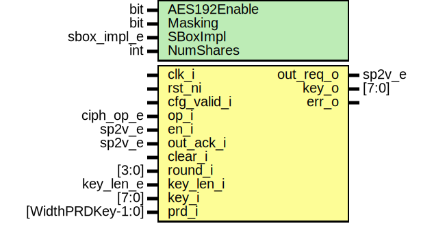

# Entity: aes_key_expand

- **File**: aes_key_expand.sv
## Diagram

## Description

Copyright lowRISC contributors.
 Licensed under the Apache License, Version 2.0, see LICENSE for details.
 SPDX-License-Identifier: Apache-2.0
 AES KeyExpand
 
## Generics

| Generic name | Type        | Value           | Description       |
| ------------ | ----------- | --------------- | ----------------- |
| AES192Enable | bit         | 1               |                   |
| Masking      | bit         | 0               |                   |
| SBoxImpl     | sbox_impl_e | SBoxImplLut     |                   |
| NumShares    | int         | Masking ? 2 : 1 | derived parameter |
## Ports

| Port name   | Direction | Type              | Description |
| ----------- | --------- | ----------------- | ----------- |
| clk_i       | input     |                   |             |
| rst_ni      | input     |                   |             |
| cfg_valid_i | input     |                   |             |
| op_i        | input     | ciph_op_e         |             |
| en_i        | input     | sp2v_e            |             |
| out_req_o   | output    | sp2v_e            |             |
| out_ack_i   | input     | sp2v_e            |             |
| clear_i     | input     |                   |             |
| round_i     | input     | [3:0]             |             |
| key_len_i   | input     | key_len_e         |             |
| key_i       | input     | [7:0]             |             |
| key_o       | output    | [7:0]             |             |
| prd_i       | input     | [WidthPRDKey-1:0] |             |
| err_o       | output    |                   |             |
## Signals

| Name             | Type                  | Description                                      |
| ---------------- | --------------------- | ------------------------------------------------ |
| en               | sp2v_e                |                                                  |
| en_err           | logic                 |                                                  |
| out_ack          | sp2v_e                |                                                  |
| out_ack_err      | logic                 |                                                  |
| rcon_d           | logic       [7:0]     |                                                  |
| rcon_q           | logic       [7:0]     |                                                  |
| rcon_we          | logic                 |                                                  |
| use_rcon         | logic                 |                                                  |
| rnd              | logic       [3:0]     |                                                  |
| rnd_type         | logic       [3:0]     |                                                  |
| spec_in_128      | logic      [31:0]     |                                                  |
| spec_in_192      | logic      [31:0]     |                                                  |
| rot_word_in      | logic      [31:0]     |                                                  |
| rot_word_out     | logic      [31:0]     |                                                  |
| use_rot_word     | logic                 |                                                  |
| sub_word_in      | logic      [31:0]     |                                                  |
| sub_word_out     | logic      [31:0]     |                                                  |
| sub_word_out_req | logic       [3:0]     |                                                  |
| sw_in_mask       | logic      [31:0]     |                                                  |
| sw_out_mask      | logic      [31:0]     |                                                  |
| rcon_add_in      | logic       [7:0]     |                                                  |
| rcon_add_out     | logic       [7:0]     |                                                  |
| rcon_added       | logic      [31:0]     |                                                  |
| irregular        | logic      [31:0]     |                                                  |
| regular          | logic [7:0][31:0]     |                                                  |
| unused_cfg_valid | logic                 | cfg_valid_i is used for gating assertions only.  |
| en_raw           | logic [Sp2VWidth-1:0] |                                                  |
| out_ack_raw      | logic [Sp2VWidth-1:0] |                                                  |
## Constants

| Name      | Type | Value           | Description       |
| --------- | ---- | --------------- | ----------------- |
| NumShares | int  | Masking ? 2 : 1 | derived parameter |
## Processes
- get_rnd_type: (  )
**Description**
For AES-192, there are four different types of rounds.

- rcon_usage: (  )
**Description**
Depending on operation, key length and round, Rcon may not be used thus must not be updated.

- rcon_update: (  )
**Description**
Generate Rcon

- reg_rcon: ( @(posedge clk_i or negedge rst_ni) )
**Description**
Rcon register

## Instantiations

- u_aes_key_expand_en_buf_chk: aes_sel_buf_chk
- u_aes_key_expand_out_ack_buf_chk: aes_sel_buf_chk
