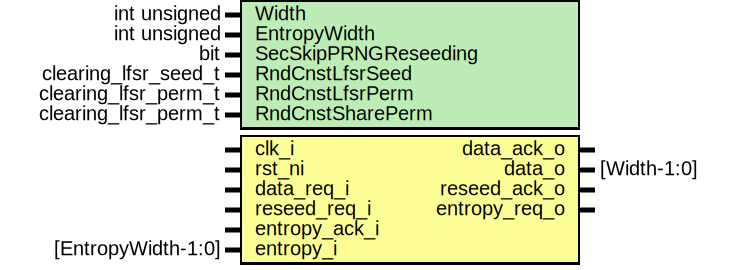

# Entity: aes_prng_clearing

- **File**: aes_prng_clearing.sv
## Diagram

## Description

 Copyright lowRISC contributors.
 Licensed under the Apache License, Version 2.0, see LICENSE for details.
 SPDX-License-Identifier: Apache-2.0

 AES low-bandwidth pseudo-random number generator for register clearing

 This module uses an LFSR connected to a PRINCE S-Box and PRESENT permutation to generate
 pseudo-random data for the AES module for clearing registers. The LFSR can be reseeded
 using an external interface.

## Generics

| Generic name         | Type                 | Value                           | Description                                                                                                                                                      |
| -------------------- | -------------------- | ------------------------------- | ---------------------------------------------------------------------------------------------------------------------------------------------------------------- |
| Width                | int unsigned         | 64                              |  At the moment we just support a width of 64.                                                                                                                    |
| EntropyWidth         | int unsigned         | edn_pkg::ENDPOINT_BUS_WIDTH     |                                                                                                                                                                  |
| SecSkipPRNGReseeding | bit                  | 0                               |  The current SCA setup doesn't provide                                                                                                                           |
| RndCnstLfsrSeed      | clearing_lfsr_seed_t | RndCnstClearingLfsrSeedDefault  |  sufficient resources to implement the  infrastructure required for PRNG reseeding.  To enable SCA resistance evaluations, we  need to skip reseeding requests.  |
| RndCnstLfsrPerm      | clearing_lfsr_perm_t | RndCnstClearingLfsrPermDefault  |                                                                                                                                                                  |
| RndCnstSharePerm     | clearing_lfsr_perm_t | RndCnstClearingSharePermDefault |                                                                                                                                                                  |
## Ports

| Port name     | Direction | Type               | Description                                   |
| ------------- | --------- | ------------------ | --------------------------------------------- |
| clk_i         | input     |                    |                                               |
| rst_ni        | input     |                    |                                               |
| data_req_i    | input     |                    |  Connections to AES internals, PRNG consumers |
| data_ack_o    | output    |                    |                                               |
| data_o        | output    | [Width-1:0]        |                                               |
| reseed_req_i  | input     |                    |                                               |
| reseed_ack_o  | output    |                    |                                               |
| entropy_req_o | output    |                    |  Connections to outer world, LFSR re-seed     |
| entropy_ack_i | input     |                    |                                               |
| entropy_i     | input     | [EntropyWidth-1:0] |                                               |
## Signals

| Name                   | Type              | Description                                     |
| ---------------------- | ----------------- | ----------------------------------------------- |
| seed_valid             | logic             |                                                 |
| seed_en                | logic             |                                                 |
| seed                   | logic [Width-1:0] |                                                 |
| lfsr_en                | logic             |                                                 |
| lfsr_state             | logic [Width-1:0] |                                                 |
| lfsr_state_scrambled   | logic [Width-1:0] |                                                 |
| share_perm_test        | logic [Width-1:0] |  Check that the supplied permutation is valid.  |
| unused_share_perm_test | logic [Width-1:0] |  Check that the supplied permutation is valid.  |
## Instantiations

- u_prim_packer_fifo: prim_packer_fifo
**Description**
 Upsizing of entropy input to correct width for LFSR reseeding.

- u_lfsr: prim_lfsr
**Description**
 LFSR instance

