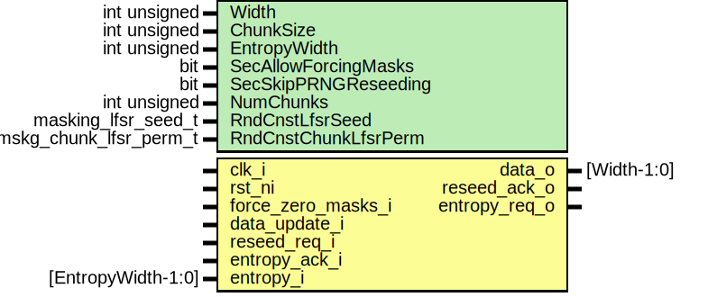

# Entity: aes_prng_masking
## Diagram

## Description
Copyright lowRISC contributors.
 Licensed under the Apache License, Version 2.0, see LICENSE for details.
 SPDX-License-Identifier: Apache-2.0
 AES high-bandwidth pseudo-random number generator for masking
 This module uses multiple parallel LFSRs connected to PRINCE S-Boxes and PRESENT permutations
 to generate pseudo-random data for masking the AES cipher core. The LFSRs can be reseeded using
 an external interface.
 IMPORTANT NOTE:                                                                               //
                                   DO NOT USE THIS BLINDLY!                                    //
                                                                                               //
 It has not yet been verified that this initial implementation produces pseudo-random numbers  //
 of sufficient quality in terms of uniformity and independence, and that it is indeed suitable //
 for masking purposes.                                                                         //
 
## Generics
| Generic name         | Type                   | Value                           | Description                           |
| -------------------- | ---------------------- | ------------------------------- | ------------------------------------- |
| Width                | int unsigned           | WidthPRDMasking                 | Must be divisble by ChunkSize and 8   |
| ChunkSize            | int unsigned           | ChunkSizePRDMasking             | Width of the LFSR primitives          |
| EntropyWidth         | int unsigned           | edn_pkg::ENDPOINT_BUS_WIDTH     |                                       |
| SecAllowForcingMasks | bit                    | 0                               | Allow forcing masks to 0 using        |
| SecSkipPRNGReseeding | bit                    | 0                               | The current SCA setup doesn't provide |
| NumChunks            | int unsigned           | Width/ChunkSize                 | derived parameter                     |
| RndCnstLfsrSeed      | masking_lfsr_seed_t    | RndCnstMaskingLfsrSeedDefault   |                                       |
| RndCnstChunkLfsrPerm | mskg_chunk_lfsr_perm_t | RndCnstMskgChunkLfsrPermDefault |                                       |
## Ports
| Port name          | Direction | Type               | Description                                  |
| ------------------ | --------- | ------------------ | -------------------------------------------- |
| clk_i              | input     |                    |                                              |
| rst_ni             | input     |                    |                                              |
| force_zero_masks_i | input     |                    |                                              |
| data_update_i      | input     |                    | Connections to AES internals, PRNG consumers |
| data_o             | output    | [Width-1:0]        |                                              |
| reseed_req_i       | input     |                    |                                              |
| reseed_ack_o       | output    |                    |                                              |
| entropy_req_o      | output    |                    | Connections to outer world, LFSR reseeding   |
| entropy_ack_i      | input     |                    |                                              |
| entropy_i          | input     | [EntropyWidth-1:0] |                                              |
## Signals
| Name       | Type                                 | Description |
| ---------- | ------------------------------------ | ----------- |
| seed_en    | logic                                |             |
| seed_valid | logic                                |             |
| seed       | logic                    [Width-1:0] |             |
| prng_seed  | logic [NumChunks-1:0][ChunkSize-1:0] |             |
| prng_en    | logic                                |             |
| prng_state | logic [NumChunks-1:0][ChunkSize-1:0] |             |
| sub        | logic [NumChunks-1:0][ChunkSize-1:0] |             |
| prng_b     | logic            [NumBytes-1:0][7:0] |             |
| sub_b      | logic            [NumBytes-1:0][7:0] |             |
| phase_q    | logic                                |             |
## Constants
| Name      | Type         | Value           | Description       |
| --------- | ------------ | --------------- | ----------------- |
| NumChunks | int unsigned | Width/ChunkSize | derived parameter |
| NumBytes  | int unsigned | Width/8         |                   |
## Processes
- reg_phase: _( @(posedge clk_i or negedge rst_ni) )_

## Instantiations
- u_prim_packer_fifo: prim_packer_fifo
**Description**
Upsizing of entropy input to correct width for PRNG reseeding.

