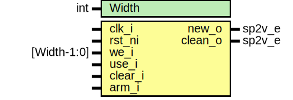

# Entity: aes_reg_status

- **File**: aes_reg_status.sv
## Diagram

## Description

Copyright lowRISC contributors.
 Licensed under the Apache License, Version 2.0, see LICENSE for details.
 SPDX-License-Identifier: Apache-2.0
 AES reg status
 This module tracks the collective status of multiple registers.
 
## Generics

| Generic name | Type | Value | Description |
| ------------ | ---- | ----- | ----------- |
| Width        | int  | 1     |             |
## Ports

| Port name | Direction | Type        | Description |
| --------- | --------- | ----------- | ----------- |
| clk_i     | input     |             |             |
| rst_ni    | input     |             |             |
| we_i      | input     | [Width-1:0] |             |
| use_i     | input     |             |             |
| clear_i   | input     |             |             |
| arm_i     | input     |             |             |
| new_o     | output    | sp2v_e      |             |
| clean_o   | output    | sp2v_e      |             |
## Signals

| Name         | Type                  | Description                                                                                                                                |
| ------------ | --------------------- | ------------------------------------------------------------------------------------------------------------------------------------------ |
| we_d         | logic [Width-1:0]     |                                                                                                                                            |
| we_q         | logic [Width-1:0]     |                                                                                                                                            |
| armed_d      | logic                 |                                                                                                                                            |
| armed_q      | logic                 |                                                                                                                                            |
| all_written  | sp2v_e                |                                                                                                                                            |
| none_written | sp2v_e                |                                                                                                                                            |
| new_d        | sp2v_e                |                                                                                                                                            |
| new_q        | sp2v_e                |                                                                                                                                            |
| clean_d      | sp2v_e                |                                                                                                                                            |
| clean_q      | sp2v_e                |                                                                                                                                            |
| new_q_raw    | logic [Sp2VWidth-1:0] | The following primitives are used to place a size-only constraint on the flops in order to prevent optimizations on these status signals.  |
| clean_q_raw  | logic [Sp2VWidth-1:0] |                                                                                                                                            |
## Processes
- reg_ops: ( @(posedge clk_i or negedge rst_ni) )
## Instantiations

- u_new_status_regs: prim_flop
- u_clean_status_regs: prim_flop
