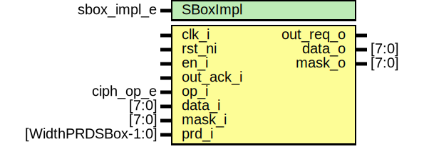

# Entity: aes_sbox

- **File**: aes_sbox.sv
## Diagram

## Description

Copyright lowRISC contributors.
 Licensed under the Apache License, Version 2.0, see LICENSE for details.
 SPDX-License-Identifier: Apache-2.0
 AES SBox
 
## Generics

| Generic name | Type        | Value       | Description |
| ------------ | ----------- | ----------- | ----------- |
| SBoxImpl     | sbox_impl_e | SBoxImplLut |             |
## Ports

| Port name | Direction | Type               | Description |
| --------- | --------- | ------------------ | ----------- |
| clk_i     | input     |                    |             |
| rst_ni    | input     |                    |             |
| en_i      | input     |                    |             |
| out_req_o | output    |                    |             |
| out_ack_i | input     |                    |             |
| op_i      | input     | ciph_op_e          |             |
| data_i    | input     | [7:0]              |             |
| mask_i    | input     | [7:0]              |             |
| prd_i     | input     | [WidthPRDSBox-1:0] |             |
| data_o    | output    | [7:0]              |             |
| mask_o    | output    | [7:0]              |             |
## Constants

| Name            | Type | Value     | Description |
| --------------- | ---- | --------- | ----------- |
| SBoxMasked      | bit  | undefined |             |
| SBoxSingleCycle | bit  | undefined |             |
