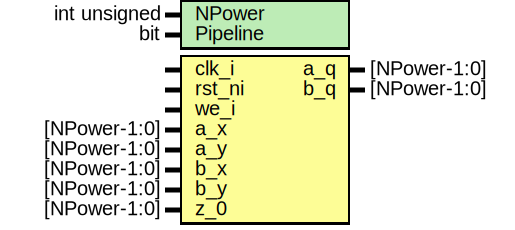

# Entity: aes_dom_indep_mul_gf2pn

- **File**: aes_sbox_dom.sv
## Diagram

## Description

 Copyright lowRISC contributors.
 Licensed under the Apache License, Version 2.0, see LICENSE for details.
 SPDX-License-Identifier: Apache-2.0

 AES S-Box with First-Order Domain-Oriented Masking

 This is the unpipelined version using DOM-dep multipliers. It has a latency of 5 clock cycles
 and requires 28 bits of pseudo-random data per evaluation. Pipelining would only be beneficial
 when using
 - either a cipher core architecture with a data path smaller than 128 bit, i.e., where the
   individual S-Boxes are evaluated more than once per round, or
 - a fully unrolled cipher core architecture for maximum throughput.

 Note: The DOM AES S-Box is built on top of the Canright masked S-Box without mask re-use.

 For details, see the following papers and reports:
 [1] Gross, "Domain-Oriented Masking: Compact Masked Hardware Implementations with Arbitrary
     Protection Order" available at https://eprint.iacr.org/2016/486.pdf
 [2] Canright, "A very compact 'perfectly masked' S-box for AES (corrected)" available at
     https://eprint.iacr.org/2009/011.pdf
 [3] Canright, "A very compact Rijndael S-box" available at https://hdl.handle.net/10945/25608

 Using the Coco-Alma tool in transient mode, this implementation has been formally verified to be
 secure against first-order side-channel analysis (SCA). For more information on the tool,
 refer to the following papers:
 [4] Gigerl, "COCO: Co-design and co-verification of masked software implementations on CPUs"
     available at https://eprint.iacr.org/2020/1294.pdf
 [5] Bloem, "Formal verification of masked hardware implementations in the presence of glitches"
     available at https://eprint.iacr.org/2017/897.pdf
/////////////////////////////////////////////////////////////////////////////////////////////////
 IMPORTANT NOTE:                                                                               //
                            DO NOT USE THIS FOR SYNTHESIS BLINDLY!                             //
                                                                                               //
 This implementation relies on primitive cells like prim_buf/flop_en containing tool-specific  //
 synthesis attributes to prevent the synthesis tool from optimizing away/re-ordering registers //
 and to enforce the correct ordering of operations. Without the proper primitives, synthesis   //
 tools might heavily optimize the design. The result is likely insecure. Use with care.        //
/////////////////////////////////////////////////////////////////////////////////////////////////
 Packed struct for pseudo-random data (PRD) distribution. Stages 1, 3 and 4 require 8 bits each.
 Stage 2 requires just 4 bits.
 DOM-indep GF(2^N) multiplier, first-order masked.
 Computes (a_q ^ b_q) = (a_x ^ b_x) * (a_y ^ b_y), i.e. q = x * y using first-order
 domain-oriented masking. The sharings of x and y are required to be uniformly random and
 independent from each other.
 See Fig. 2 in [1].

## Generics

| Generic name | Type         | Value | Description |
| ------------ | ------------ | ----- | ----------- |
| NPower       | int unsigned | 4     |             |
| Pipeline     | bit          | 1'b0  |             |
## Ports

| Port name | Direction | Type         | Description              |
| --------- | --------- | ------------ | ------------------------ |
| clk_i     | input     |              |                          |
| rst_ni    | input     |              |                          |
| we_i      | input     |              |                          |
| a_x       | input     | [NPower-1:0] | Share a of x             |
| a_y       | input     | [NPower-1:0] | Share a of y             |
| b_x       | input     | [NPower-1:0] | Share b of x             |
| b_y       | input     | [NPower-1:0] | Share b of y             |
| z_0       | input     | [NPower-1:0] | Randomness for resharing |
| a_q       | output    | [NPower-1:0] | Share a of q             |
| b_q       | output    | [NPower-1:0] | Share b of q             |
## Signals

| Name        | Type               | Description                                                                 |
| ----------- | ------------------ | --------------------------------------------------------------------------- |
| mul_ax_ay_d | logic [NPower-1:0] | ///////////////  Calculation // ///////////////  Inner-domain terms         |
| mul_bx_by_d | logic [NPower-1:0] | ///////////////  Calculation // ///////////////  Inner-domain terms         |
| mul_ax_by   | logic [NPower-1:0] |  Cross-domain terms                                                         |
| mul_ay_bx   | logic [NPower-1:0] |  Cross-domain terms                                                         |
| aq_z0_d     | logic [NPower-1:0] | /////////////  Resharing // /////////////  Resharing of cross-domain terms  |
| bq_z0_d     | logic [NPower-1:0] | /////////////  Resharing // /////////////  Resharing of cross-domain terms  |
| aq_z0_q     | logic [NPower-1:0] |                                                                             |
| bq_z0_q     | logic [NPower-1:0] |                                                                             |
| mul_ax_ay   | logic [NPower-1:0] | ///////////////////////  Optional Pipelining // ///////////////////////     |
| mul_bx_by   | logic [NPower-1:0] | ///////////////////////  Optional Pipelining // ///////////////////////     |
## Instantiations

- u_prim_flop_abq_z0: prim_flop_en
 **Description**
 Registers

