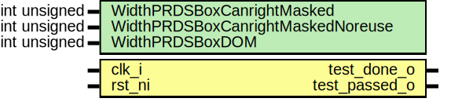

# Entity: aes_sbox_tb

- **File**: aes_sbox_tb.sv
## Diagram

## Description

 Copyright lowRISC contributors.
 Licensed under the Apache License, Version 2.0, see LICENSE for details.
 SPDX-License-Identifier: Apache-2.0

 AES SBox testbench

## Generics

| Generic name                      | Type         | Value | Description      |
| --------------------------------- | ------------ | ----- | ---------------- |
| WidthPRDSBoxCanrightMasked        | int unsigned | 8     |  PRD Generation  |
| WidthPRDSBoxCanrightMaskedNoreuse | int unsigned | 18    |                  |
| WidthPRDSBoxDOM                   | int unsigned | 8     |                  |
## Ports

| Port name     | Direction | Type | Description |
| ------------- | --------- | ---- | ----------- |
| clk_i         | input     |      |             |
| rst_ni        | input     |      |             |
| test_done_o   | output    |      |             |
| test_passed_o | output    |      |             |
## Signals

| Name            | Type                                           | Description                           |
| --------------- | ---------------------------------------------- | ------------------------------------- |
| count_d         | logic [8:0]                                    |                                       |
| count_q         | logic [8:0]                                    |                                       |
| stimulus        | logic [7:0]                                    |                                       |
| op              | ciph_op_e                                      |                                       |
| responses       | logic [7:0]                                    |                                       |
| masked_stimulus | logic  [7:0]                                   |  Mask Generation                      |
| in_mask         | logic  [7:0]                                   |                                       |
| masked_response | logic  [7:0]                                   |                                       |
| out_mask        | logic  [7:0]                                   |                                       |
| mask            | logic [31:0]                                   |                                       |
| unused_mask     | logic [23:0]                                   |                                       |
| prd             | logic                                   [31:0] |                                       |
| unused_prd      | logic [31-WidthPRDSBoxCanrightMaskedNoreuse:0] |                                       |
| dom_done        | logic                                          |  Instantiate DOM SBox Implementation  |
## Constants

| Name                  | Type | Value                                  | Description |
| --------------------- | ---- | -------------------------------------- | ----------- |
| NUM_SBOX_IMPLS        | int  | 2                                      |             |
| NUM_SBOX_IMPLS_MASKED | int  | 3                                      |             |
| NumSBoxImplsTotal     | int  | NUM_SBOX_IMPLS + NUM_SBOX_IMPLS_MASKED |             |
## Processes
- reg_count: ( @(posedge clk_i or negedge rst_ni) )
  - **Type:** always_ff
- reg_mask: ( @(posedge clk_i or negedge rst_ni) )
  - **Type:** always_ff
- reg_prd: ( @(posedge clk_i or negedge rst_ni) )
  - **Type:** always_ff
- unmask_resp: (  )
  - **Type:** always_comb
**Description**
 Unmask responses 
- tb_ctrl: ( @(posedge clk_i or negedge rst_ni) )
  - **Type:** always_ff
**Description**
 Check responses, signal end of simulation 
## Instantiations

- aes_sbox_lut: aes_sbox_lut
**Description**
 Instantiate SBox Implementations

- aes_sbox_canright: aes_sbox_canright
