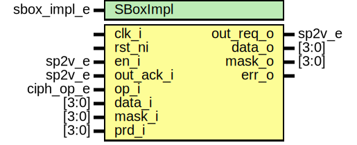

# Entity: aes_sub_bytes

- **File**: aes_sub_bytes.sv
## Diagram

## Description

 Copyright lowRISC contributors.
 Licensed under the Apache License, Version 2.0, see LICENSE for details.
 SPDX-License-Identifier: Apache-2.0

 AES SubBytes

## Generics

| Generic name | Type        | Value       | Description |
| ------------ | ----------- | ----------- | ----------- |
| SBoxImpl     | sbox_impl_e | SBoxImplLut |             |
## Ports

| Port name | Direction | Type      | Description |
| --------- | --------- | --------- | ----------- |
| clk_i     | input     |           |             |
| rst_ni    | input     |           |             |
| en_i      | input     | sp2v_e    |             |
| out_req_o | output    | sp2v_e    |             |
| out_ack_i | input     | sp2v_e    |             |
| op_i      | input     | ciph_op_e |             |
| data_i    | input     | [3:0]     |             |
| mask_i    | input     | [3:0]     |             |
| prd_i     | input     | [3:0]     |             |
| data_o    | output    | [3:0]     |             |
| mask_o    | output    | [3:0]     |             |
| err_o     | output    |           |             |
## Signals

| Name        | Type                  | Description                       |
| ----------- | --------------------- | --------------------------------- |
| en          | sp2v_e                |                                   |
| en_err      | logic                 |                                   |
| out_req     | logic [3:0][3:0]      |                                   |
| out_ack     | sp2v_e                |                                   |
| out_ack_err | logic                 |                                   |
| en_raw      | logic [Sp2VWidth-1:0] |  Check sparsely encoded signals.  |
| out_ack_raw | logic [Sp2VWidth-1:0] |                                   |
## Instantiations

- u_aes_sb_en_buf_chk: aes_sel_buf_chk
- u_aes_sb_out_ack_buf_chk: aes_sel_buf_chk
