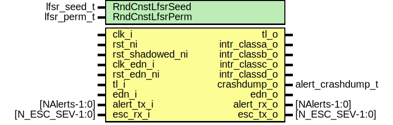

# Entity: alert_handler

- **File**: alert_handler.sv
## Diagram

## Description

Copyright lowRISC contributors.
 Licensed under the Apache License, Version 2.0, see LICENSE for details.
 SPDX-License-Identifier: Apache-2.0
 Alert handler top.
 Note that the alert_pkg, the regfile and alert_handler_reg_wrap
 have to be generated using the reg_alert_handler.py script.
 
## Generics

| Generic name    | Type        | Value                  | Description                                                |
| --------------- | ----------- | ---------------------- | ---------------------------------------------------------- |
| RndCnstLfsrSeed | lfsr_seed_t | RndCnstLfsrSeedDefault | Compile time random constants, to be overriden by topgen.  |
| RndCnstLfsrPerm | lfsr_perm_t | RndCnstLfsrPermDefault |                                                            |
## Ports

| Port name     | Direction | Type              | Description                        |
| ------------- | --------- | ----------------- | ---------------------------------- |
| clk_i         | input     |                   |                                    |
| rst_ni        | input     |                   |                                    |
| clk_edn_i     | input     |                   |                                    |
| rst_edn_ni    | input     |                   |                                    |
| tl_i          | input     |                   | Bus Interface (device)             |
| tl_o          | output    |                   |                                    |
| intr_classa_o | output    |                   | Interrupt Requests                 |
| intr_classb_o | output    |                   |                                    |
| intr_classc_o | output    |                   |                                    |
| intr_classd_o | output    |                   |                                    |
| crashdump_o   | output    | alert_crashdump_t | State information for HW crashdump |
| edn_o         | output    |                   | Entropy Input                      |
| edn_i         | input     |                   |                                    |
| alert_tx_i    | input     | [NAlerts-1:0]     | Alert Sources                      |
| alert_rx_o    | output    | [NAlerts-1:0]     |                                    |
| esc_rx_i      | input     | [N_ESC_SEV-1:0]   | Escalation outputs                 |
| esc_tx_o      | output    | [N_ESC_SEV-1:0]   |                                    |
## Signals

| Name              | Type                                 | Description |
| ----------------- | ------------------------------------ | ----------- |
| loc_alert_trig    | logic [N_LOC_ALERT-1:0]              |             |
| irq               | logic [N_CLASSES-1:0]                |             |
| hw2reg_wrap       | hw2reg_wrap_t                        |             |
| reg2hw_wrap       | reg2hw_wrap_t                        |             |
| alert_ping_req    | logic [NAlerts-1:0]                  |             |
| alert_ping_ok     | logic [NAlerts-1:0]                  |             |
| esc_ping_req      | logic [N_ESC_SEV-1:0]                |             |
| esc_ping_ok       | logic [N_ESC_SEV-1:0]                |             |
| edn_req           | logic                                |             |
| edn_ack           | logic                                |             |
| edn_data          | logic [LfsrWidth-1:0]                |             |
| alert_integfail   | logic [NAlerts-1:0]                  |             |
| alert_trig        | logic [NAlerts-1:0]                  |             |
| class_esc_sig_req | logic [N_CLASSES-1:0][N_ESC_SEV-1:0] |             |
| esc_sig_req       | logic [N_ESC_SEV-1:0]                |             |
| esc_integfail     | logic [N_ESC_SEV-1:0]                |             |
| esc_sig_req_trsp  | logic [N_ESC_SEV-1:0][N_CLASSES-1:0] |             |
## Instantiations

- u_reg_wrap: alert_handler_reg_wrap
- u_edn_req: prim_edn_req
- u_ping_timer: alert_handler_ping_timer
- u_class: alert_handler_class
