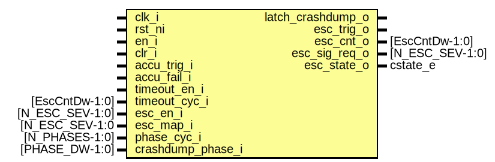

# Entity: alert_handler_esc_timer

- **File**: alert_handler_esc_timer.sv
## Diagram

## Description

 Copyright lowRISC contributors.
 Licensed under the Apache License, Version 2.0, see LICENSE for details.
 SPDX-License-Identifier: Apache-2.0

 This module implements the escalation timer, which times the four escalation
 phases. There are two mechanisms that can trigger the escalation protocol:

 1) via accum_trigger_i, which will be asserted once the accumulator value
    exceeds a programmable amount of alert occurences.

 2) via an interrupt timeout, if this is enabled. If this functionality is
    enabled, the internal escalation counter is reused to check whether the
    interrupt times out. If it does time out, the outcome is the same as if
    accum_trigger_i where asserted.

 Note that escalation always takes precedence over the interrupt timeout.

## Ports

| Port name         | Direction | Type            | Description                                                                                                    |
| ----------------- | --------- | --------------- | -------------------------------------------------------------------------------------------------------------- |
| clk_i             | input     |                 |                                                                                                                |
| rst_ni            | input     |                 |                                                                                                                |
| en_i              | input     |                 | enables timeout/escalation                                                                                     |
| clr_i             | input     |                 | aborts escalation                                                                                              |
| accu_trig_i       | input     |                 | this triggers escalation                                                                                       |
| accu_fail_i       | input     |                 | this moves the FSM into a terminal error state                                                                 |
| timeout_en_i      | input     |                 | enables timeout                                                                                                |
| timeout_cyc_i     | input     | [EscCntDw-1:0]  | interrupt timeout. 0 = disabled                                                                                |
| esc_en_i          | input     | [N_ESC_SEV-1:0] | escalation signal enables                                                                                      |
| esc_map_i         | input     | [N_ESC_SEV-1:0  |                                                                                                                |
| phase_cyc_i       | input     | [N_PHASES-1:0]  |  escalation signal / phase map                                                                                 |
| crashdump_phase_i | input     | [PHASE_DW-1:0]  | determines when to assert latch_crashdump_o                                                                    |
| latch_crashdump_o | output    |                 | asserted when entering escalation                                                                              |
| esc_trig_o        | output    |                 | asserted if escalation triggers                                                                                |
| esc_cnt_o         | output    | [EscCntDw-1:0]  | current timeout / escalation count                                                                             |
| esc_sig_req_o     | output    | [N_ESC_SEV-1:0] | escalation signal outputs                                                                                      |
| esc_state_o       | output    | cstate_e        |  current state output 000: idle, 001: irq timeout counting 100: phase0, 101: phase1, 110: phase2, 111: phase3  |
## Signals

| Name           | Type                                | Description                                                                                                                                                                        |
| -------------- | ----------------------------------- | ---------------------------------------------------------------------------------------------------------------------------------------------------------------------------------- |
| cnt_en         | logic                               | //////////////////  Tandem Counter // //////////////////                                                                                                                           |
| cnt_clr        | logic                               | //////////////////  Tandem Counter // //////////////////                                                                                                                           |
| cnt_ge         | logic                               | //////////////////  Tandem Counter // //////////////////                                                                                                                           |
| cnt_q          | logic [1:0][EscCntDw-1:0]           |                                                                                                                                                                                    |
| thresh         | logic [EscCntDw-1:0]                |  threshold test, the thresholds are muxed further below  depending on the current state                                                                                            |
| cnt_check_fail | logic                               |  consistency check                                                                                                                                                                 |
| phase_oh       | logic [N_PHASES-1:0]                | ////////////  Main FSM // ////////////                                                                                                                                             |
| fsm_error      | logic                               |                                                                                                                                                                                    |
| state_d        | state_e                             |                                                                                                                                                                                    |
| state_q        | state_e                             |                                                                                                                                                                                    |
| esc_map_oh     | logic [N_ESC_SEV-1:0][N_PHASES-1:0] |                                                                                                                                                                                    |
| state_raw_q    | logic [StateWidth-1:0]              | /////////////////  FSM Registers // /////////////////  This primitive is used to place a size-only constraint on the  flops in order to prevent FSM state encoding optimizations.  |
## Constants

| Name       | Type | Value | Description                                                                                                                                                                                                                                                                                                                                                                                                                                 |
| ---------- | ---- | ----- | ------------------------------------------------------------------------------------------------------------------------------------------------------------------------------------------------------------------------------------------------------------------------------------------------------------------------------------------------------------------------------------------------------------------------------------------- |
| StateWidth | int  | 10    |  Encoding generated with:  $ ./util/design/sparse-fsm-encode.py -d 5 -m 8 -n 10 \       -s 784905746 --language=sv   Hamming distance histogram:    0: --   1: --   2: --   3: --   4: --   5: |||||||||||||||||||| (42.86%)   6: |||||||||||||||||||| (42.86%)   7: |||||| (14.29%)   8: --   9: --  10: --   Minimum Hamming distance: 5  Maximum Hamming distance: 7  Minimum Hamming weight: 2  Maximum Hamming weight: 7   |
## Types

| Name    | Type                                                                                                                                                                                                                                                                                                                                                                                                                                                                                                                                                                                                     | Description |
| ------- | -------------------------------------------------------------------------------------------------------------------------------------------------------------------------------------------------------------------------------------------------------------------------------------------------------------------------------------------------------------------------------------------------------------------------------------------------------------------------------------------------------------------------------------------------------------------------------------------------------- | ----------- |
| state_e | enum logic [StateWidth-1:0] {      IdleSt     = 10'b1101000111,      TimeoutSt  = 10'b0010011110,      Phase0St   = 10'b1111011001,      Phase1St   = 10'b0001110100,      Phase2St   = 10'b1110110010,      Phase3St   = 10'b0010000001,      TerminalSt = 10'b0101101010,      FsmErrorSt = 10'b1000101101   } |             |
## Processes
- p_fsm: (  )
  - **Type:** always_comb
## Instantiations

- u_state_regs: prim_flop
