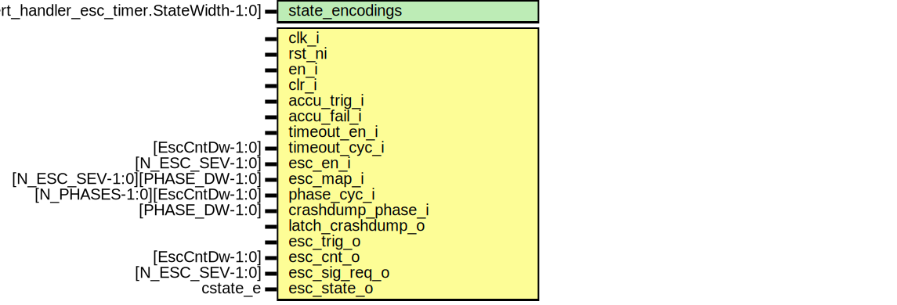

# Entity: alert_handler_esc_timer_assert_fpv

## Diagram

## Description

Copyright lowRISC contributors.
 Licensed under the Apache License, Version 2.0, see LICENSE for details.
 SPDX-License-Identifier: Apache-2.0
 Assertions for alert_handler_esc_timer.
 Intended to be used with a formal tool.
 
## Generics

| Generic name    | Type                                           | Value | Description                         |
| --------------- | ---------------------------------------------- | ----- | ----------------------------------- |
| state_encodings | logic [alert_handler_esc_timer.StateWidth-1:0] |       | check escalation cnt and state out  |
## Ports

| Port name     | Direction | Type                          | Description |
| ------------- | --------- | ----------------------------- | ----------- |
| clk_i         | input     |                               |             |
| rst_ni        | input     |                               |             |
| en_i          | input     |                               |             |
| clr_i         | input     |                               |             |
| accu_trig_i   | input     |                               |             |
| accu_fail_i   | input     |                               |             |
| timeout_en_i  | input     |                               |             |
| timeout_cyc_i | input     | [EscCntDw-1:0]                |             |
| esc_en_i      | input     | [N_ESC_SEV-1:0]               |             |
| esc_map_i     | input     | [N_ESC_SEV-1:0][PHASE_DW-1:0] |             |
| phase_cyc_i   | input     | [N_PHASES-1:0][EscCntDw-1:0]  |             |
| esc_trig_o    | input     |                               |             |
| esc_cnt_o     | input     | [EscCntDw-1:0]                |             |
| esc_sig_req_o | input     | [N_ESC_SEV-1:0]               |             |
| esc_state_o   | input     | cstate_e                      |             |
## Signals

| Name                | Type          | Description                        |
| ------------------- | ------------- | ---------------------------------- |
| esc_sel             | logic [1:0]   | symbolic vars for phase map check  |
| phase_sel           | logic [1:0]   |                                    |
| esc_has_triggered_q | logic         | set regs                           |
| timeout_en_i        | timeout_cyc_i |                                    |
| esc_has_triggered_q | timeout_cyc_i |                                    |
| clk_i               | timeout_cyc_i |                                    |
| accu_fail_i         | timeout_cyc_i |                                    |
|                     | inside        |                                    |
## Constants

| Name               | Type         | Value     | Description                 |
| ------------------ | ------------ | --------- | --------------------------- |
| MAX_TIMEOUT_CYCLES | int unsigned | 10        | constrain the state-spaces  |
| MAX_PHASE_CYCLES   | int unsigned | 10        |                             |
| phases             | cstate_e     | undefined |                             |
## Processes
- p_regs: ( @(posedge clk_i or negedge rst_ni) )
**Description**
set registers

